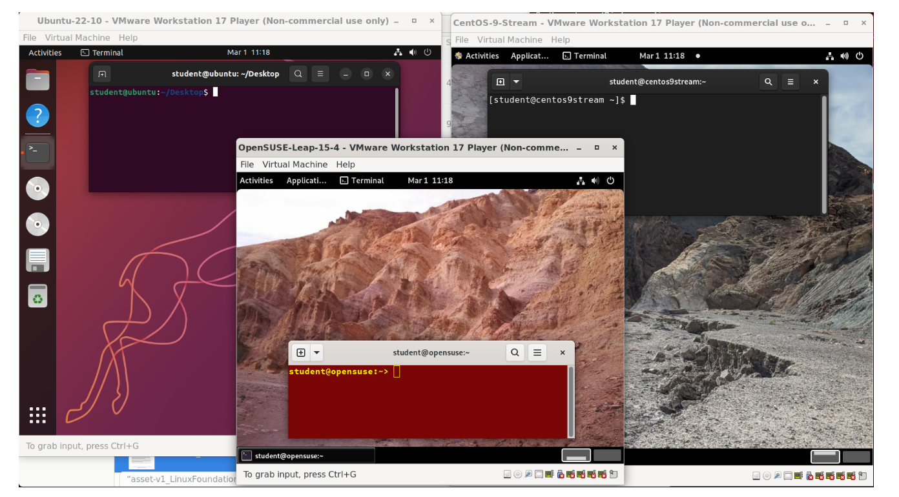
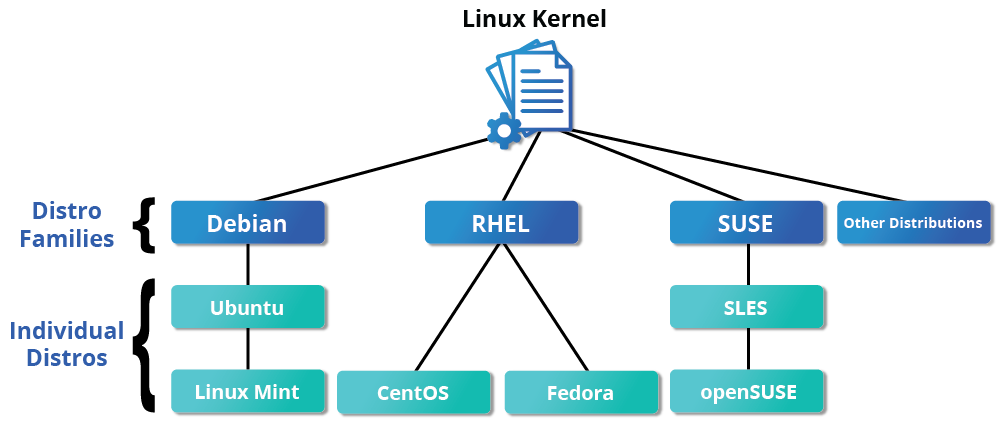
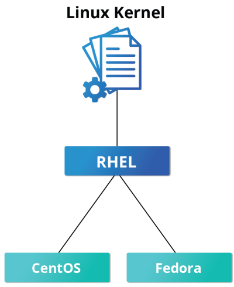
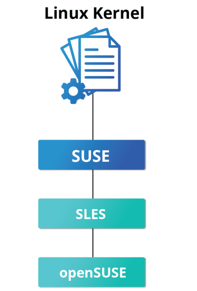
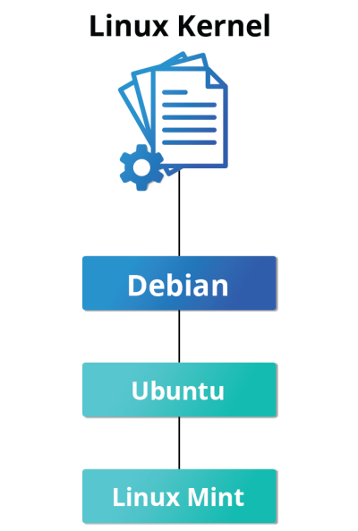

# Introduction to Linux (LFS101)

## The Linux Foundation

The Linux Foundation is the world’s leading home for collaboration on open source software, hardware, standards, and data. Linux Foundation projects are critical to the world’s infrastructure, including Linux, Kubernetes, Node.js, ONAP, PyTorch, RISC-V, SPDX, OpenChain, and more. The Linux Foundation focuses on leveraging best practices and addressing the needs of contributors, users, and solution providers to create sustainable models for open collaboration. The Linux Foundation has registered trademarks and uses trademarks. For a list of trademarks of The Linux Foundation, please see its trademark usage page. Linux is a registered trademark of Linus Torvalds.

## Linux Foundation Events

Over 85,000 open source technologists and leaders worldwide gather at Linux Foundation events annually to share ideas, learn and collaborate. Linux Foundation events are the meeting place of choice for open source maintainers, developers, architects, infrastructure managers, and sysadmins and technologists leading open source program offices, and other critical leadership functions.

These events are the best place to gain visibility within the open source community quickly and advance open source development work by forming connections with the people evaluating and creating the next generation of technology. They provide a forum to share and gain knowledge, help organizations identify software trends early to inform future technology investments, connect employers with talent, and showcase technologies and services to influential open source professionals, media, and analysts around the globe.

## Linux Foundation Education

The Linux Foundation Education Group works with expert instructors and experienced open source developers to create training courses for every level of experience, from complete newbies to veteran developers, as well as certification exams which demonstrate your skills to potential employers in a trusted verifiable way.

To get more information about specific courses and certification exams offered by the Linux Foundation, including technical requirements and other logistics, visit the Linux Foundation Education website.

## Course Software Requirements

In order to fully benefit from this course, you will need to have at least one Linux distribution installed (if you are not already familiar with the term distribution, as it relates to Linux, you soon will be!).

On the next page, you will learn some more details about the many available Linux distributions and the families they can be considered to belong to. Because there are literally hundreds of distributions, we have not covered them all in this course. Instead, we have decided to focus on the three major distribution families, and we have chosen distributions from within each family to use for illustrations, examples, and exercises. This is not meant to suggest that we endorse these specific distributions; they were simply chosen because they are fairly widely used and each is broadly representative of its respective family.

The families and representative distributions we are using are:

Red Hat Family Systems (including CentOS and Fedora)
SUSE Family Systems (including openSUSE)
Debian Family Systems (including Ubuntu and Linux Mint).

## Focus on Three Major Linux Distribution Families

In the next chapter, you will learn about the components that make up a Linux distribution.

For now, what you need to know is that this course focuses on the three major Linux distribution families that currently exist. However, as long as there are talented contributors, the families of distributions and the distributions within these families will continue to change and grow. People see a need, and develop special configurations and utilities to respond to that need. Sometimes that effort creates a whole new distribution of Linux. Sometimes, that effort will leverage an existing distribution to expand the members of an existing family.

For a rather long list of available distributions, see The LWN.net Linux Distribution List.

## The Red Hat Family

Red Hat Enterprise Linux (RHEL) heads the family that includes CentOS, CentOS Stream, Fedora and Oracle Linux.

Fedora has a close relationship with RHEL and contains significantly more software than Red Hat's enterprise version. One reason for this is that a diverse community is involved in building Fedora, with many contributors who do not work for Red Hat. Furthermore, it is used as a testing platform for future RHEL releases.

We will use CentOS Stream and CentOS more often for activities, demonstrations, and labs because there is no cost to the end user, and there is a longer release cycle than for Fedora (which releases a new version every six months or so).

The basic version of CentOS is also virtually identical to RHEL, the most popular Linux distribution in enterprise environments. However, CentOS 8 has no scheduled updates after 2021. The replacement is CentOS 8 Stream. The difference between the two versions is CentOS Stream gets updates before RHEL, while CentOS gets them after. For most purposes this matters very little and not at all for this course. While there are alternatives to CentOS Stream that look more like the older CentOS, for this course we find CentOS 8 Stream works just fine.

## Key Facts About the Red Hat Family

Some of the key facts about the Red Hat distribution family are:

- Fedora serves as an upstream testing platform for RHEL.
- CentOS is a close clone of RHEL; in fact, CentOS has been part of Red Hat since 2014.
- A heavily patched version 4.18 kernel is used in RHEL/CentOS 8 Stream, while version 5.14 is used in RHEL/CentOS 9 Stream.
- It supports multiple hardware platforms.
- It uses dnf, the RPM-based package manager (covered in detail later) to install, update, and remove packages in the system.
- RHEL is widely used by enterprises which host their own systems.

## The SUSE Family

The relationship between SUSE (SUSE Linux Enterprise Server, or SLES) and openSUSE is similar to the one described between RHEL, CentOS, and Fedora.

We use openSUSE as the reference distribution for the SUSE family, as it is available to end users at no cost. Because the two products are extremely similar, the material that covers openSUSE can typically be applied to SLES with few problems.

## Key Facts About the SUSE Family

Some of the key facts about the SUSE family are listed below:

- SUSE Linux Enterprise Server (SLES) is upstream for openSUSE.
- Kernel version 5.14 is used in openSUSE Leap 15.4.
- It uses the RPM-based zypper package manager (we cover it in detail later) to install, update, and remove packages in the system.
- It includes the YaST (Yet Another Setup Tool) application for system administration purposes.
- SLES is widely used in retail and many other sectors.

## The Debian Family
The Debian distribution is upstream for several other distributions, including Ubuntu. In turn, Ubuntu is upstream for Linux Mint and a number of other distributions. It is commonly used on both servers and desktop computers. Debian is a pure open source community project (not owned by any corporation) and has a strong focus on stability.

Debian provides by far the largest and most complete software repository to its users of any Linux distribution.

Ubuntu aims at providing a good compromise between long term stability and ease of use. Since Ubuntu gets most of its packages from Debian’s stable branch, it also has access to a very large software repository. For those reasons, we will use Ubuntu LTS (Long Term Support) as the reference to Debian family distributions for this course.

Key Facts About the Debian Family
Some key facts about the Debian family are listed below:

- The Debian family is upstream for Ubuntu, and Ubuntu is upstream for Linux Mint and others.
- Kernel version 5.19 is used in Ubuntu 22.04 LTS.
- It uses the DPKG-based APT package manager (using apt, apt-get, apt-cache, etc., which we cover in detail later) to install, update, and remove packages in the system.
- Ubuntu has been widely used for cloud deployments.
- While Ubuntu is built on top of Debian and is GNOME-based under the hood, it differs visually from the interface on standard Debian, as well as other distributions.

## More About the Software Environment

The material produced by The Linux Foundation is distribution-flexible. This means that technical explanations, labs, and procedures should work on almost all modern distributions. While choosing between available Linux systems, you will notice that the technical differences are mainly about package management systems, software versions, and file locations. Once you get a grasp of those differences, it becomes relatively painless to switch from one Linux distribution to another.

The desktop environment used for this course is GNOME. As we will note in the Graphical Interface chapter, there are different environments, but we selected GNOME as it is the most widely used.

Chapter Summary
You have completed Chapter 2. Let’s summarize the key concepts covered:

The Linux Foundation is the umbrella organization for many critical open source projects that power corporations, spanning all industry sectors. Its work today extends far beyond Linux, fostering innovation at every layer of the software stack.
The Linux Foundation training is for the community and by the community. Linux training is distribution-flexible, technically advanced, and created with the leaders of the Linux development community.
There are three major distribution families within Linux: Red Hat, SUSE and Debian. In this course, we will work with representative members of all of these families throughout.

## Glossary

- **APT**: Advanced Package Tool. A user-friendly command-line tool for handling packages on Debian and its derivatives.
- **CentOS**: Community ENTerprise Operating System. A Linux distribution functionally compatible with its upstream source, Red Hat Enterprise Linux (RHEL).
- **DPKG**: Debian Package. The base package management system for the Debian Linux family.
- **GNOME**: GNU Network Object Model Environment. A popular desktop environment and graphical user interface.
- **LTS**: Long Term Support. A version of software that is supported for a longer period than the standard edition.
- **ONAP**: Open Network Automation Platform. A project for real-time, policy-driven orchestration and automation of network functions.
- **PyTorch**: An open-source machine learning framework.
- **RHEL**: Red Hat Enterprise Linux. A Linux distribution developed by Red Hat for the commercial market.
- **RISC-V**: An open standard instruction set architecture (ISA) based on reduced instruction set computer (RISC) principles.
- **SLES**: SUSE Linux Enterprise Server. A Linux-based operating system developed by SUSE.
- **SPDX**: Software Package Data Exchange. An open standard for communicating software bill of material information.
- **YaST**: Yet Another Setup Tool. A setup and configuration tool for openSUSE and SUSE Linux Enterprise.