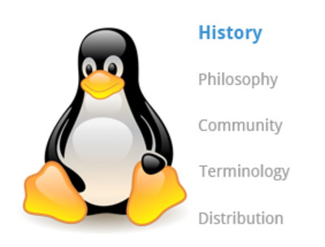
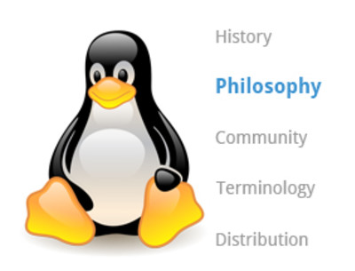
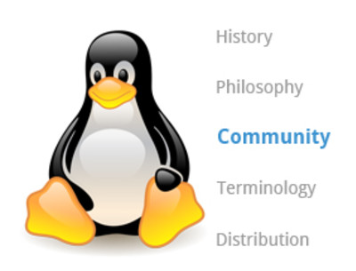
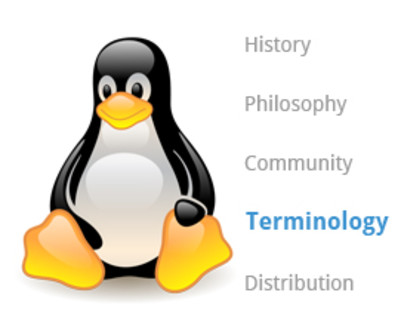
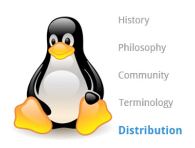
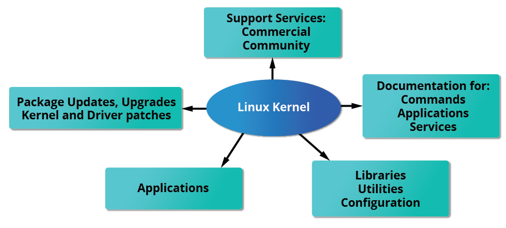
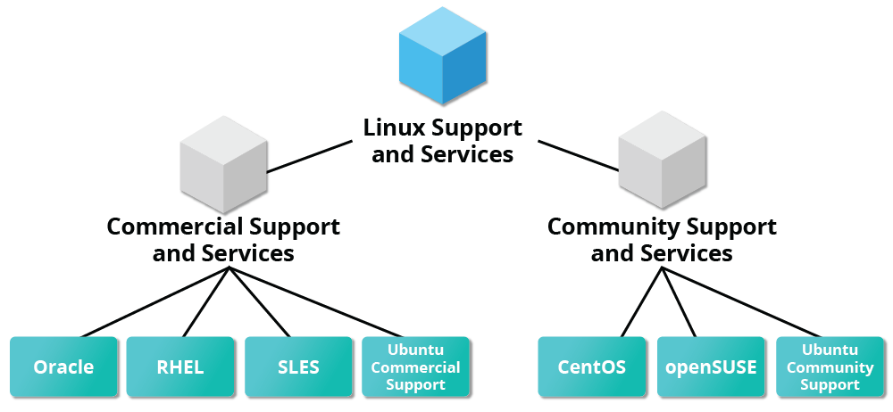

# The Power of Linux

## Three Important Pieces of Context

Please keep in mind the following:

1. **Things change in Linux**
No matter how hard we have worked to stay current, Linux is constantly evolving, both at the technical level (including kernel features) and at the distribution and interface level. So, please keep in mind while we have tried to be as up-to-date as possible at the time this course was released, there are likely to be changes and new features we have not discussed. This is unavoidable.

2. **We have repeated some things in the class material**
It is just about impossible in a course this comprehensive to never revisit topics that have previously been covered, and short reviews are helpful, so you do not have to go scouring through earlier sections to jog your memory. This is particularly true with system configuration items, like how to use sudo to gain temporary root privileges in as safe a manner as possible. We know we have done this, and, at least in most cases, it is by design, not by accident. If we did not do this, it would take a long time before we would know enough to perform useful tasks and work on lab exercises.

3. **We have tried to avoid holy wars**
There are many areas where there are strong preference disagreements in the Linux (and wider open source) community. Examples include the best editor: emacs vs. vi; the best graphical desktop: GNOME vs. KDE, etc. Often, we have chosen a particular alternative to emphasize just to keep things clean. For example, we talk much more about GNOME than KDE simply because it has a bigger user base and many more students will be using it, not because we are taking a position as to which is superior.

## Final Thoughts (1)

In order for you to get the most out of this course, we recommend that you have Linux installed on a machine that you can use throughout this course. You do not need to view the course material on a Linux machine (all you need is a browser). However, you will see that there are a lot of follow-along activities and labs that you will benefit from only if you can do them on your own machine. We have prepared a brief installation guide, "Preparing Your Computer for Linux Training" (see below), that helps you to select a Linux distribution to install, decide on whether you want to do a stand-alone pure Linux machine or a dual-boot one, whether to do a physical or virtual install, etc. And then guides through the steps. We will also discuss the installation procedure in detail in a later section.

We will not cover everything in comprehensive detail;  keep in mind most of the documentation in Linux is actually already on your system in the form of man pages, which we will discuss in great detail later. Whenever you do not understand something or want to know more about a command, program, topic, or utility, you can just type man **topic** at the command line. We will assume you are thinking this way and not constantly repeat, "For more information, look at the man page for **topic**".

On a related note, throughout the course, we use a shorthand that is common in the open source community. When referring to cases where the user has to make a choice of what to enter (e.g., name of a program or file), we use shorthand to like **insert file name here**. So beware, we are not actually suggesting that you type those words exactly, but that you substitute an appropriate file name or another string.

## Learning Objectives

By the end of this chapter, you should be able to:

- Discuss the history and philosophy of Linux.
- Describe the Linux community.
- Define the common terms associated with Linux.
- Discuss the components of a Linux distribution.

## Linux History Overview

Linux is an open source computer operating system, initially developed on and for Intel x86-based personal computers. It has been subsequently ported to an astoundingly long list of other hardware platforms, from tiny embedded appliances to the world's largest supercomputers.

In this section, we follow the surprising history of how Linux evolved from a project of one Finnish college student, into a massive effort with an enormous impact on today's world.

## Linux History

Linus Torvalds was a student in Helsinki, Finland, in 1991, when he started a project: writing his own operating system kernel. He also collected together and/or developed the other essential ingredients required to construct an entire operating system with his kernel at the center. It wasn't long before this became known as the Linux kernel. 

In 1992, Linux was re-licensed using the General Public License (GPL) by GNU (a project of the Free Software Foundation or FSF, which promotes freely available software), which enabled it to build a worldwide community of developers. By combining the kernel with other system components from the GNU project, numerous other developers created complete systems called Linux Distributions, which first appeared in the mid-90s.

## More About Linux History

The Linux distributions created in the mid-90s provided the basis for fully free (in the sense of freedom, not zero cost) computing and became a driving force in the open source software movement. In 1998, major companies like IBM and Oracle announced their support for the Linux platform and began major development efforts as well.

Today, Linux powers more than half of the servers on the Internet, the majority of smartphones (via the Android system, which is built on top of Linux), more than 90 percent of the public cloud workload, and all of the world’s most powerful supercomputers.

## Linux Philosophy Overview

Every successful project or organization needs an implicit or explicit philosophy that frames its objectives and projects its growth path. This section contains a description of the philosophy adopted by the Linux community and how it has impacted Linux's amazing evolution.

Linux is constantly enhanced and maintained by a network of developers from all over the world collaborating over the Internet, with Linus Torvalds at the head. Technical skills, a desire to contribute, and the ability to collaborate with others are the only qualifications for participating.

## Linux Philosophy

Linux borrows heavily from the well-established family of UNIX operating systems. It was written to be a free and open source alternative; at the time, UNIX was designed for computers much more powerful than PCs, and furthermore, it was quite expensive.

Files are stored in a hierarchical filesystem, with the top node of the system being the **root** or simply **"/"**. Whenever possible, Linux makes its components available via files or objects that look like files. Processes, devices, and network sockets are all represented by file-like objects and can often be worked with using the same utilities used for regular files. Linux is a fully multitasking (i.e., multiple threads of execution are performed simultaneously), multiuser operating system with built-in networking and service processes known as daemons in the UNIX world.

**NOTE**: Linux was inspired by UNIX, but it is not UNIX.

## Linux Community Overview

Suppose that, as part of your job, you need to configure a Linux file server, and you run into some difficulties. If you are not able to figure out the answer yourself or get help from a co-worker, the Linux community might just save the day!

There are many ways to engage with the Linux community, even if you are not a developer:

- Post queries on relevant discussion forums.
- Subscribe to discussion threads.
- Join local Linux groups that meet in your area.

## More About Linux Community

The Linux community is a far-reaching ecosystem consisting of developers, system administrators, users, and vendors who use many different forums to connect with one another. Among the most popular are:

Internet Relay Chat (IRC) software (such as WeeChat, HexChat, Pidgin, and XChat)
Online communities and discussion boards including Linux User Groups (both local and online)
Many collaborative projects hosted on services such as GitHub and GitLab
Newsgroups and mailing lists, including the Linux Kernel Mailing List
Community events, e.g., Hackathons, Install Fests, Open Source Summits, Embedded Linux Conferences, and many other conferences and get-togethers.
A portal to one of the most powerful online user communities can be found at linux.com. This site is hosted by The Linux Foundation and serves over one million unique visitors every month. It has active sections on:

News
Community discussion threads
Free tutorials and user tips.
We will refer several times in this course to relevant articles or tutorials on this site.

There are also many e-learning courses on Linux and other related technologies, such as this course on edX.  Many are no or low cost, and there are also more expensive training opportunities with live instructors, either in person or over the Internet.  The [Linux Foundation Training](https://trainingportal.linuxfoundation.org/learn/course/introduction-to-linux-lfs101/linux-philosophy-and-concepts/linux-community?page=3#:~:text=Linux%20Foundation%20Training) website offers many such courses in all these categories but is by no means the only place you can look.

## Linux Terminology Overview

When you start exploring Linux, you will soon come across some terms which may be unfamiliar, such as distribution, boot loader, desktop environment, etc. Before we proceed further, let's stop and take a look at some basic terminology used in Linux to help you get up to speed.

## Linux Distributions Overview

If you are building a product designed to run on Linux, project requirements will surely include making sure the project works properly on the most widely used Linux distributions. To accomplish this, you need to learn about the different components, services, and configurations associated with each distribution. We are about to look at how you would go about doing exactly that.

## Linux Distributions

So, what is a Linux distribution, and how does it relate to the Linux kernel?

The Linux kernel is the core of the operating system. A full Linux distribution consists of the kernel plus a number of other software tools for file-related operations, user management, and software package management. Each of these tools provides a part of the complete system. Each tool is often its own separate project, with its own developers working to perfect that piece of the system.

While the most recent Linux kernel (and earlier versions) can always be found in the Linux Kernel Archives, Linux distributions may be based on different kernel versions. For example, the very popular RHEL 8 distribution is based on the 4.18 kernel, which is not new, but is extremely stable, while the newer RHEL 9 distribution is based on the much later 5.14 kernel. Other distributions may move more quickly in adopting the latest kernel releases. It is important to note that the kernel is not an all-or-nothing proposition. For example, RHEL/CentOS has incorporated many of the more recent kernel improvements into their customized older versions, as have Ubuntu, openSUSE, Fedora, etc.

Examples of other essential tools and ingredients provided by distributions include the C/C++ and Clang compilers, the gdb debugger, the core system libraries applications need to link with in order to run, the low-level interface for drawing graphics on the screen, as well as the higher-level desktop environment, and the system for installing and updating the various components, including the kernel itself. And all distributions come with a rather complete suite of applications already installed.

## Services Associated with Distributions

The vast variety of Linux distributions are designed to cater to many different audiences and organizations according to their specific needs and tastes. However, large organizations, such as companies and governmental institutions, and other entities, tend to choose the major commercially-supported distributions from Red Hat, SUSE, and Canonical (Ubuntu).

CentOS and CentOS Stream are popular free (as in no cost) alternatives to Red Hat Enterprise Linux (RHEL) and are often used by organizations that are comfortable operating without paid technical support. Note that new versions of CentOS disappeared at the end of 2021 in favor of CentOS Stream. However, at least two new RHEL-derived substitutes, Alma Linux and Rocky Linux, have established a healthy foothold.

The RHEL variants, such as CentOS and AlmaLinux, are designed to be binary-compatible with RHEL; i.e., in most cases, binary software packages will install properly across the distributions.

Ubuntu and Fedora are widely used by developers and are also popular in the educational realm. Many commercial distributors, including Red Hat, Ubuntu, SUSE, and Oracle, provide long-term fee-based support for their distributions, as well as hardware and software certification. All major distributors provide update services for keeping your system primed with the latest security and bug fixes and performance enhancements, as well as provide online support resources.

## Chapter Summary

You have completed Chapter 3. Let’s summarize the key concepts covered:

- Linux borrows heavily from the UNIX operating system, with which its creators were well-versed.
- Linux accesses many features and services through files and file-like objects.
- Linux is a fully multi-tasking, multi-user operating system, with built-in networking and service processes known as daemons.
- Linux is developed by a loose confederation of developers from all over the world, collaborating over the Internet, with Linus - Torvalds at the head. Technical skill and a desire to contribute are the only qualifications for participating.
- The Linux community is a far reaching ecosystem of developers, vendors, and users that supports and advances the Linux operating system.
- Some of the common terms used in Linux are: kernel, distribution, boot loader, service, filesystem, X Window system, desktop environment, and command line.
- A full Linux distribution consists of the kernel plus a number of other software tools for file-related operations, user management, and software package management.

