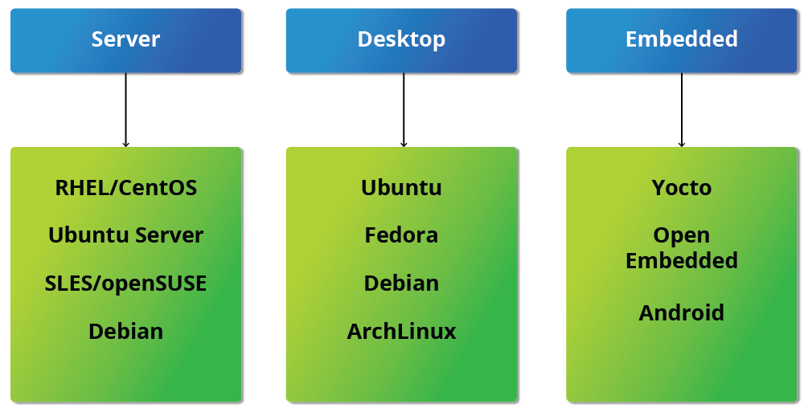

# Linux Basics and System Startup

## Learning Objectives

By the end of this chapter, you should be able to:

- Identify Linux filesystems.
- Identify the differences between partitions and filesystems.
- Describe the boot process.
- Install Linux on a computer.

## The Boot Process

The Linux boot process is the procedure for initializing the system. It consists of everything that happens from when the computer power is first switched on until the user interface is fully operational.

Having a good understanding of the steps in the boot process may help you with troubleshooting problems, as well as with tailoring the computer's performance to your needs.

On the other hand, the boot process can be rather technical, and you can start using Linux without knowing all the details.

**NOTE**: You may want to come back and study this section later, if you want to first get a good feel for how to use a Linux system.


## BIOS - The First Step

While Linux runs on many kinds of hardware, we will concentrate on the x86 family, which is the basis of almost all desktop and laptop PCs. Starting an x86-based Linux system involves a number of steps. When the computer is powered on, the Basic Input/Output System (BIOS) initializes the hardware, including the screen and keyboard, and tests the main memory. This process is also called POST (Power On Self Test).

The BIOS software is stored on a read-only memory (ROM) chip on the motherboard. After this, the remainder of the boot process is controlled by the operating system (OS).


## Master Boot Record (MBR), EFI Partition, and Boot Loader

Once the POST is completed, system control passes from the BIOS to the boot loader. The boot loader is usually stored on one of the system’s storage devices, such as a hard disk or SSD drive, either in the boot sector (for traditional BIOS/MBR systems) or the EFI partition (for more recent (Unified) Extensible Firmware Interface or EFI/UEFI systems). Up to this stage, the machine does not access any mass storage media. Then, information on the date, time, and the most important peripherals are loaded from the CMOS values (after a technology used for the battery-powered memory store, which allows the system to keep track of the date and time even when it is powered off).

A number of boot loaders exist for Linux; the most common ones are GRUB (for GRand Unified Boot loader), ISOLINUX (for booting from removable media), and DAS U-Boot (for booting on embedded devices/appliances). Most Linux boot loaders can present a user interface for choosing alternative options for booting Linux and even other operating systems that might be installed. When booting Linux, the boot loader is responsible for loading the kernel image and the initial RAM disk or filesystem (which contains some critical files and device drivers needed to start the system) into memory.


## Boot Loader in Action

The boot loader has two distinct stages:

For systems using the BIOS/MBR method, the boot loader resides at the first sector of the hard disk, also known as the Master Boot Record (MBR). The size of the MBR is just 512 bytes. In this stage, the boot loader examines the partition table and finds a bootable partition. Once it finds a bootable partition, it then searches for the second stage boot loader, for example GRUB, and loads it into RAM (Random Access Memory). For systems using the EFI/UEFI method, UEFI firmware reads its Boot Manager data to determine which UEFI application is to be launched and from where (i.e., from which disk and partition the EFI partition can be found). The firmware then launches the UEFI application, for example GRUB, as defined in the boot entry in the firmware's boot manager. This procedure is more complicated but more versatile than the older MBR methods.

The second stage boot loader resides under **/boot**. A splash screen is displayed, which allows us to choose which operating system (OS) and/or kernel to boot. After the OS and kernel are selected, the boot loader loads the kernel of the operating system into RAM and passes control to it. Kernels are almost always compressed, so the first job they have is to uncompress themself. After this, it will check and analyze the system hardware and initialize any hardware device drivers built into the kernel.

## The Initial RAM Disk

The **initramfs** filesystem image contains programs and binary files that perform all actions needed to mount the proper root filesystem, including providing the kernel functionality required for the specific filesystem that will be used, and loading the device drivers for mass storage controllers, by taking advantage of the **udev** system (for user device), which is responsible for figuring out which devices are present, locating the device drivers they need to operate properly, and loading them. After the root filesystem has been found, it is checked for errors and mounted.

The **mount** program instructs the operating system that a filesystem is ready for use and associates it with a particular point in the overall hierarchy of the filesystem (the **mount point**). If this is successful, the initramfs is cleared from RAM, and the init program on the root filesystem (/sbin/init) is executed.

init handles the mounting and pivoting over to the final real root filesystem. If special hardware drivers are needed before the mass storage can be accessed, they must be in the initramfs image.


## Text-Mode Login

Near the end of the boot process, **init** starts a number of text-mode login prompts. These enable you to type your username, followed by your password, and to eventually get a command shell. However, if you are running a system with a graphical login interface, you will not see these at first.

As you will learn in Chapter 8. Command Line Operations, the terminals which run the command shells can be accessed using the **ALT** key plus a **function** key. Most distributions start six text terminals and one graphics terminal starting with **F1** or **F2**. Within a graphical environment, switching to a text console requires pressing **CTRL-ALT** + the appropriate function key (with **F7** or **F1** leading to the **GUI**).

Usually, the default command shell is **bash** (the GNU Bourne Again Shell), but there are a number of other advanced command shells available. The shell prints a text prompt, indicating it is ready to accept commands; after the user types the command and presses Enter, the command is executed, and another prompt is displayed after the command is done.


# Kernel, init and Services

## The Linux Kernel

The boot loader loads both the kernel and an initial RAM–based file system (initramfs) into memory, so it can be used directly by the kernel.

When the kernel is loaded in RAM, it immediately initializes and configures the computer’s memory and also configures all the hardware attached to the system. This includes all processors, I/O subsystems, storage devices, etc. The kernel also loads some necessary user space applications.


## /sbin/init and Services

Once the kernel has set up all its hardware and mounted the root filesystem, the kernel runs **/sbin/init**. This then becomes the initial process, which then starts other processes to get the system running. Most other processes on the system trace their origin ultimately to init; exceptions include the so-called kernel processes. These are started by the kernel directly, and their job is to manage internal operating system details.

Besides starting the system, **/init** is responsible for keeping the system running and for shutting it down cleanly. One of its responsibilities is to act when necessary as a manager for all non-kernel processes; it cleans up after them upon completion, and restarts user login services as needed when users log in and out, and does the same for other background system services.

Traditionally, this process startup was done using conventions that date back to the 1980s and the System V variety of UNIX. This serial process (called **/SysVinit**) had the system pass through a sequence of **/runlevels** containing collections of scripts that start and stop services. Each runlevel supported a different mode of running the system. Within each runlevel, individual services could be set to run, or to be shut down if running.

However, all major distributions have moved away from this sequential method of system initialization, although they usually can emulate many System V utilities for compatibility purposes. Next, we discuss the new methods, of which **systemd** has become dominant.


## Startup Alternatives

**SysVinit** viewed things as a serial process, divided into a series of sequential stages. Each stage required completion before the next could proceed. Thus, startup did not easily take advantage of the **parallel processing**  that could be done with the multiple processors or cores found on modern systems.

Furthermore,  starting up and rebooting were seen as relatively rare events; exactly how long they took was not considered important. This is no longer true, especially with mobile devices and embedded Linux systems. Some modern methods, such as the use of containers, can require almost instantaneous startup times. Thus, systems now require methods with faster and enhanced capabilities. Finally, the older methods required rather complicated startup scripts, which were difficult to keep universal across distribution versions, kernel versions, architectures, and types of systems. The two main alternatives developed were:

**Upstart**

- Developed by Ubuntu and first included in 2006
- Adopted in Fedora 9 (in 2008) and in RHEL 6 and its clones

**systemd**

- Adopted by Fedora first (in 2011)
- Adopted by RHEL 7 and SUSE
- Replaced Upstart in Ubuntu 16.04

While the migration to **systemd** was rather controversial, it has been adopted by all major distributions, and so we will not discuss the older System V method or Upstart, which has become a dead end. Regardless of how one feels about the controversies or the technical methods of **systemd**, almost universal adoption has made learning how to work on Linux systems simpler, as there are fewer differences among distributions. We enumerate **systemd** features next.

## systemd Features

Systems with **systemd** start up faster than those with earlier **init** methods. This is largely because it replaces a serialized set of steps with aggressive parallelization techniques, which permits multiple services to be initiated simultaneously.

Complicated startup shell scripts are replaced with simpler configuration files, which enumerate what has to be done before a service is started, how to execute service startup, and what conditions the service should indicate have been accomplished when startup is finished. One thing to note is that **/sbin/init** now just points to **/lib/systemd/systemd**; i.e. **systemd** takes over the init process.

One **systemd** command (**systemctl**) is used for most basic tasks. While we have not yet talked about working at the command line, here is a brief listing of its use:

- Starting, stopping, restarting a service (using **httpd**, the Apache web server, as an example) on a currently running system:

```bash
  sudo systemctl start|stop|restart httpd.service
```

- Enabling or disabling a system service from starting up at system boot:

```bash
  sudo systemctl enable|disable httpd.service
```

- Checking on the status of a service:

```bash
  sudo systemctl status httpd.service
```

In most cases, the .service can be omitted. There are many technical differences with older methods that lie beyond the scope of our discussion.


# Linux Filesystem Basics

## Linux Filesystems

Libraries separate books and other media into multiple sections; this organization will depend on the subject matter, audience, media type, and frequency of retrieval. The same concept applies to a filesystem, which is the embodiment of a method of storing and organizing arbitrary collections of data in a human-usable form.

Different types of filesystems supported by Linux:

- Conventional disk filesystems: **ext3**, **ext4**, **XFS**, **Btrfs**, **JFS**, **NTFS**, **vfat**, **exfat**, etc.
- Flash storage filesystems: **ubifs**, **jffs2**, **yaffs**, etc.
- Database filesystems
- Special purpose filesystems: **procfs**, **sysfs**, **tmpfs**, **squashfs**, **debugfs**, **fuse**, etc.

This section will describe the standard filesystem layout shared by most Linux distributions.

## Partitions and Filesystems

A partition is a  dedicated subsection of physical storage media.  Historically this meant a physically contiguous portion of a hard disk; today’s storage devices can be more complicated, but we still think of a partition as a fixed area to be treated as a whole.

A filesystem is just a method of storing and accessing files.

One can think of a partition as a container in which a filesystem resides. However, in some circumstances, a filesystem can span more than one partition if one uses symbolic links, which we will discuss much later.

Table: A comparison between filesystems in Windows and Linux

| Feature                          | Windows   | Linux                  |
| -------------------------------- | --------- | ---------------------- |
| Partition                        | Disk1     | /dev/sda1              |
| Filesystem type                  | NTFS/VFAT | EXT3/EXT4/XFS/BTRFS... |
| Mounting parameters              | DriveLetter | MountPoint             |
| Base folder (where OS is stored) | C:\       | /                      |

## The Filesystem Hierarchy Standard

Linux systems store their important files according to a standard layout called the Filesystem Hierarchy Standard (FHS), which has long been maintained by the Linux Foundation. For more information, take a look at the following document: **"[Filesystem Hierarchy Standard](https://refspecs.linuxfoundation.org/FHS_3.0/fhs-3.0.pdf)"**" created by LSB Workgroup. Having a standard is designed to ensure that users, administrators, and developers can move between distributions without having to re-learn how the system is organized.

Linux uses the **‘/’** character to separate paths **(as sis UNIX unlike Windows, which uses ‘\’)** and does not have drive letters. Multiple drives and/or partitions are mounted as directories in the single filesystem. Removable media such as USB drives and CDs, and DVDs will show up as mounted at **/run/media/yourusername/disklabel** for recent Linux systems or under **/media** for older distributions. For example, if your username is student, a USB pen drive labeled **FEDORA** might end up being found at **/run/media/student/FEDORA**, and a file **README.txt** on that disc would be at **/run/media/student/FEDORA/README.txt**.


## More About the Filesystem Hierarchy Standard

All Linux filesystem names are case-sensitive, so **/boot**, **/Boot**, and **/BOOT** represent three different directories (or folders). Many distributions distinguish between core utilities needed for proper system operation and other programs, and place the latter in directories under **/usr** (think user). To get a sense for how the other programs are organized, find the **/usr** directory in the diagram from the previous page and compare the subdirectories with those that exist directly under the system root directory **(/)**.


# Linux Distribution Installation

## Choosing a Linux Distribution

Determining which Linux distribution to deploy requires thoughtful planning. The figure shows some, but not all, choices. Note that many embedded Linux systems use custom-crafted contents rather than Android or Yocto.



## Questions to Ask When Choosing a Distribution

Some questions worth thinking about before deciding on a distribution include:

- What is the main function of the system (server or desktop)?
- What types of packages are important to the organization? For example, web server, word processing, etc.
- How much storage space is required, and how much is available? For example, when installing Linux on an embedded device, space is usually constrained.
- How often are packages updated?
- How long is the support cycle for each release? For example, LTS releases have long-term support.
- Do you need kernel customization from the vendor or a third party?
- What hardware are you running on? For example, it might be X86, RISC-V, ARM, PPC, etc.
- Do you need long-term stability? Or can you accept (or need) a more volatile cutting-edge system running the latest software versions?

## Linux Installation

## Installation Steps

## Planning

The partition layout is best decided at the time of installation; it can be difficult to change later. While Linux systems handle multiple partitions by mounting them at specific points in the filesystem, and you can always modify the design later, it is always easier to try and get it right to begin with.


Nearly all Linux distribution installers provide a reasonable default layout, with either all space dedicated to normal files on one big partition and a smaller swap partition or with separate partitions for some space-sensitive areas like /home and /var. You may need to override the defaults and do something different if you have special needs or if you want to use more than one disk.

## Software Choices

All installations include the bare minimum software for running a Linux distribution.

Distributions also provide options for adding categories of software. Common applications (such as the Firefox web browser and LibreOffice office suite), developer tools (like the vi and emacs text editors, which we will explore later in this course), and other popular services (such as the Apache web server tools or MySQL database) are usually included. In addition, for any system with a graphical desktop, a chosen desktop (such as GNOME or KDE) is installed by default.

Modern distributions tend to do a simple and quick install first and then let you make these choices once the system is running in at least some basic fashion. In earlier times, there were a lot of choices to make during first installation, which could be intimidating and confusing to a new user, and also make the install take a much longer time.

All installers set up some initial security features on the new system. One basic step consists of setting the password for the superuser (root) and setting up an initial user. In some cases (such as with Fedora and Ubuntu), only an initial user is set up; direct root login is not configured, and root access requires logging in first as a normal user and then using sudo, as we will describe later. Some distributions will also install more advanced security frameworks, such as SELinux or AppArmor. For example, all Red Hat-based systems, including Fedora and CentOS, always use SELinux by default, and Ubuntu comes with AppArmor up and running.

## Install Source

Like other operating systems, Linux distributions are provided on removable media such as USB drives and CDs or DVDs. Most Linux distributions also support booting a small image and downloading the rest of the system over the network. These small images are usable on media, or as network boot images, in which case it is possible to perform an install without using any local media.

Many installers can do an installation completely automatically, using a configuration file to specify installation options. This file is called a Kickstart file for Red Hat-based systems, an AutoYAST profile for SUSE-based systems, and a Preseed file for Debian-based systems.

Each distribution provides its own documentation and tools for creating and managing these files.


## The Process

The actual installation process is pretty similar for all distributions.

After booting from the installation media, the installer starts and asks questions about how the system should be set up. These questions are skipped if an automatic installation file is provided. Then, the installation is performed.

Finally, the computer reboots into the newly-installed system, and additional configuration questions are asked.

Most installers have the option of downloading and installing updates as part of the installation process; this requires Internet access. Otherwise, the system uses its normal update mechanism to retrieve those updates after the installation is done.

NOTE: We will be demonstrating the installation process for two of the three Linux distribution families we cover in this course. You can view a demonstration for the distribution type of your choice.

## The Warning

> [!CAUTION]
> **IMPORTANT!**
>
> The demonstrations show how to install Linux directly on your machine, **erasing everything that was there**. While the demonstrations will not alter your computer, following these procedures in real life will erase all current data.


The Linux Foundation has a document: "Preparing Your Computer for Linux Training" (see Chapter 3 > Introduction > Final Thoughts (1) to access the PDF file) that describes alternate methods of installing Linux without overwriting existing data. You may want to consult it, if you need to preserve the information on your hard disk.

These alternate methods are:

- Re-partitioning your hard disk to free up enough room to permit dual boot (side-by-side) installation of Linux, along with your present operating system.
- Using a host machine hypervisor program (such as VMWare's products or Oracle Virtual Box) to install a client Linux Virtual Machine.
- Booting off of and using a Live CD or USB stick and not writing to the hard disk at all.

The first method is sometimes complicated and should be done when your confidence is high and you understand the steps involved. The second and third methods are quite safe and make it difficult to damage your system.

## Chapter Summary

You have completed Chapter 4. Let’s summarize the key concepts covered:

- A partition is a logical part of the disk.
- A filesystem is a method of storing/finding files on a hard disk.
- By dividing the hard disk into partitions, data can be grouped and separated as needed. When a failure or mistake occurs, only the data in the affected partition will be damaged, while the data on the other partitions will likely survive.
- The boot process has multiple steps, starting with BIOS, which triggers the boot loader to start up the Linux kernel. From there, the initramfs filesystem is invoked, which triggers the init program to complete the startup process.
- Determining the appropriate distribution to deploy requires that you match your specific system needs to the capabilities of the different distributions.