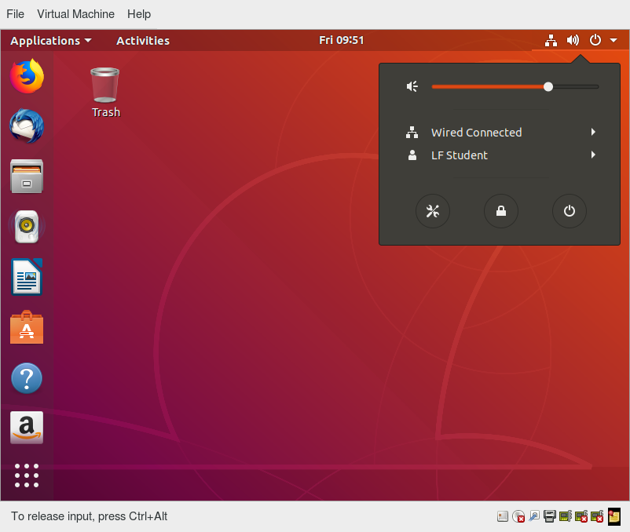

# Graphical Interface

## Learning Objectives

By the end of this chapter, you should be able to:

- Manage graphical interface sessions.
- Perform basic operations using the graphical interface.
- Change the graphical desktop to suit your needs.

# Graphical Desktop

You can use either a Command Line Interface (CLI) or a Graphical User Interface (GUI) when using Linux. To work at the CLI, you have to remember which programs and commands are used to perform tasks, and how to quickly and accurately obtain more information about their use and options. On the other hand, using the GUI is often quick and easy. It allows you to interact with your system through graphical icons and screens. For repetitive tasks, the CLI is often more efficient, while the GUI is easier to navigate if you do not remember all the details or do something only rarely.

We will learn how to manage sessions using the GUI for the three Linux distribution families that we cover the most in this course: Red Hat (CentOS, Fedora), SUSE (openSUSE), and Debian (Ubuntu, Mint). Since we are using the GNOME-based variant of openSUSE rather than the KDE-based one, all are actually quite similar. If you are using KDE (or other Linux desktops such as XFCE), your experience will vary somewhat from what is shown, but not in any intrinsically difficult way, as user interfaces have converged to certain well-known behaviors on modern operating systems. In subsequent sections of this course we will concentrate in great detail on the command line interface, which is pretty much the same on all distributions.

## X Window System

Loading the graphical desktop is one of the final steps in the boot process of a Linux desktop. Historically, this was known as the X Windows System, often just called X.

A service called the Display Manager keeps track of the displays being provided and loads the X server (so-called, because it provides graphical services to applications, sometimes called X clients). The display manager also handles graphical logins and starts the appropriate desktop environment after a user logs in.

X is rather old software; it dates back to the mid-1980s and, as such, has certain deficiencies on modern systems (for example, with security), as it has been stretched rather far from its original purposes. A newer system, known as Wayland, is gradually superseding it and is the default display system for Fedora, RHEL, and other recent distributions.  For the most part, it looks just like X to the user, although under the hood it is quite different.

## More About the Graphical Desktop

A desktop environment consists of a session manager, which starts and maintains the components of the graphical session, and the window manager, which controls the placement and movement of windows, window title-bars, and controls.

Although these can be mixed, generally a set of utilities, session manager, and window manager are used together as a unit, and together provide a seamless desktop environment.

If the display manager is not started by default in the default runlevel, you can start the graphical desktop different way, after logging on to a text-mode console, by running startx from the command line. Or, you can start the display manager (gdm, kdm, xdm, etc.) manually from the command line. This differs from running startx as the display managers will project a sign in screen. We discuss them next.

## GUI Startup

When you install a desktop environment, the display manager starts at the end of the boot process. It is responsible for starting the graphics system, logging in the user, and starting the user’s desktop environment. You can often select from a choice of desktop environments when logging in to the system.

The default display manager for GNOME is called gdm. Another popular display manager is kdm, associated with KDE.

## GNOME Desktop Environment

GNOME is a popular desktop environment with an easy-to-use graphical user interface. It is bundled as the default desktop environment for most Linux distributions, including Red Hat Enterprise Linux (RHEL), Fedora, CentOS, SUSE Linux Enterprise, Ubuntu, and Debian. GNOME has menu-based navigation and is sometimes an easy transition to accomplish for Windows users. However, the look and feel can be quite different across distributions, even if they are all using GNOME.

Another common desktop environment very important in the history of Linux and also widely used is KDE, which has often been used in conjunction with SUSE and openSUSE. Other alternatives for a desktop environment include Unity (present on older Ubuntu but still based on GNOME), XFCE, and LXDE. As previously mentioned, most desktop environments follow a similar structure to GNOME, and we will restrict ourselves mostly to it to keep things less complex.

## Graphical Desktop Background

Each Linux distribution comes with its own set of desktop backgrounds. You can change the default by choosing a new wallpaper or selecting a custom picture to be set as the desktop background. If you do not want to use an image as the background, you can select a color to be displayed on the desktop instead.

In addition, you can also change the desktop theme, which changes the look and feel of the Linux system. The theme also defines the appearance of application windows.

We will learn how to change the desktop background and theme.

## Customizing the Desktop Background

To change the background, you can right-click anywhere on the desktop and choose Change Background.

## gnome-tweaks

Most common settings, both personal and system-wide, are to be found by clicking in the upper right-hand corner, on either a gear or other obvious icon, depending on your Linux distribution.

However, there are many settings which many users would like to modify which are not thereby accessible; the default settings utility is unfortunately rather limited in modern GNOME-based distributions. Unfortunately, the quest for simplicity has actually made it difficult to adapt your system to your tastes and needs.  

Fortunately, there is a standard utility, gnome-tweaks, which exposes many more setting options. It also permits you to easily install extensions by external parties. Not all Linux distributions install this tool by default, but it is always available (older distributions used the name gnome-tweak-tool). You may have to run it by hitting Alt-F2 and then typing in the name. You may want to add it to your Favorites list, as we shall discuss.

As discussed in the next chapter, some recent distributions have taken most of the functionality out of this tool and placed it in a new one called gnome-extensions-app.

In the screenshot below, the keyboard mapping is being adjusted so the useless CapsLock key can be used as an additional Ctrl key; this saves users who use Ctrl a lot (such as emacs aficionados) from getting physically damaged by pinkie strain.

## Changing the Theme

The visual appearance of applications (the buttons, scroll bars, widgets, and other graphical components) are controlled by a theme. GNOME comes with a set of different themes which can change the way your applications look.

The exact method for changing your theme may depend on your distribution. For many GNOME-based distributions, you can simply run gnome-tweaks, as shown in the screenshot from Ubuntu. However, as mentioned earlier, if you don't find it there, you will need to look at gnome-extensions-app, which can now sometimes configure themes. This requires installing even more software and going to external websites, so it is unlikely to be seen as an improvement by many users.

There are other options to get additional themes beyond the default selection. You can download and install themes from GNOME's Wiki website.

# Session Management

## Logging In and Out

The next screen shows a demonstration for logging in and out on the major Linux distribution families we concentrate on in this course. Note that evolution has brought us to a stage where it little matters which distribution you choose, as they are all rather similar.

## Locking the Screen

It is often a good idea to lock your screen to prevent other people from accessing your session while you are away from your computer.

**NOTE**: This does not suspend the computer; all your applications and processes continue to run while the screen is locked.

There are two ways to lock your screen:

- Using the graphical interface
Clicking in the upper-right corner of the desktop, and then clicking on the lock icon.
- Using the keyboard shortcut **SUPER-L** (or **SUPER-Escape**)
(The **SUPER** key is also known as the **Windows** key).
The keyboard shortcut for locking the screen can be modified by altering keyboard settings, the exact prescription varying by distribution, but not hard to ascertain.

To re-enter the desktop session you just need to provide your password again.

The screenshot below shows how to lock the screen for Ubuntu. The details vary little in modern distributions.

## Switching Users

Linux is a true multi-user operating system, which allows more than one user to be simultaneously logged in. If more than one person uses the system, for each person must have their own user account and password. This allows for individualized settings, home directories, and other files and protects against both accidental and malicious corruption. Users can take turns using the machine, while keeping everyone's sessions alive, or even be logged in simultaneously through the network.

**NOTE**: The next screens show a demonstration and Try-It-Yourself activity for changing users on a Linux system.

## Shutting Down and Restarting

Besides normal daily starting and stopping of the computer, a system restart may be required as part of certain major system updates, generally only those involving installing a new Linux kernel.

Initiating the shutdown process from the graphical desktop is rather trivial on all current Linux distributions, with very little variation. We will discuss later how to do this from the command line, using the **shutdown** command.

In all cases, you click on either a settings (gear) or a power icon and follow the prompts.

## Shutting Down and Restarting on GNOME

To shut down the computer in any recent GNOME-based Linux distribution, perform the following steps:

1. Click either the Power or the Gear icon in the upper-right corner of the screen.
2. Click on Power Off, Restart, or Cancel. If you do nothing, the system will shut down in 60 seconds.

Shutdown, reboot, and logout operations will ask for confirmation before going ahead. This is because many applications will not save their data properly when terminated this way.

Always save your documents and data before restarting, shutting down, or logging out.

## Suspending

All modern computers support **Suspend** (or **Sleep**) **Mode** when you want to stop using your computer for a while. Suspend Mode saves the current system state and allows you to resume your session more quickly while remaining on, but uses very little power in the sleeping state. It works by keeping your system’s applications, desktop, and so on, in system RAM, but turning off all of the other hardware. This shortens the time for a full system start-up as well as conserves battery power. One should note that modern Linux distributions actually boot so fast that the amount of time saved is often minor.

## Suspending the System

To suspend the system, the procedure starts the same as that for shutdown or locking the screen.

The method is quite simple and universal in most recent GNOME-based distributions. If you click on the Power icon and hold for a short time and release, you will get the double line icon displayed below, which you then click to suspend the system. Some distributions, including Ubuntu, may still show a separate Suspend icon instead of using the above method.

**NOTE**: To wake your system and resume your session, move the mouse or press any button on the keyboard. The system will wake up with the screen locked, just as if you had manually locked it; type in your password to resume.

# Basic Operations

Even experienced users can forget the precise command that launches an application, or exactly what options and arguments it requires. Fortunately, Linux allows you to quickly open applications using the graphical interface.

Applications are found at different places in Linux (and within GNOME):

- From the Applications menu in the upper-left corner.
- From the Activities menu in the upper-left corner.
- In some Ubuntu versions, from the Dash button in the upper-left corner.
- For KDE, and some other environments, applications can be opened from the button in the lower-left corner.

On the following pages you will learn how to perform basic operations in Linux using the graphical interface.

## Locating Applications

Unlike other operating systems, the initial install of Linux usually comes with a wide range of applications and software archives that contain thousands of programs that enable you to accomplish a wide variety of tasks with your computer. For most key tasks, a default application is usually already installed. However, you can always install more applications and try different options.

For example, Firefox is popular as the default browser in many Linux distributions, while Epiphany, Konqueror, and Chromium (the open source base for Google Chrome) are usually available for install from software repositories. Proprietary web browsers, such as Opera and Chrome, are also available.

Locating applications from the GNOME and KDE menus is easy, as they are neatly organized in functional submenus.

## Default Applications

Multiple applications are available to accomplish various tasks and to open a file of a given type. For example, you can click on a web address while reading an email and launch a browser such as Firefox or Chrome.

To set default applications, enter the Settings menu (on all recent Linux distributions) and then click on either Default Applications or Details > Default Applications. The exact list will vary from what is shown here in the Ubuntu screenshot according to what is actually installed and available on your system.

## File Manager

Each distribution implements the **Nautilus** (**File Manager**) utility, which is used to navigate the file system. It can locate files and, when a file is clicked upon, either it will run if it is a program, or an associated application will be launched using the file as data. This behavior is completely familiar to anyone who has used other operating systems.

To start the file manager you will have to click on its icon (a file cabinet) which is easily found, usually under Favorites or Accessories. It will have the name Files.

This will open a window with your **Home** directory displayed. The left panel of the File Manager window holds a list of commonly used directories, such as **Desktop, Documents, Downloads and Pictures**.

You can click the magnifying glass icon on the top-right to search for files or directories (folders).

## Home Directories

The File Manager lets you access different locations on your computer and the network, including the **Home** directory, **Desktop, Documents, Pictures**, and other **Other Locations**.

Every user with an account on the system will have a home directory, usually created under /home, and usually named according to the user, such as **/home/student**.

By default, files the user saves will be placed in a directory tree starting there. Account creation, whether during system installation or at a later time, when a new user is added, also induces default directories to be created under the user's **Home** directory, such as **Documents, Desktop**, and **Downloads**.

In the screenshot shown for Ubuntu, we have chosen the list format and are also showing hidden files (those starting with a period). See if you can do the same on your distribution.

## Viewing Files

The File Manager allows you to view files and directories in more than one way.

You can switch between the Icons and List formats, either by clicking the familiar icons in the top bar, or you can press **CTRL-1** or **CTRL-2** respectively.

In addition, you can also arrange the files and directories by name, size, type, or modification date for further sorting. To do so, click View and select Arrange Items.

Another useful option is to show hidden files (sometimes imprecisely called system files), which are usually configuration files that are hidden by default and whose name starts with a dot. To show hidden files, select Show Hidden Files from the menu or press **CTRL-H**.

The file browser provides multiple ways to customize your window view to facilitate easy drag and drop file operations. You can also alter the size of the icons by selecting Zoom In and Zoom Out under the View menu.

## Searching for Files

The File Manager includes a great search tool inside the file browser window.

- Click Search in the toolbar (to bring up a text box).
- Enter the keyword in the text box. This causes the system to perform a recursive search from the current directory for any file or directory which contains a part of this keyword.

To open the File Manager from the command line, on most systems simply type **nautilus**.

The shortcut key to get to the search text box is **CTRL-F**. You can exit the search text box view by clicking the Search button or **CTRL-F** again.

Another quick way to access a specific directory is to press **CTRL-L**, which will give you a Location text box to type in a path to a directory.

## More About Searching for Files

You can refine your search beyond the initial keyword by providing dropdown menus to further filter the search.

1. Based on Location or File Type, select additional criteria from the dropdown.
2. To regenerate the search, click the Reload button.
3. To add multiple search criteria, click the + button and select Additional Search Criteria.

For example, if you want to find a PDF file containing the word "Linux" in your home directory, navigate to your **Home** directory and search for the word "Linux". You should see that the default search criterion limits the search to your **Home** directory already. To finish the job, click the + button to add another search criterion, select File Type for the type of criterion, and select PDF under the File Type dropdown.

## Editing a File

Editing any text file through the graphical interface is easy in the GNOME desktop environment. Simply double-click the file on the desktop or in the Nautilus file browser window to open the file with the default text editor.

The default text editor in GNOME is **gedit**. It is simple yet powerful, ideal for editing documents, making quick notes, and programming. Although **gedit** is designed as a general-purpose text editor, it offers additional features for spell-checking, highlighting, file listings, and statistics.

You will learn much more about using text editors in a later chapter.

## Removing a File

Deleting a file in Nautilus will automatically move the deleted files to the **.local/share/Trash/files/**. directory (a trash can of sorts) under the user's home directory. There are several ways to delete files and directories using Nautilus.

1. Select all the files and directories that you want to delete.
2. Press **.CTRL-Delete**. on your keyboard, or right-click the file.
3. Select Move to Trash.

Note that you may have a Delete Permanently option which bypasses the trash folder, and that this option may be visible all the time or only in list (rather than) icon mode.

## More About Removing a File

To permanently delete a file:

1. On the left panel inside a Nautilus file browser window, right-click on the **Trash** directory.
2. Select Empty Trash.

Alternatively, select the file or directory you want to permanently delete and press **Shift-Delete**.

As a precaution, you should never delete your Home directory, as doing so will most likely erase all your GNOME configuration files and possibly prevent you from logging in. Many personal system and program configurations are stored under your home directory.

## Chapter Summary
You have completed Chapter 5. Let's summarize the key concepts covered:

- GNOME is a popular desktop environment and graphical user interface that runs on top of the Linux operating system.
- The default display manager for GNOME is called gdm.
- The gdm display manager presents the user with the login screen, which prompts for the login username and password.
- Logging out through the desktop environment kills all processes in your current X session and returns to the display manager login screen.
- Linux enables users to switch between logged-in sessions.
- Suspending puts the computer into sleep mode.
- For each key task, there is generally a default application installed.
- Every user created in the system will have a home directory.
- The Places menu contains entries that allow you to access different parts of the computer and the network.
- Nautilus gives three formats to view files.
- Most text editors are located in the Accessories submenu.
- Each Linux distribution comes with its own set of desktop backgrounds.
- GNOME comes with a set of different themes which can change the way your applications look.