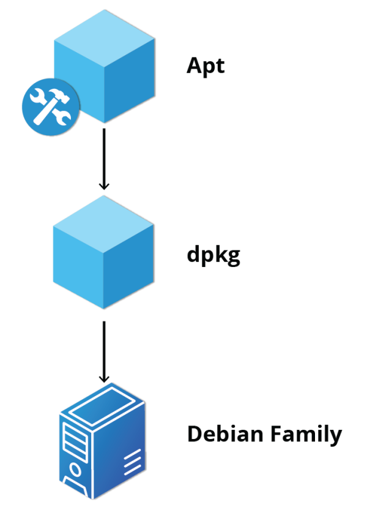

# System Configuration from Graphical Interface

## Learning Objectives

By the end of this chapter, you should be able to:

- Apply system, display, and date and time settings using the System Settings panel.
- Track the network settings and manage connections using Network Manager in Linux.
- Install and update software in Linux from a graphical interface.

**NOTE**: 
>We will revisit all these tasks later, when we discuss how to accomplish them from the command line interface.

# System, Display, Date and Time Settings

## System Settings

The System Settings panel allows you to control most of the basic configuration options and desktop settings, such as specifying the screen resolution, managing network connections, or changing the date and time of the system.

For the GNOME Desktop Manager, one clicks on the upper right-hand corner and then selects the tools image (screwdriver crossed with a wrench or a gear). Depending on your distribution, you may find other ways to get into the settings configuration as well. You will also find variation in the menu layout between Linux distributions and versions, so you may have to hunt for the settings you need to examine or modify.

## System Settings Menus

To get deeper into device configuration, one can click on the appropriate items on the previous menu in order to configure items like the display, the keyboard, the printers, etc. Clicking on Applications lets you configure the options relevant to many installed programs.

## gnome-tweaks

A lot of personalized configuration settings do not appear on the settings menus. Instead, you have to launch a tool called either **gnome-tweaks** (or **gnome-tweak-tool** on older Linux distributions). We have not really discussed working at the command line yet, but you can always launch a program such as this by doing **Alt-F2** and typing in the command. Some distributions have a link to the tweaks menus in the settings, but for some mysterious reason, many obscure this tool's existence, and it becomes hard to discover how to modify even rather basic desktop attributes and behavior.

Important things you can do with this tool include selecting a **theme**, configuring **extensions** which you can get from your distribution or download from the Internet, control fonts, modify the keyboard layout, and set which programs start when you login.

The most recent GNOME versions have removed a lot of the functionality of **gnome-tweaks**; extensions now have to be configured using a new app called **gnome-extensions-app**. The reasoning for this is obscure.

The screenshot here shows running **gnome-extensions-app** on a Red Hat system with quite a few extensions installed, but not all being used.

## Display Settings

Clicking on

>Settings > Displays (or Settings > Devices > Displays)

will expose the most common settings for changing the desktop appearance. You can also bring this up by right-clicking anywhere on the desktop and selecting Display Settings. These settings function independently of the specific display drivers you are running. The exact appearance will depend enormously on how many monitors you have and other factors, such as Linux distribution and particular version.

If your system uses a proprietary video card driver (usually from nVidia or AMD), you will probably have a separate configuration program for that driver. This program may give more configuration options, but may also be more complicated, and might require sysadmin (root) access. If possible, you should configure the settings in the Displays panel rather than with the proprietary program.

On systems utilizing the X Window system, the server which actually provides the GUI, uses **/etc/X11/xorg.conf** as its configuration file if it exists; In modern Linux distributions, this file is usually present only in unusual circumstances, such as when certain less common graphic drivers are in use. Changing this configuration file directly is usually for more advanced users.

## Setting Resolution and Configuring Multiple Screens

While your system will usually figure out the best resolution for your screen automatically, it may get this wrong in some cases, or you might want to change the resolution to meet your needs.

You can accomplish this using the Displays panel. The switch to the new resolution will be effective when you click Apply, and then confirm that the resolution is working. In case the selected resolution fails to work or you are just not happy with the appearance, the system will switch back to the original resolution after a short timeout. Once again, the exact appearance of the configuration screen will vary a lot between distributions and versions, but usually is rather intuitive and easy, once you find the configuration menus.

In most cases, the configuration for multiple displays is set up automatically as one big screen spanning all monitors, using a reasonable guess for screen layout. If the screen layout is not as desired, a check box can turn on mirrored mode, where the same display is seen on all monitors. Clicking on a particular monitor image lets you configure the resolution of each one, and whether they make one big screen, or mirror the same video, etc.

## Date and Time Settings

By default, Linux always uses Coordinated Universal Time (UTC) for its own internal timekeeping. Displayed or stored time values rely on the system time zone setting to get the proper time. UTC is similar to, but more accurate than, Greenwich Mean Time (GMT).

If you click on the time displayed on the top panel, you can adjust the format with which the date and time is shown; on some distributions, you can also alter the values.

The more detailed date and time settings can be selected from the Date & Time window in the System Settings Menu.

## Network Time Protocol

The **Network Time Protocol (NTP)** is the most popular and reliable protocol for setting the local time by consulting established Internet servers. Linux distributions always come with a working NTP setup, which refers to specific time servers run or relied on by the distribution. This means that no setup, beyond "on" or "off", is generally required for network time synchronization.

# Network Manager

## Network Configuration

All Linux distributions have network configuration files, but file formats and locations can differ from one distribution to another. Hand editing of these files can handle quite complicated setups, but is not very dynamic or easy to learn and use. **Network Manager** was developed to make things easier and more uniform across distributions. It can list all available networks (both wired and wireless), allow the choice of a wired, wireless, or mobile broadband network, handle passwords, and set up **Virtual Private Networks (VPNs)**. Except for unusual situations, it is generally best to let Network Manager establish your connections and keep track of your settings.

In this section, you will learn how to manage network connections, including wired and wireless connections, and mobile broadband and **VPN connections**.

## Wired and Wireless Connections

Wired connections usually do not require complicated or manual configuration. The hardware interface and signal presence are automatically detected, and then **Network Manager** sets the actual network settings via **Dynamic Host Configuration Protocol (DHCP)**.

For **static** configurations that do not use **DHCP**, manual setup can also be done easily through Network Manager. You can also change the **Ethernet Media Access Control (MAC)** address if your hardware supports it. The **MAC address** is a unique hexadecimal number of your network card.

Wireless networks are usually not connected by default. You can view the list of available wireless networks and see which one (if any) you are currently connected to by using Network Manager. You can then add, edit, or remove known wireless networks, and also specify which ones you want connected by default when present.

## Configuring Wireless Connections

To configure a wireless network in any recent **GNOME-based distribution**:

Click on the upper-right corner of the top panel, which brings up a settings and/or network window. While the exact appearance will depend on Linux distribution and version, it will always be possible to click on a **Wi-Fi** submenu, as long as the hardware is present. Here is an example from a RHEL 8 system:

Select the wireless network you wish to connect to. If it is a secure network, the first time it will request that you enter the appropriate password. By default, the password will be saved for subsequent connections.

If you click on Wi-Fi Settings, you will bring up the third screenshot. If you click on the Gear icon for any connection, you can configure it in more detail.

## Mobile Broadband and VPN Connections

You can set up a mobile broadband connection with **Network Manager**, which will launch a wizard to set up the connection details for each connection.

Once the configuration is done, the network is configured automatically each time the broadband network is attached.

Network Manager can also manage your **VPN** connections.

It supports many **VPN** technologies, such as native **IPSec, Cisco OpenConnect** (via either the Cisco client or a native open source client), **Microsoft PPTP**, and **OpenVPN**.

You might get support for **VPN** as a separate package from your distributor. You need to install this package if your preferred VPN is not supported.

# Installing and Updating Software

Each package in a Linux distribution provides one piece of the system, such as the Linux kernel, the **C** compiler, utilities for manipulating text or configuring the network, or for your favorite web browsers and email clients.

Packages often depend on each other. For example, because your email client can communicate using SSL/TLS, it will depend on a package that provides the ability to encrypt and decrypt SSL and TLS communication and will not install unless that package is also installed at the same time.

All systems have a lower-level utility that handles the details of unpacking a package and putting the pieces in the right places. However, most of the time, you will be working with a higher-level utility that knows how to download and install packages directly from the Internet and can manage dependencies and groups for you.

In this section, you will learn how to install and update software in Linux using the Debian packaging system (used by systems such as **Ubuntu** as well) and **RPM** packaging systems (which are used by both **Red Hat** and **SUSE family** systems). These are the main ones in use, although others work well for other distributions which have a smaller user base, such as **Archlinux** and **Gentoo**.

## Debian Packaging

Let’s look at the package management for the Debian family system.

**dpkg** is the underlying package manager for these systems. It can install, remove, and build packages. Unlike higher-level package management systems, it does not automatically download and install packages and satisfy their dependencies.

For **Debian-based** systems, the higher-level package management system is the **Advanced Package Tool (APT)** system of utilities. Generally, while each distribution within the **Debian family** uses **APT**, it creates its own user interface on top of it (for example, **apt and apt-get, synaptic, gnome-software, Ubuntu Software Center,** etc). Although apt repositories are generally compatible with each other, the software they contain generally is not. Therefore, most repositories target a particular distribution (like **Ubuntu**), and often software distributors ship with multiple repositories to support multiple distributions. Demonstrations are shown later in this section.

## Red Hat Package Manager (RPM)

**Red Hat Package Manager (RPM)** is the other package management system popular on **Linux** distributions. It was developed by **Red Hat** and adopted by a number of other distributions, including **Fedora, CentOS, SUSE/openSUSE, Oracle Linux**, and others.

The higher-level package manager differs between distributions. Red Hat family distributions historically use **RHEL/CentOS**, and **Fedora** uses **dnf**, while **SUSE family** distributions such as **openSUSE** also use **RPM** but use the **zypper interface**.

## openSUSE’s YaST Software Management

The **Yet another Setup Tool (YaST)** software manager is similar to other graphical package managers. It is an **RPM-based** application. You can add, remove, or update packages using this application very easily. To access the YaST software manager:

1. Click Activities
2. In the Search box, type "YaST"
3. Click the YaST icon
4. Click Software Management

You can also find **YaST** by clicking on Applications > Other-YaST, which is a strange place to put it.

**openSUSE’s YaST** software management application is similar to the graphical package managers in other distributions. A demonstration of the YaST software manager is shown later in this section.

## Chapter Summary

You have completed Chapter 6. Let's summarize the key concepts covered:

- You can control basic configuration options and desktop settings through the System Settings panel.
- Linux always uses Coordinated Universal Time (UTC) for its own internal time-keeping. You can set the date and time settings from the System Settings window.
- The Network Time Protocol is the most popular and reliable protocol for setting the local time via Internet servers.
- The Displays panel allows you to change the resolution of your display and configure multiple screens.
- Network Manager can present available wireless networks, allow the choice of a wireless or mobile broadband network, handle passwords, and set up VPNs.
- dpkg and RPM are the most popular package management systems used on Linux distributions.
- Debian distributions use dpkg and apt-based utilities for package management.
- RPM was developed by Red Hat, and adopted by a number of other distributions, including the openSUSE, Mandriva, CentOS, Oracle Linux, and others.