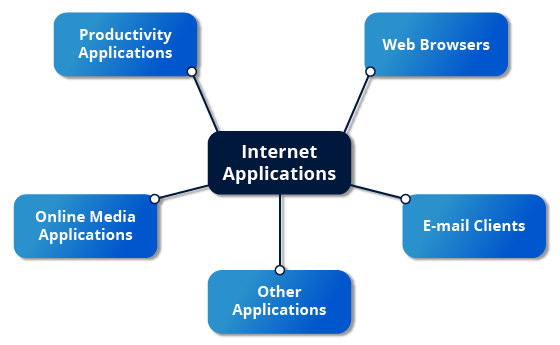
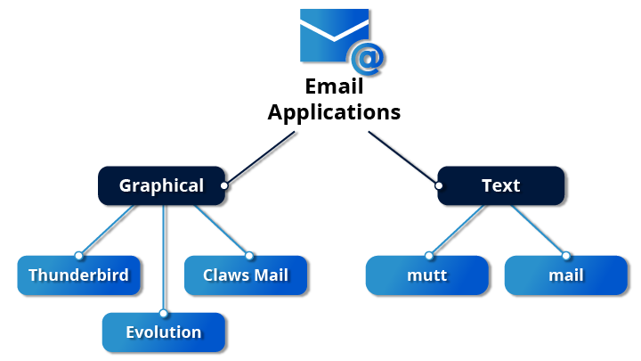
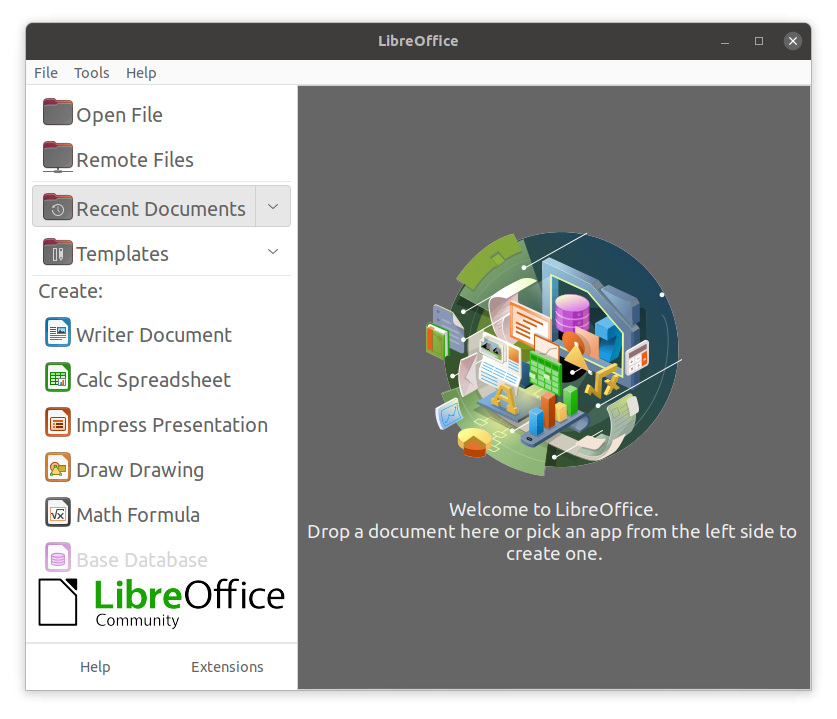
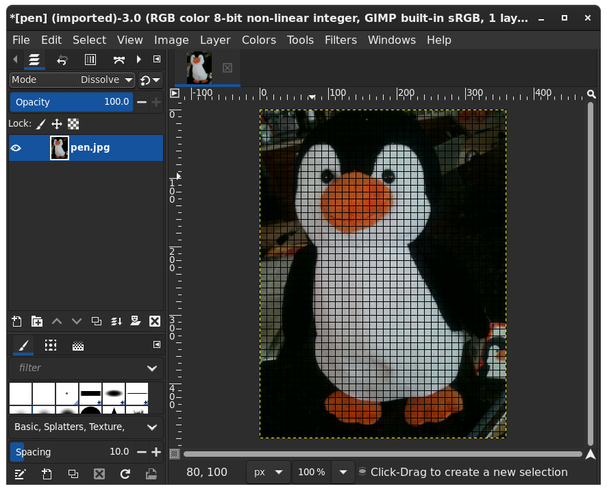

# Common Applications

## Learning Objectives

By the end of this chapter, you should be familiar with common Linux applications, including:

- Internet applications such as browsers and email programs.
- Office Productivity Suites such as LibreOffice.
- Developer tools, such as compilers, debuggers, etc.
- Multimedia applications, such as those for audio and video.
- Graphics editors such as GIMP and other graphics utilities.

# Internet Applications

The Internet is a global network that allows users around the world to perform multiple tasks, such as searching for data, communicating through emails and online shopping. Obviously, you need to use network-aware applications to take advantage of the Internet. These include:

- **Web browsers**
- **Email clients**
- **Streaming media applications**
- **Internet Relay Chats**
- **Conferencing software**

## Web Browsers

As discussed in the Graphical Interface chapter, Linux offers a wide variety of web browsers, both graphical and text-based, including:

- **Firefox**
- **Google Chrome**
- **Chromium**
- **Epiphany (renamed web)**
- **Konqueror**
- **linx, lynx, w3m**
- **Opera**

## Email Applications

**Email** applications allow for sending, receiving, and reading messages over the **Internet**. **Linux systems** offer a wide number of email clients, both graphical and text-based. In addition, many users simply use their browsers to access their email accounts.

Most email clients use the **Internet Message Access Protocol (IMAP)** or the older **Post Office Protocol (POP)** to access emails stored on a remote mail server. Most email applications also display **HTML (HyperText Markup Language)** formatted emails that display objects, such as pictures and hyperlinks. The features of advanced email applications include the ability of importing address books/contact lists, configuration information, and emails from other email applications.

Linux supports the following types of email applications:

- **Graphical email** clients, such as **Thunderbird, Evolution**, and **Claws Mail**.
- **Text mode** email clients, such as **Mutt** and **mail**.
- All **web browser-based** clients, such as **Gmail, Yahoo Mail, and Office 365**.

## Other Internet Applications

Linux systems provide many other applications for performing Internet-related tasks.

**Applications**:

**FileZilla:**

- Intuitive graphical FTP client that supports FTP, Secure File Transfer Protocol (SFTP), and FTP Secured (FTPS). Used to transfer files to/from (FTP) servers.

**Pidgin**

- To access GTalk, AIM, ICQ, MSN, IRC and other messaging networks.

**Hexchat**

- To access Internet Relay Chat (IRC) networks.

# Productivity and Development Applications

## Office Applications

Most day-to-day computer systems have productivity applications (sometimes called office suites) available or installed. Each suite is a collection of closely coupled programs used to create and edit different kinds of files such as:

- Text (articles, books, reports, etc.)
- Spreadsheets
- Presentations
- Graphical objects.

Most Linux distributions offer [LibreOffice](https://www.libreoffice.org/), an open source office suite that started in 2010 and has evolved from OpenOffice. While other office suites are available, LibreOffice is the most mature, widely used and intensely developed.

In addition, Linux users have full access to Internet-based office suites such as Google Docs and Microsoft Office 365.

## LibreOffice Components

The component applications included in LibreOffice are:

- Writer: Word Processing
- Calc: Spreadsheets
- Impress: Presentations
- Draw: Create and edit graphics and diagrams

The LibreOffice applications can read and write non-native document formats, such as those used by Microsoft Office. Usually, fidelity is maintained quite well, but complicated documents might have some imperfect conversions.

## Development Applications
Linux distributions come with a complete set of applications and tools that are needed by those developing or maintaining both user applications and the kernel itself.

These tools are tightly integrated and include:

- Advanced editors customized for programmers' needs, such as vi and emacs.
- Compilers (such as gcc and clang for programs in **C and C++**) for every computer language that has ever existed, including very popular new ones such as **Golang and Rust**.
- Debuggers such as gdb and various graphical front ends to it and many other debugging tools (such as **Valgrind**).
- Performance measuring and monitoring programs, some with easy to use graphical interfaces, others more arcane and meant to be used only by serious experienced development engineers.
- Source and Revision control systems, such as [git](https://git-scm.com/) (and associated interfaces to it, including [GitHub](https://github.com/) and [GitLab](https://gitlab.com/gitlab-org/gitlab)) and older systems, such as [Apache Subversion](https://subversion.apache.org/).
- Complete Integrated Development Environments (IDE's) such as Eclipse and Visual Studio Code that put all these tools together.

On other operating systems, these tools have to be obtained and installed separately, often at a high cost, while on Linux they are all available at no cost, either through standard package installation systems or direct downloading from the responsible maintainers and hosts.

# Multimedia Applications

## Sound Players

Multimedia applications are used to listen to music, watch videos, etc., as well as to present and view text and graphics. Linux systems offer a number of sound player applications.

**Amarok**

- Mature MP3 player with a graphical interface, that plays audio and video files, and streams (online audio files). It allows you to create a playlist that contains a group of songs, and uses a database to store information about the music collection.

**Audacity**

- Used to record and edit sounds. Audacity has a simple interface to get you started.

**Audacious**

- Another smart audio media player.

**Rhythmbox**

- Of course, Linux systems can also connect with commercial online music streaming services, such as Pandora and Spotify through web browsers.

## Movie Players
Movie (video) players can portray input from many different sources, either local to the machine or on the Internet.

Linux systems offer a number of movie players, including:

- **VLC**
- **MPlayer**
- **Xine**
- **Totem**

## Movie Editors

Movie editors are used to edit videos or movies. Linux systems offer a number of movie editors.

**Blender**

- Create 3D animation and design. Blender is a professional tool that uses modeling as a starting point. There are complex and powerful tools for camera capture, recording, editing, enhancing and creating video, each having its own focus.

**Cinelerra**

- Capture, compose, and edit audio/video.

**FFmpeg**

- Record, convert, and stream audio/video. FFmpeg is a format converter, among other things, and has other tools such as ffplay and ffserver.

## GIMP (GNU Image Manipulation Program)

**Graphic editors** allow you to create, edit, view, and organize images of various formats, like **Joint Photographic Experts Group (JPEG or JPG)**, **Portable Network Graphics (PNG)**, **Graphics Interchange Format (GIF)**, and **Tagged Image File Format (TIFF)**.

The **GNU Image Manipulation Program (GIMP)** is a feature-rich image retouching and editing tool similar to **Adobe Photoshop** and is available on all Linux distributions. Some features of the GIMP are:

- It can handle any image file format.
- It has many special purpose plugins and filters.
- It provides extensive information about the image, such as layers, channels, and histograms.

## Graphics Utilities

In addition to GIMP, there are other graphics utilities that help perform various image-related tasks.

**Eye of Gnome (eog)**

- Eye of Gnome (eog) is an image viewer that provides slide show capability and a few image editing tools, such as rotate and resize. It can also step through the images in a directory with just a click.

.png)

**Inkscape**

- Inkscape is an image editor with lots of editing features. It works with layers and transformations of the image. It is sometimes compared to Adobe Illustrator.

**convert**

- convert is a command line tool (part of the ImageMagick set of applications) that can modify image files in many ways. The options include file format conversion and numerous image modification options, such as blur, resize, despeckle, etc.

**Scribus**

- Scribus is used for creating documents used for publishing and providing a What You See Is What You Get (WYSIWYG) environment. It also provides numerous editing tools.

## Chapter Summary

You have completed Chapter 7. Let’s summarize the key concepts covered:

- Linux offers a wide variety of Internet applications, such as web browsers, email clients, online media applications, and others.
- Web browsers supported by Linux can be either graphical or text-based, such as Firefox, Google Chrome, Epiphany, w3m, lynx, and others.
- Linux supports graphical email clients, such as Thunderbird, Evolution, and Claws Mail, and text mode email clients, such as Mutt and mail.
- Linux systems provide many other applications for performing Internet-related tasks, such as Filezilla, XChat, Pidgin, and others.
- Most Linux distributions offer LibreOffice to create and edit different kinds of documents.
- Linux systems offer entire suites of development applications and tools, including compilers and debuggers.
- Linux systems offer a number of sound players including Amarok, Audacity, Audacious, and Rhythmbox.
- Linux systems offer a number of movie players, including VLC, MPlayer, Xine, and Totem.
- Linux systems offer a number of movie editors, including Kino, Blender among others.
- The GIMP (GNU Image Manipulation Program) utility is a feature-rich image retouching and editing tool available on all Linux distributions.
- Other graphics utilities that help perform various image-related tasks are eog, Inkscape, convert, and Scribus.