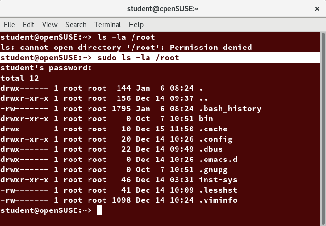
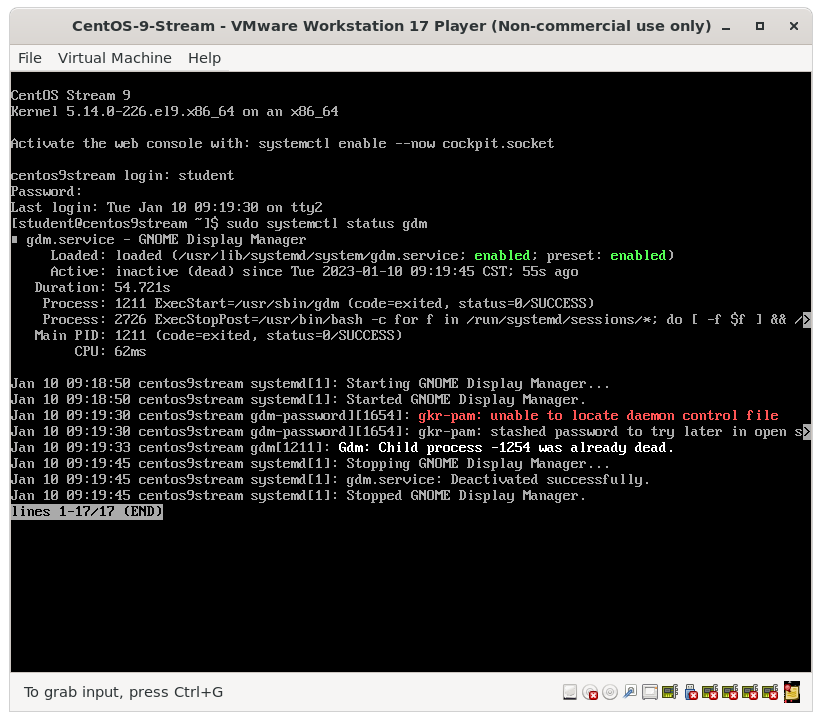
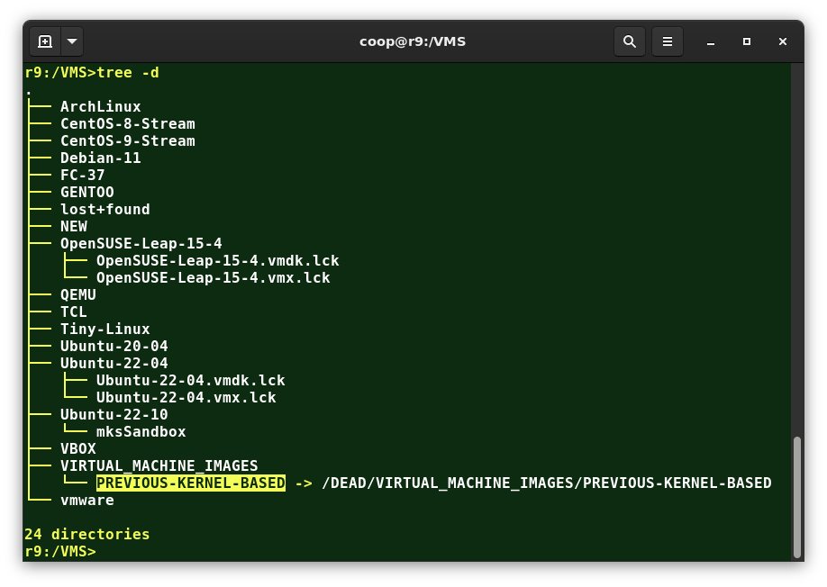

# Command Line Operations

## Learning Objectives

By the end of this chapter, you should be able to:

- Use the command line to perform operations in Linux.
- Search for files.
- Create and manage files.
- Install and update software.

# Command-Line Mode Options

## Using a Text Terminal on the Graphical Desktop

A **terminal emulator** program emulates (simulates) a standalone terminal within a window on the desktop. By this, we mean it behaves essentially as if you were logging into the machine at a pure text terminal with no running graphical interface. Most terminal emulator programs support multiple terminal sessions by opening additional tabs or windows.

By default, on **GNOME** desktop environments, the **gnome-terminal** application is used to emulate a text-mode terminal in a window. Other available terminal programs include:

- **xterm**
- **konsole (default on KDE)**
- **terminator**


## Launching Terminal Windows

To open a **terminal** on any system using a recent GNOME desktop click on *Applications > System Tools > Terminal or Applications > Utilities > Terminal*. If you do not have the Applications menu, you will have to install the appropriate **gnome-shell-extension** package and turn it on with **gnome-tweaks**.

On most GNOME-based distributions, you can always open a terminal by right-clicking anywhere on the desktop background and selecting Open in Terminal. If this does not work, you may need to install and activate the appropriate package, usually called **gnome-shell-extension-apps-menu**.

You can also hit **Alt-F2** and type gnome-terminal.

Because distributions have had a history of burying how to open up a command line terminal, and the place in menus may vary in the desktop GUI, It is a good idea to figure out how to "pin" the terminal icon to the panel, which might mean adding it to the Favorites grouping on GNOME systems.

## Some Basic Utilities

There are some basic command line utilities that are used constantly, and it would be impossible to proceed further without using some of them in simple form before we discuss them in more detail. A short list has to include:

- **cat**: used to type out a file (or combine files).
- **head**: used to show the first few lines of a file.
- **tail**: used to show the last few lines of a file.
- **man**: used to view documentation.

The screenshot shows elementary uses of these programs. Note the use of the pipe symbol (|) used to have one program take as input the output of another.

For the most part, we will only use these utilities in screenshots displaying various activities, before we discuss them in detail.


## The Command Line

Most input lines entered at the shell prompt have three basic elements:

- **Command**
- **Options**
- **Arguments**

The command is the name of the program or script you are executing. It may be followed by one or more options (or switches) that modify what the command may do. Options usually start with one or two dashes, for example, **-p** or **--print**, in order to differentiate them from arguments, which represent what the command operates on.

However, plenty of commands have no options, no arguments, or neither. In addition, other elements (such as setting environment variables) can also appear on the command line when launching a task.

## sudo

All the demonstrations created have a user configured with **sudo** capabilities to provide the user with administrative (admin) privileges when required. **sudo** allows users to run programs using the security privileges of another user, generally root (superuser).

On your own systems, you may need to set up and enable **sudo** to work correctly. To do this, you need to follow some steps that we will discuss but not explain in much detail right now.  Many distributions, including Ubuntu, configure **sudo** for you during installation. On other Linux distributions, you will need to configure **sudo** to work properly after the initial installation.  We will return to discussing the differences and use of both **su** and **sudo** later in our security-focused section.



## Steps for Setting Up and Running sudo

If your system does not already have **sudo** set up and enabled, you need to do the following steps:

1. You will need to make modifications as the administrative, or superuser, root. While **sudo** will become the preferred method of doing this, we do not have it set up yet, so we will need to use su instead. At the command line prompt, type **su** and press **Enter**. You will then be prompted for the root password, so enter it and press **Enter**. You will notice that nothing is printed; this is so others cannot see the password on the screen. You should end up with a different looking prompt, often ending with ‘#’. For example:

    ```bash
    $ su Password:
    #
    ```

2. Now, you need to create a configuration file to enable your user account to use **sudo**. Typically, this file is created in the /etc/sudoers.d/ directory with the name of the file the same as your username. For example, for this demo, let’s say your username is student. After doing step 1, you would then create the configuration file for student by doing this:

    ```bash
    # echo "student ALL=(ALL) ALL" > /etc/sudoers.d/student
    ```

3. Finally, some Linux distributions will complain if you do not also change permissions on the file by doing:

    ```bash
    # chmod 440 /etc/sudoers.d/student
    ```

That should be it. For the rest of this course, if you use **sudo** you should be properly set up. When using **sudo**, by default you will be prompted to give a password (your own user password) at least the first time you do it within a specified time interval. It is possible (though very insecure) to configure **sudo** to not require a password or change the time window in which the password does not have to be repeated with every **sudo** command.


(Retrieved from [XKCD](https://xkcd.com/149/), provided under a [Creative Commons Attribution-NonCommercial 2.5 License](https://creativecommons.org/licenses/by-nc/2.5/))

## Switching Between the GUI and the Command Line

The customizable nature of Linux allows you to drop the graphical interface (temporarily or permanently) or to start it up after the system has been running.

Most Linux distributions give an option during installation (or have more than one version of the install media) to choose between a desktop or workstation (with a graphical user interface) or server (usually without one).

Linux production servers are usually installed without the GUI, and even if it is installed, usually do not launch it during system startup. Removing the graphical interface from a production server can be very helpful in maintaining a lean system, which can be easier to support and keep secure.


## Virtual Terminals

**Virtual Terminals (VT)** are console sessions that use the entire display and keyboard outside of a graphical environment. Such terminals are considered "virtual" because, although there can be multiple active terminals, only one terminal remains visible at a time. A VT is not the same as a command line terminal window; you can have many of those visible simultaneously on a graphical desktop.

One virtual terminal (usually VT 1 or VT 7) is reserved for the graphical environment, and text logins are enabled on the unused VTs.

An example of a situation where using VTs is helpful is when you run into problems with the graphical desktop. In this situation, you can switch to one of the text VTs and troubleshoot.

To switch between VTs, press **CTRL-ALT-function** key for the VT. For example, press **CTRL-ALT-F6** for VT 6. Actually, you only have to press the **ALT-F6** key combination if you are in a VT and want to switch to another VT.


## Turning Off the Graphical Desktop

Linux distributions can start and stop the graphical desktop in various ways. The exact method differs among distributions and between versions. For the newer system-based distributions, the display manager is run as a service, and you can stop the GUI desktop with the systemctl utility. In addition, most distributions will also work with the telinit command, as in:

```bash
sudo systemctl stop gdm (or sudo telinit 3)
```

and restart it (after logging into the console) with:

```bash
sudo systemctl start gdm (or sudo telinit 5)
```



# Basic Operations

In this section, we will discuss how to accomplish basic operations from the command line. These include how to log in and log out from the system, restart or shut down the system, locate applications, access directories, identify absolute and relative paths, and explore the filesystem.


## Logging In and Out

An available text terminal will prompt for a username (with the string **login:**) and password. When typing your password, nothing is displayed on the terminal (not even a * to indicate that you typed in something), to prevent others from seeing your password. After you have logged into the system, you can perform basic operations.

Once your session is started (either by logging into a text terminal or via a graphical terminal program), you can also connect and log into remote systems by using Secure SHell (SSH). For example, by typing **ssh <student@remote-server.com>**, SSH would connect securely to the remote machine (**remote-server.com**) and give **student** a command line terminal window, using either a password (as with regular logins) or cryptographic key to sign in without providing a password to verify the identity.


## Rebooting and Shutting Down

The preferred method to shut down or reboot the system is to use the **shutdown** command. This sends a warning message, and then prevents further users from logging in. The init process will then control shutting down or rebooting the system. It is important to always shut down properly; failure to do so can result in damage to the system and/or loss of data.

The **halt** and **poweroff** commands issue **shutdown -h** to halt the system; **reboot** issues **shutdown -r** and causes the machine to reboot instead of just shutting down. Both rebooting and shutting down from the command line requires superuser (root) access.

When administering a multi-user system, you have the option of notifying all users prior to shutdown, as in:

```bash
    sudo shutdown -h 10:00 "Shutting down for scheduled maintenance."
```


## Locating Applications

Depending on the specifics of your particular distribution's policy, programs and software packages can be installed in various directories. In general, executable programs and scripts should live in the **/bin, /usr/bin, /sbin, /usr/sbin directories**, or somewhere under **/opt**. They can also appear in **/usr/local/bin** and **/usr/local/sbin**, or in a directory in a user's account space, such as **/home/student/bin**.

One way to locate programs is to employ the which utility. For example, to find out exactly where the diff program resides on the filesystem:

```bash
$ which diff
/usr/bin/diff
```

If **which** does not find the program, **whereis** is a good alternative because it looks for packages in a broader range of system directories:

```bash
$ whereis diff
diff: /usr/bin/diff /usr/share/man/man1/diff.1.gz /usr/share/man/man1p/diff.1p.gz
```

as well as locating source and **man** files packaged with the program.


## Accessing Directories

When you first log into a system or open a terminal, the default directory should be your home directory. You can see the exact location by typing **echo $HOME**. However, most Linux distributions open new graphical terminals in **$HOME/Desktop** instead.

Table: Commands useful for directory navigation

| Command | Result |
|---|---|
| `pwd` | Displays the present working directory. |
| `cd ~` or `cd` | Change to your home directory; shortcut name is `~` (tilde). |
| `cd ..` | Change to parent directory (`..`). |
| `cd -` | Change to previous working directory (`-`). |

## Understanding Absolute and Relative Paths

### Paths

**Absolute pathname**

- An **absolute pathname** begins with the root directory (/) and follows the tree, branch by branch, until it reaches the desired directory or file. Absolute paths always start with /.

**Relative pathname**

- A **relative pathname** starts from the present working directory. Relative paths never start with /.

Multiple slashes **(/)** between directories and files are allowed, but all but one slash between elements in the pathname is ignored by the system. While **////usr//bin** is valid, it is seen as just **/usr/bin** by the system.

Most of the time, it is most convenient to use relative paths, which require less typing. Usually, you take advantage of the shortcuts provided by: . (present directory), .. (parent directory) and ~ (your home directory).

For example, suppose you are currently working in your home directory and wish to move to the **/usr/bin**. directory The following two ways will bring you to the same directory from your home directory:

- Absolute pathname method

```bash
cd /usr/bin
```

- Relative pathname method

```bash
cd ../../usr/bin
```

In this case, the absolute pathname method requires less typing and is less error-prone.


## Exploring the Filesystem

Traversing up and down the filesystem tree can get tedious. The tree command is a good way to get a bird’s-eye view of the filesystem tree. Use tree -d to view just the directories and to suppress listing file names.



Table: Exploring the Filesystem - Useful Commands

| Command | Usage |
|---|---|
| `cd /` | Changes your current directory to the root (`/`) directory (or path you supply). |
| `ls` | List the contents of the present working directory. |
| `ls -a` | List all files, including hidden files and directories (those whose name start with a `.`). |
| `tree` | Displays a tree view of the filesystem. |

## Hard Links

The **ln** utility is used to create hard links and (with the **-s** option) soft links, also known as symbolic links or symlinks. These two kinds of links are very useful in UNIX-based operating systems.

Suppose that **file1** already exists. A hard link, called **file2**, is created with the command:

```bash
ln file1 file2
```

Note that two files now appear to exist. However, a closer inspection of the file listing shows that this is not quite true.

```bash
ls -li file1 file2
```

The **-i** option to **ls** prints out in the first column the inode number, which is a unique quantity for each file object. This field is the same for both of these files; what is really going on here is that it is only one file, but it has more than one name associated with it, as is indicated by the **2** that appears in the **ls** output. Thus, there was already another object linked to file1 before the command was executed.


Hard links are very useful and they save space, but you have to be careful with their use, sometimes in subtle ways. For one thing, if you remove either **file1** or **file2** in the example, the inode object (and the remaining file name) will remain, which might be undesirable, as it may lead to subtle errors later if you recreate a file of that name.

If you edit one of the files, exactly what happens depends on your editor; most editors, including **vi** and **gedit**, will retain the link *by default*, but it is possible that modifying one of the names may break the link and result in the creation of two objects.

## Soft (Symbolic) Links

Soft (or Symbolic) links are created with the **-s** option, as in:

```bash
ln -s file1 file3
ls -li file1 file3
```

Notice **file3** no longer appears to be a regular file, and it clearly points to **file1** and has a different inode number.

-Links.png)

Symbolic links take no extra space on the filesystem (unless their names are very long). They are extremely convenient, as they can easily be modified to point to different places. An easy way to create a shortcut from your home directory to long pathnames is to create a symbolic link.

Unlike hard links, soft links can point to objects even on different filesystems, partitions, and/or disks and other media, which may or may not be currently available or even exist. In the case where the link does not point to a currently available or existing object, you obtain a dangling link.

## Navigating Through Directory History (1)

The **cd** command remembers where you were last, and lets you get back there with **cd -**. For remembering more than just the last directory visited, use **pushd** to change the directory instead of **cd**; this pushes your starting directory onto a list. Using **popd** will then send you back to those directories, walking in reverse order (the most recent directory will be the first one retrieved with **popd**). The list of directories is displayed with the **dirs** command.

.png)

# Working with Files

Linux provides many commands that help you with viewing the contents of a file, creating a new file or an empty file, changing the timestamp of a file, and moving, removing and renaming a file or directory. These commands help you in managing your data and files and in ensuring that the correct data is available at the correct location.

In this section, you will learn how to manage files.

Table: Command Line Utilities Used to View Files

| Command | Usage |
|---|---|
| `cat` | Used for viewing files that are not very long; it does not provide any scroll-back. |
| `tac` | Used to look at a file backwards, starting with the last line. |
| `less` | Used to view larger files because it is a paging program. It pauses at each screen full of text, provides scroll-back capabilities, and lets you search and navigate within the file.<br><br>**NOTE:** Use `/` to search for a pattern in the forward direction and `?` for a pattern in the backward direction. An older program named `more` is still used, but has fewer capabilities: "less is more". |
| `tail` | Used to print the last 10 lines of a file by default. You can change the number of lines by doing `-n 15` or just `-15` if you wanted to look at the last 15 lines instead of the default. |
| `head` | The opposite of `tail`; by default, it prints the first 10 lines of a file. |

## touch

**touch** is often used to set or update the access, change, and modify times of files. By default, it resets a file's timestamp to match the current time.

However, you can also create an empty file using **touch**:

```bash
 touch <filename>
```

This is normally done to create an empty file as a placeholder for a later purpose.

**touch** provides several useful options. For example, the **-t** option allows you to set the date and timestamp of the file to a specific value, as in:

```bash
 touch -t 12091600 myfile
```

This sets the **myfile** file's timestamp to 4 p.m., December 9th (12 09 1600).


## mkdir and rmdir

**mkdir** is used to create a directory:

- **mkdir sampdir**
It creates a sample directory named **sampdir** under the current directory.
- **mkdir /usr/sampdir**
It creates a sample directory called **sampdir** under **/usr**.

Removing a directory is done with **rmdir**. The directory must be empty or the command will fail. To remove a directory and all of its contents you have to do **rm -rf**.


## Moving, Renaming or Removing a File

Note that **mv** does double duty, in that it can:

- Simply rename a file
- Move a file to another location, while possibly changing its name at the same time.

If you are not certain about removing files that match a pattern you supply, it is always good to run **rm** interactively (**rm –i**) to prompt before every removal.

Table: Useful Commands

| Command | Usage |
|---|---|
| `mv` | Rename a file. |
| `rm` | Remove a file. |
| `rm -f` | Forcefully remove a file. |
| `rm -i` | Interactively remove a file. |

## Modifying the Command Line Prompt

The **PS1** variable is the character string that is displayed as the prompt on the command line. Most distributions set **PS1** to a known default value, which is suitable in most cases. However, users may want custom information to show on the command line. For example, some system administrators require the user and the host system name to show up on the command line as in:

```bash
student@r9 $
```

This could prove useful if you are working in multiple roles and want to be always reminded of who you are and what machine you are on. The prompt above could be implemented by setting the **PS1** variable to: **\u@\h \$**.

For example:

```bash
$ echo $PS1
\$
$ PS1="\u@\h \$ "
student@r9 $ echo $PS1
\u@\h \$
student@r9 $
```

By convention, most systems are set up so that the root user has a pound sign (**#**) as their prompt.

# Searching for Files

## Standard File Streams

When commands are executed, by default there are three standard file streams (or descriptors) always open for use: standard input (standard in or **stdin**), standard output (**standard out** or **stdout**) and **standard error** (or **stderr**).

Table: Standard File Streams

| Name | Symbolic Name | Value | Example |
|---|---|---|---|
| standard input | `stdin` | 0 | keyboard |
| standard output | `stdout` | 1 | terminal |
| standard error | `stderr` | 2 | log file |

Usually, **stdin** is your keyboard, and **stdout** and **stderr** are printed on your terminal. **stderr** is often redirected to an error logging file, while **stdin** is supplied by directing input to come from a file or from the output of a previous command through a pipe. **stdout** is also often redirected into a file. Since **stderr** is where error messages (and warning) are written, usually nothing will go there.

In Linux, all open files are represented internally by what are called file descriptors. Simply put, these are represented by numbers starting at zero. **stdin** is file descriptor 0, **stdout** is file descriptor 1, and **stderr** is file descriptor 2. Typically, if other files are opened in addition to these three, which are opened by default, they will start at file descriptor 3 and increase from there.

On the next page and in the chapters ahead, you will see examples which alter where a running command gets its input, where it writes its output, or where it prints diagnostic (error) messages.

## I/O Redirection

Through the command shell, we can redirect the three standard file streams so that we can get input from either a file or another command, instead of from our keyboard, and we can write output and errors to files or use them to provide input for subsequent commands.

For example, if we have a program called **do_something** that reads from **stdin** and writes to **stdout** and **stderr**, we can change its input source by using the less-than sign (**<**) followed by the name of the file to be consumed for input data:

```bash
do_something < input-file
```

If you want to send the output to a file, use the greater-than sign (>) as in:

```bash
do_something > output-file
```

In fact, you can do both at the same time as in:

```bash
do_something < input-file > output-file
```

Because **stderr** is not the same as **stdout**, error messages will still be seen on the terminal windows in the above example.

If you want to redirect **stderr** to a separate file, you use **stderr**’s file descriptor number (2), the greater-than sign (>), followed by the name of the file you want to receive everything the running command writes to **stderr**:

```bash
do_something 2> error-file
```

**NOTE**: *By the same logic, do_something 1> output-file is the same as do_something > output-file*.

A special shorthand notation can send anything written to file descriptor **2 (stderr)** to the same place as file descriptor **1 (stdout): 2>&1**.

```bash
do_something > all-output-file 2>&1
```

bash permits an easier syntax for the above:

```bash
do_something >& all-output-file
```

## Pipes

The UNIX/Linux philosophy is to have many simple and short programs (or commands) cooperate together to produce quite complex results, rather than have one complex program with many possible options and modes of operation. In order to accomplish this, extensive use of pipes is made. You can pipe the output of one command or program into another as its input.

In order to do this, we use the vertical-bar, pipe symbol (|), between commands as in:

```bash
command1 | command2 | command3
```

The above represents what we often call a pipeline, and allows Linux to combine the actions of several commands into one. This is extraordinarily efficient because **command2** and **command3** do not have to wait for the previous pipeline commands to complete before they can begin processing at the data in their input streams; on multiple CPU or core systems, the available computing power is much better utilized and things get done quicker.

Furthermore, there is no need to save output in (temporary) files between the stages in the pipeline, which saves disk space and reduces reading and writing from disk, which often constitutes the slowest bottleneck in getting something done.


## Searching for Files

Being able to quickly find the files you are looking for will save you time and enhance productivity. You can search for files in both your home directory space, or in any other directory or location on the system.

The main tools for doing this are the **locate** and **find** utilities. We will also show how to use wildcards in **bash**, in order to specify any file which matches a given generalized request.

## locate

The **locate** utility program performs a search while taking advantage of a previously constructed database of files and directories on your system, matching all entries that contain a specified character string. This can sometimes result in a very long list.

To get a shorter (and possibly more relevant) list, we can use the **grep** program as a filter. **grep** will print only the lines that contain one or more specified strings, as in:

```bash
locate zip | grep bin
```

which will list all the files and directories with both **zip** and **bin** in their name. We will cover **grep** in more detail later. Notice the use of | to pipe the two commands together.

**locate** utilizes a database created by a related utility, **updatedb**. Most Linux systems run this automatically once a day. However, you can update it at any time by just running **updatedb** from the command line as the root user.


## Wildcards and Matching Filenames

You can search for a filename containing specific characters using wildcards.

Table: Wildcards

| Wildcard | Result |
|---|---|
| `?` | Matches any single character. |
| `*` | Matches any string of characters. |
| `[set]` | Matches any character in the set of characters, for example `[adf]` will match any occurrence of `a`, `d`, or `f`. |
| `[!set]` | Matches any character not in the set of characters. |

To search for files using the ? wildcard, replace each unknown character with ?. For example, if you know only the first two letters are 'ba' of a three-letter filename with an extension of **.out**, type **ls ba?.out**.

To search for files using the *wildcard, replace the unknown string with*. For example, if you remember only that the extension was **.out**, type **ls *.out**.

## The find Program

find is an extremely useful and often-used utility program in the daily life of a Linux system administrator. It recurses down the filesystem tree from any particular directory (or set of directories) and locates files that match specified conditions. The default pathname is always the present working directory.

For example, administrators sometimes scan for potentially large core files (which contain diagnostic information after a program fails) that are more than several weeks old in order to remove them.

It is also common to remove files non-essential or outdated files in **/tmp** (and other volatile directories, such as those under **/var/cache/** containing dispensable cached files) that have not been accessed recently. Many Linux distributions use shell scripts that run periodically (through cron usually) to perform such house cleaning.


## Using find

When no arguments are given, **find** lists all files in the current directory and all of its subdirectories. Commonly used options to shorten the list include **-name** (only list files with a certain pattern in their name), -iname (also ignore the case of file names), and **-type** (which will restrict the results to files of a certain specified type, such as **d** for directory, **l** for symbolic link, or **f** for a regular file, etc.).

Searching for files and directories named gcc:

```bash
find /usr -name gcc
```

Searching only for directories named gcc:

```bash
find /usr -type d -name gcc
```

Searching only for regular files named gcc:

```bash
find /usr -type f -name gcc
```


## Using Advanced find Options

Another good use of **find** is being able to run commands on the files that match your search criteria. The -exec option is used for this purpose.

To find and remove all files that end with **.swp**:

```bash
find -name "*.swp" -exec rm {} ';'
```

The {} (squiggly brackets) is a placeholder that will be filled with all the file names that result from the find expression, and the preceding command will be run on each one individually.

Please note that you have to end the command with either ';' (including the single-quotes) or \;. Both forms are fine.

One can also use the -ok option, which behaves the same as -exec, except that find will prompt you for permission before executing the command. This makes it a good way to test your results before blindly executing any potentially dangerous commands.


## Finding Files Based on Time and Size

It is sometimes the case that you wish to find files according to attributes, such as when they were created, last used, etc., or based on their size. It is easy to perform such searches.

To find files based on time:

```bash
find / -ctime 3
```

Here, **-ctime** is when the inode metadata (i.e. file ownership, permissions, etc.) last changed; it is often, but not necessarily, when the file was first created. You can also search for accessed/last read (**-atime**) or modified/last written (**-mtime**) times. The number is the number of days and can be expressed as either a number **(n)** that means exactly that value, **+n**, which means greater than that number, or **-n**, which means less than that number. There are similar options for times in minutes (as in **-cmin**, **-amin**, and **-mmin**).

To find files based on sizes:

```bash
find / -size 0
```

Note the size here is in 512-byte blocks, by default; you can also specify **bytes (c), kilobytes (k), megabytes (M), gigabytes (G)**, etc. As with the time numbers above, file sizes can also be exact numbers **(n), +n or -n**. For details, consult the man page for find.

For example, to find files greater than 10 MB in size and running a command on those files:

```bash
find / -size +10M -exec command {} ’;’
```


# Installing Software

## Package Management Systems on Linux

The core parts of a Linux distribution and most of its add-on software are installed via the **Package Management System**. Each package contains the files and other instructions needed to make one software component work well and cooperate with the other components that comprise the entire system. Packages can depend on each other. For example, a package for a web-based application written in Python will require the appropriate Python packages to be installed first.

There are two broad families of package managers widely deployed: those based on Debian and those which use **RPM** as their low-level package manager. The two systems are incompatible but, broadly speaking, provide the same essential features and satisfy the same needs. In addition, there are some other systems used by more specialized Linux distributions.

In this section, you will learn how to install, remove, or search for packages from the command line using these two package management systems.

## Package Managers: Two Levels

Both package management systems operate on two distinct levels: a low-level tool (such as **dpkg** or **rpm**) takes care of the details of unpacking individual packages, running scripts, getting the software installed correctly, while a high-level tool (such as **apt, dnf**, or **zypper**) works with groups of packages, downloads packages from the vendor, and figures out dependencies.

Most of the time users need to work only with the high-level tool, which will take care of calling the low-level tool as needed. Dependency resolution is a particularly important feature of the high-level tool, as it handles the details of finding and installing each dependency for you. Be careful, however, as installing a single package could result in many dozens or even hundreds of dependent packages being installed.


## Working With Different Package Management Systems

The **Advanced Packaging Tool (apt)** is the underlying package management system that manages software on Debian-based systems. While it forms the backend for graphical package managers, such as the Ubuntu Software Center and synaptic, its native user interface is at the command line, with programs that include **apt** (or **apt-get**) and **apt-cache**.

**dnf** is the open source command-line package-management utility for the RPM-compatible Linux systems that belong to the Red Hat family.


**zypper** is the package management system for the **SUSE/openSUSE family** and is also based on **RPM**. **zypper** also allows you to manage repositories from the command line. **zypper** is fairly straightforward to use and closely resembles **dnf**.

Table: Basic Packaging Commands

| Operation | rpm | deb |
|---|---|---|
| Install package | `rpm -i foo.rpm` | `dpkg --install foo.deb` |
| Install package, dependencies | `dnf install foo` | `apt install foo` |
| Remove package | `rpm -e foo.rpm` | `dpkg --remove foo.deb` |
| Remove package, dependencies | `dnf remove foo` | `apt autoremove foo` |
| Update package | `rpm -U foo.rpm` | `dpkg --install foo.deb` |
| Update package, dependencies | `dnf update foo` | `apt install foo` |
| Update entire system | `dnf update` | `apt dist-upgrade` |
| Show all installed packages | `rpm -qa` or `dnf list installed` | `dpkg --list` |
| Get information on package | `rpm -qil foo` | `dpkg --listfiles foo` |
| Show packages named foo | `dnf list "foo"` | `apt-cache search foo` |
| Show all available packages | `dnf list available` | `apt-cache dumpavail` |
| What package is file part of? | `rpm -qf file` | `dpkg --search file` |

## Chapter Summary

You have completed Chapter 8. Let’s summarize the key concepts we covered:

- Virtual terminals (VT) in Linux are consoles, or command line terminals that use the connected monitor and keyboard.
- Different Linux distributions start and stop the graphical desktop in different ways.
- A terminal emulator program on the graphical desktop works by emulating a terminal within a window on the desktop.
- The Linux system allows you to either log in via text terminal or remotely via the console.
- When typing your password, nothing is printed to the terminal, not even a generic symbol to indicate that you typed.
- The preferred method to shut down or reboot the system is to use the shutdown command.
- There are two types of pathnames: absolute and relative.
- An absolute pathname begins with the root directory and follows the tree, branch by branch, until it reaches the desired directory or file.
- A relative pathname starts from the present working directory.
- Using hard and soft (symbolic) links is extremely useful in Linux.
- cd remembers where you were last, and lets you get back there with cd -.
- locate performs a database search to find all file names that match a given pattern.
- find locates files recursively from a given directory or set of directories.
- find is able to run commands on the files that it lists, when used with the -exec option.
- touch is used to set the access, change, and edit times of files, as well as to create empty files.
- The Advanced Packaging Tool (apt) package management system is used to manage installed software on Debian-based systems.
- You can use the dnf command-line package management utility for the RPM-based Red Hat - Family Linux distributions.
- The zypper package management system is based on RPM and used for openSUSE.

