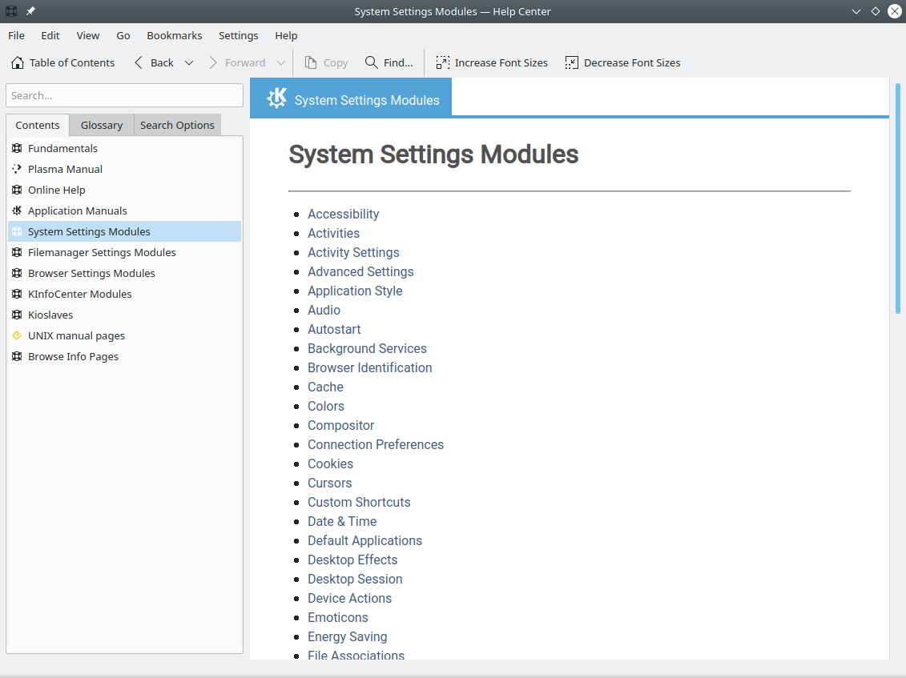

# Finding Linux Documentation

## Introduction

### Learning Objectives

By the end of this chapter, you should be able to:

- Use different sources of documentation.
- Use the man pages.
- Access the GNU Info System.
- Use the help command and --help option.
- Use other documentation sources.

# Documentation Sources

## Linux Documentation Sources

Whether you are an inexperienced user or a veteran, you will not always know (or remember) the proper use of various programs and utilities: what command to use, what options should it take, what results to expect, etc. Thus, you will probably need to get help from consult help documentation regularly. Because Linux-based systems draw from a large variety of sources, there are numerous reservoirs of documentation and ways of getting help. Distributors consolidate this material and present it in a comprehensive and easy-to-use manner; this is an important function of any Linux distribution.


Important Linux documentation sources include:

- The man pages (short for manual pages)
- GNU Info
- The help command and --help option
- Other documentation sources, e.g., [Gentoo Handbook, Ubuntu Documentation, or Fedora Documentation](https://www.gentoo.org/support/documentation/).

# The man pages

The **man** pages are the most often-used source of Linux documentation. They provide in-depth documentation about many programs and utilities, as well as other topics, including configuration files and programming APIs for system calls, library routines, and the kernel. They are present on all Linux distributions and are always at your fingertips.

Typing man with a topic name as an argument retrieves the information stored in the topic's man pages.

The man pages infrastructure was first introduced in the early UNIX versions, at the beginning of the 1970s. The name **man** is just an abbreviation for **manual**.

man pages are often converted to other formats, such as PDF documents and web pages. To learn more, take a look at [Linux man pages online](http://man7.org/linux/man-pages/). Many web pages have a graphical interface for help items, which may include man pages.

Other sources of documentation include published books and many Internet sites.

## man

The **man** program searches, formats, and displays the information contained in the man page system. Because many topics have copious amounts of relevant information, output is piped through a pager program (such as less) to be viewed one page at a time. At the same time, the information is formatted for a good visual display.

A given topic may have multiple pages associated with it and there is a default order determining which one is displayed when no options or section number is specified. To list all pages on the topic, use the -f option. To list all pages that discuss a specific topic (even if the specified subject is not present in the name), use the –k option.

```bash
man –f generates the same result as typing whatis.
man –k generates the same result as typing apropos.
```

The default order is specified in **/etc/man_db.conf** and is roughly (but not exactly) in ascending numerical order by section.

## Manual Chapters

The man pages are divided into chapters numbered 1 through 9. In some cases, a letter is appended to the chapter number to identify a specific topic. For example, many pages describing part of the X Window API are in chapter 3X.

The chapter number can be used to force man to display the page from a particular chapter. It is common to have multiple pages across multiple chapters with the same name, especially for names of library functions or system calls.

With the -a parameter, man will display all pages with the given name in all chapters, one after the other, as in:

```bash
$ man -a socket
```


# GNU Info

## The GNU Info System

The next source of Linux documentation is the GNU Info System.

This is the GNU project's standard documentation format, which it prefers as an alternative to **man**. The Info System is basically free-form, and supports linked subsections.

Functionally, **info** resembles **man** in many ways. However, topics are connected using links (even though its design predates the World Wide Web). Information can be viewed through either a command line interface, a graphical help utility, printed or viewed online.

While the info interface may seem to be rather outdated compared to modern help systems (even **man**), it often is the only easy source to get more complete information.  For example, if you compare the output on any simple command, you may find much more detail in the info page (try **man ls** vs **info ls** and count the lines, for example). Thus, it is still important to learn how to use info.


## Using info from the Command Line

Typing **info** with no arguments in a terminal window displays an index of available topics. You can browse through the topic list using the regular movement keys: **arrows, Page Up**, and **Page Down**.

You can view help for a particular topic by typing info **<topic name>**. The system then searches for the topic in all available info files.

Some useful keys are: **q** to quit, **h** for help, and **Enter** to select a menu item.


## info Page Structure

The topic which you view in an info page is called a **node**. The table lists the basic keystrokes for moving between nodes.

Nodes are essentially sections and subsections in the documentation. You can move between nodes or view each node sequentially. Each node may contain menus and linked subtopics, or items.

Items function like browser links and are identified by an asterisk **(*)** at the beginning of the item name. Named items (outside a menu) are identified with double-colons **(::)** at the end of the item name. Items can refer to other nodes within the file or to other files.

**Table: Keys and Functions**

| Key | Function                      |
|-----|-------------------------------|
| n   | Go to the next node           |
| p   | Go to the previous node       |
| u   | Move one node up in the index |

# The --help Option and help Command

## The --help Option

Another important source of Linux documentation is use of the **--help** option.

Most commands have an available short description which can be viewed using the **--help** or the ****-h** option along with the command or application. For example, to learn more about the ****man** command, you can type:

```bash
$ man --help
```

The **--help** option is useful as a quick reference and it displays information faster than the **man** or **info** pages.


## The help Command

When run within a **bash** command shell, some popular commands (such as **echo** and **cd**) actually run especially built-in **bash**  versions of the commands rather than the usual binaries found on the file system, say under **/bin** or **/usr/bin**. It is more efficient to do so as execution is faster because fewer resources are used (we will discuss command shells later). One should note that there can be some (usually small) differences in the two versions of the command.

To view a synopsis of these built-in commands, you can simply type **help** as shown in the screenshot.

For these built-in commands, **help** performs the same basic function as the **-h** and **--help** arguments perform for standalone programs.


# Other Documentation Sources

In addition to the man pages, the GNU Info System, and the help command, there are other sources of Linux documentation, some examples of which include:

- Desktop help system
- Package documentation
- Online resources.


## Graphical Help Systems

All Linux desktop systems have a graphical help application. This application is usually displayed as a question-mark icon or an image of a ship’s life preserver, and can also always be found within the menu system. These programs usually contain custom help for the desktop itself and some of its applications, and will sometimes also include graphically-rendered info and **man** pages.

If you do not want to spend time hunting for the right icon or menu item to launch the help application, you can also start the graphical help system from a terminal window or command prompt by using one of the following utility programs:

- GNOME: **gnome-help or yelp**
- KDE: **khelpcenter**




## Package Documentation

Linux documentation is also available as part of the package management system. Usually, this documentation is directly pulled from the upstream source code, but it can also contain information about how the distribution packaged and set up the software.

Such information is placed under the***/usr/share/doc** directory, grouped in subdirectories named after each package.


## Online Resources

There are many places to access online Linux documentation, and a little bit of searching will get you buried in it.

The following book has been well-reviewed by other users of this course. It is a free, downloadable command line compendium under a Creative Commons license: "[The Linux Command Line](http://linuxcommand.org/tlcl.php)" by William Shotts.

You can also find very helpful documentation for each distribution. Each distribution has its own user-generated forums and wiki sections. Here are just a few links to such sources:

- [Ubuntu Documentation](https://help.ubuntu.com/)
- [CentOS Documentation](https://wiki.centos.org/Documentation)
- [openSUSE Documentation](https://doc.opensuse.org/)
- [Gentoo Documentation](https://www.gentoo.org/support/documentation/)
- [Fedora Documentation](https://docs.fedoraproject.org/)

Moreover, you can use online search sites to locate helpful resources from all over the Internet, including blog posts, forum and mailing list posts, news articles, and so on.

## Chapter Summary

You have completed Chapter 9. Let’s summarize the key concepts covered:

- The main sources of Linux documentation are the man pages, GNU info, the help options and command, and a rich variety of online documentation sources. 
- The man utility searches, formats, and displays man pages.
- The man pages provide in-depth documentation about programs and other topics about the system, including configuration files, system calls, library routines, and the kernel.
- The GNU Info System was created by the GNU project as its standard documentation. It is robust and is accessible via command line, web, and graphical tools using info.
- Short descriptions for commands are usually displayed with the -h or --help argument.
- You can type help at the command line to display a synopsis of built-in commands.
- There are many other help resources both on your system and on the Internet.