# File Operations

## Learning Objectives

By the end of this chapter, you should be able to:

- Explore the filesystem and its hierarchy.
- Explain the filesystem layout and the purpose of important directories.
- List common filesystem types used in Linux.
- Understand disk partitions and mounting and checking filesystems.
- Use NFS.
- Compare files and identify different file types.
- Back up and compress data.

# Filesystems

## Introduction to Filesystems

“Everything is a file” is an often repeated adage quoted by users of Linux (and all UNIX-like operating systems). Whether you are dealing with normal data files and documents, or with devices such as sound cards and printers, this means interaction with them proceeds through the same Input/Output (I/O) operations you commonly use with files. This simplifies things: you open a “file” and perform normal operations like reading and writing it (which is one reason why text editors, which you will learn about in an upcoming section, are so important).

On many systems (including Linux), the filesystem is structured like a tree. The tree is usually portrayed as inverted and starts at what is most often called the **root directory**, which marks the beginning of the hierarchical filesystem and is also sometimes referred to as the trunk and simply denoted by /. The root directory is **not** the same as the root user. The hierarchical filesystem also contains other elements in the path (directory names), which are separated by forward slashes (**/**), as in **/usr/bin/emacs**, where the last element is the actual file name.

In this section, you will learn about some basic concepts, including the filesystem hierarchy, as well as disk partitions.

## Filesystem Varieties

Linux supports a number of native filesystem types, expressly created by Linux developers, such as:

- **ext3**
- **ext4**
- **squashfs**
- **btrfs**

It also offers implementations of filesystems used on other alien operating systems, such as those from:

- **Windows (ntfs, vfat, exfat)**
- **SGI (xfs)**
- **IBM (jfs)**
- **MacOS (hfs, hfs+)**

Many older, legacy filesystems, such as FAT, are also supported.

It is often the case that more than one filesystem type is used on a machine, based on considerations such as the size of files, how often they are modified, what kind of hardware they sit on and what kind of access speed is needed, etc. The most advanced filesystem types in common use are the **journaling** varieties: **ext4, xfs, btrfs**, and **jfs**. These have many state-of-the-art features and high performance, and are not easy to corrupt accidentally.

Linux also makes use of network (or distributed)  filesystems, where all or part of the filesystem is on external machines. Besides **NFS (Network File System)** whose usage we will discuss, this includes **Ceph, Lustre**, and **OpenAFS**.

## Linux Partitions

In most situations, each filesystem on a Linux system occupies a disk partition. (It is also possible to encapsulate a filesystem in a *loopback file* residing on another regular partition-based filesystem, but we won’t discuss that here.) Partitions help to organize the contents of disks according to the kind and use of the data contained. For example, important programs required to run the system are often kept on a separate partition (known as **root** or **/**) than the one that contains files owned by regular users of that system (**/home**). In addition, temporary files created and destroyed during the normal operation of Linux may be located on dedicated partitions. One advantage of this kind of isolation by type and variability is that when all available space on a particular partition is exhausted, the system may still operate normally. Furthermore, if data is either corrupted through error or hardware failure, or breached through a security problem,  it might be possible to confine problems to an area smaller than the entire system.

The picture shows the use of the **GParted** utility, which displays the partition layout on a laptop system that has two operating systems on it: RHEL9 and RHEL 8.

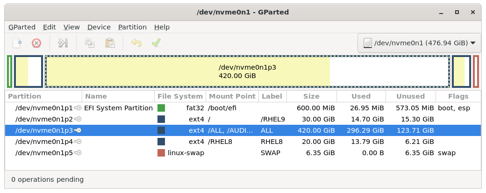

## Mount Points

Before you can start using a filesystem, you need to **mount** it on the filesystem tree at a mount point. This is simply a directory (which may or may not be empty) where the filesystem is to be grafted on. Sometimes, you may need to create the directory if it does not already exist.

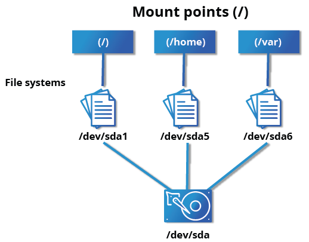

**WARNING**: *If you mount a filesystem on a non-empty directory, the former contents of that directory are covered-up and not accessible until the filesystem is unmounted. Thus, mount points are usually empty directories.*

## Mounting and Unmounting

The **mount** command is used to attach a filesystem (which can be local to the computer or on a network) somewhere within the filesystem tree. The basic arguments are the **device node** and **mount** point. For example,

```bash
$ sudo mount /dev/sda5 /home
```

will attach the filesystem contained in the disk partition associated with the **/dev/sda5** device node into the filesystem tree at the **/home** mount point. There are other ways to specify the partition other than the device node, such as using the disk **label** or **UUID** (*U*niversally *U*nique *I*Dentifier).

To unmount the partition, the command would be:

```bash
$ sudo umount /home
```

Note the command is **umount**, not **unmount!** Only a root user (logged in as root, or using **sudo**) has the privilege to run these commands, unless the system has been otherwise configured.

If you want it to be automatically available every time the system starts up, you need to edit **/etc/fstab** accordingly (the name is short for **filesystem table**). Looking at this file will show you the configuration of all pre-configured filesystems. **man fstab** will display how this file is used and how to configure it.

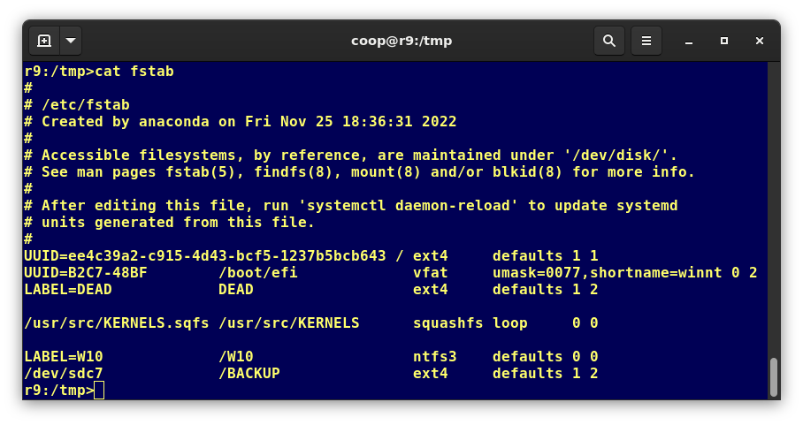

Executing  **umount** without any arguments will show all presently mounted filesystems.

The command **df -Th (disk free)** will display information about mounted filesystems, including the filesystem type, and usage statistics about currently used and available space.


You may notice a number of entries of type **tmpfs**. These are not real physical filesystems but are parts of system memory that are represented as such to take advantage of certain programming features.

## NFS and Network Filesystems

It is often necessary to share data across physical systems which may be either in the same location or anywhere that can be reached by the Internet. A network (also sometimes called distributed) filesystem may have all its data on one machine or have it spread out on more than one network **node**. A variety of different filesystems can be used locally on individual machines; a network filesystem can be thought of as a grouping of lower-level filesystems of varying types.

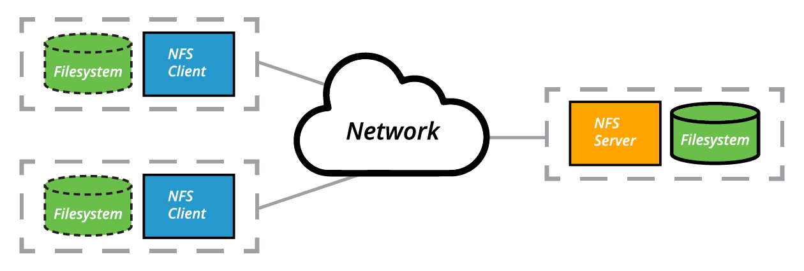

The Client-Server Architecture of NFS
(based on the original from https://developer.ibm.com/tutorials/l-network-filesystems/)

Many system administrators mount remote users' home directories on a server in order to give them access to the same files and configuration files across multiple client systems. This allows the users to log in to different computers, yet still have access to the same files and resources.

The most common such filesystem is named simply **NFS (the Network Filesystem)**. It has a very long history and was first developed by Sun Microsystems. Another common implementation is **CIFS** (also termed **SAMBA**), which has Microsoft roots. We will restrict our attention in what follows to **NFS**.

## NFS on the Server

We will now look in detail at how to use NFS on the server.

On the server machine, NFS uses **daemons** (built-in networking and service processes in Linux) and other system servers are started at the command line by typing:

```bash
$ sudo systemctl start nfs
```

**NOTE**: *On some systems, such as RHEL/CentOS, and Fedora, the service is now called nfs-server, not nfs*.

The text file **/etc/exports** contains the directories and permissions that a host is willing to share with other systems over NFS. A very simple entry in this file may look like the following:

**/projects *.example.com(rw)**

This entry allows the directory **/projects** to be mounted using NFS with read and write (**rw**) permissions and shared with other hosts in the example.com domain. As we will detail in the next chapter, every file in Linux has three possible permissions: read (**r**), write (**w**) and execute (**x**).

After modifying the **/etc/exports** file, you can type **exportfs -av** to notify Linux about the directories you are allowing to be remotely mounted using NFS. You can also restart NFS with **sudo systemctl restart nfs**, but this is heavier, as it halts NFS for a short while before starting it up again. To make sure the NFS service starts whenever the system is booted, issue **sudo systemctl enable nfs**.

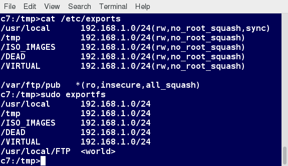

## NFS on the Client

On the client machine, if it is desired to have the remote filesystem mounted automatically upon system boot, **/etc/fstab** is modified to accomplish this. For example, an entry in the client's **/etc/fstab** might look like the following:

**servername:/projects /mnt/nfs/projects nfs defaults 0 0**

You can also mount the remote filesystem without a reboot or as a one-time mount by directly using the mount command:

```bash
$ sudo mount servername:/projects /mnt/nfs/projects
```

Remember, if **/etc/fstab** is not modified, this remote mount will not be present the next time the system is restarted. Furthermore, you may want to use the nofail option in **fstab** in case the NFS server is not live at boot.

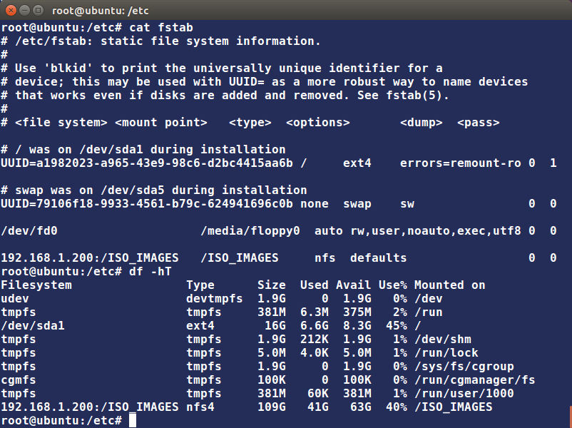

# Filesystem Layout

## Overview of User Home Directories

In this section, you will learn to identify and differentiate between the most important directories found in Linux. We start with ordinary users' home directory space.

Each user has a home directory, usually placed under **/home**. The **/root** ("slash-root") directory on modern Linux systems is no more than the home directory of the root user (or superuser or system administrator account).

On multi-user systems, the **/home** directory infrastructure may be mounted as a separate filesystem on its own partition or even exported (shared) remotely on a network through NFS.

Sometimes, you may group users based on their department or function. You can then create subdirectories under the */home**directory for each of these groups. For example, a school may organize */home**with something like the following:

**/home/faculty/**
**/home/staff/**
**/home/students/**

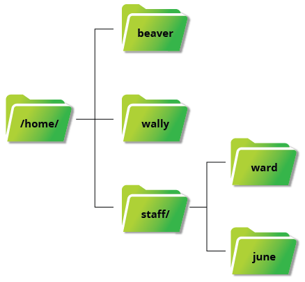

## The /bin and /sbin Directories

The /bin directory contains executable binaries, essential commands used to boot the system or in single-user mode, and essential commands required by all system users, such as **cat, cp, ls, mv, ps**, and **rm**.

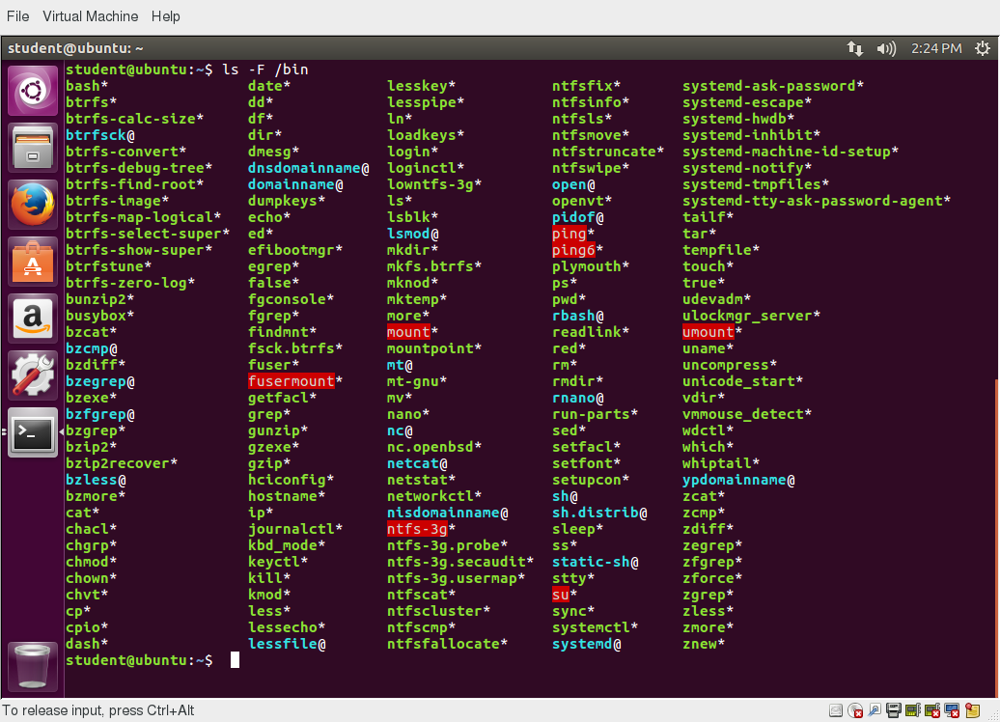

Likewise, the **/sbin** directory is intended for essential binaries related to system administration, such as **fsck** and **ip**. To view a list of these programs, type:

```bash
$ ls /bin /sbin
```

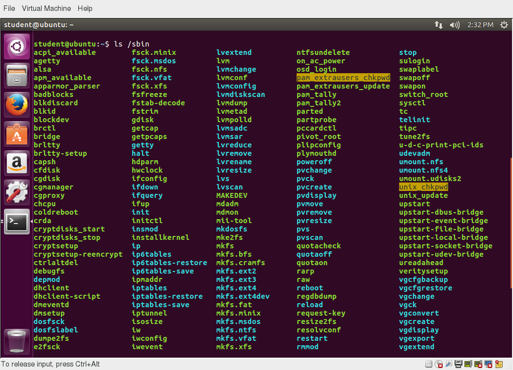

Commands that are not essential (theoretically) for the system to boot or operate in single-user mode are placed in the **/usr/bin** and **/usr/sbin** directories. Historically, this was done so **/usr** could reside on a separate filesystem that could be mounted at a later stage of system startup or even over a network. However, nowadays most find this distinction to be obsolete. In fact, many distributions have been discovered to be unable to boot with this separation, as this modality had not been used or tested for a long time.

Thus, on most Linux distributions today, **/usr/bin** and **/bin** are actually just symbolically linked together, as are **/usr/sbin** and **/sbin**, so there are really just two directories, not four.

## The /proc Filesystem

Certain filesystems, like the one mounted at **/proc**, are called **pseudo-filesystems** because they have no actual permanent presence anywhere on the disk.

The **/proc**filesystem contains virtual files (files that exist only in memory) that permit viewing constantly changing kernel data. **/proc** contains files and directories that mimic kernel structures and configuration information. It does not contain real files, but runtime system information, e.g. system memory, devices mounted, hardware configuration, etc. Some important entries in **/proc** are:

**/proc/cpuinfo**
**/proc/interrupts**
**/proc/meminfo**
**/proc/mounts**
**/proc/partitions**
**/proc/version**

**/proc** has subdirectories as well, including:

**/proc/<Process-ID-#>**
**/proc/sys**

The first example shows there is a directory for every process running on the system, which contains vital information about it. The second example shows a virtual directory that contains a lot of information about the entire system, in particular its hardware and configuration. The **/proc** filesystem is very useful because the information it reports is gathered only as needed and never needs storage on the disk.

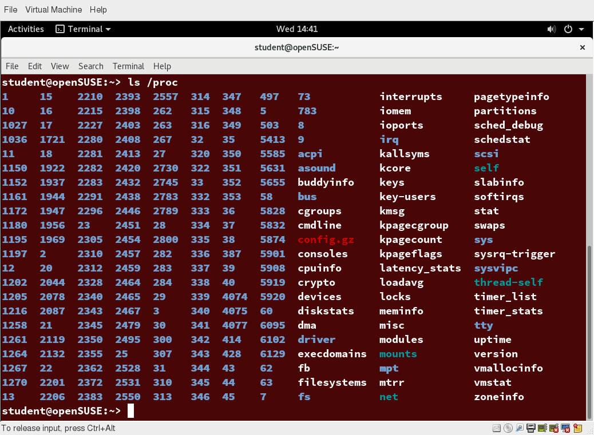

## The /dev Directory

The **/dev** directory contains **device nodes**, a type of pseudo-file used by most hardware and software devices, except for network devices. This directory is:

- Empty on the disk partition when it is not mounted
- Contains entries which are created by the udev system, which creates and manages device nodes on Linux, creating them dynamically when devices are found. The /dev directory contains items such as:

1. **/dev/sda1** (first partition on the first hard disk)
2. **/dev/lp1** (second printer)
3. **/dev/random** (a source of random numbers).

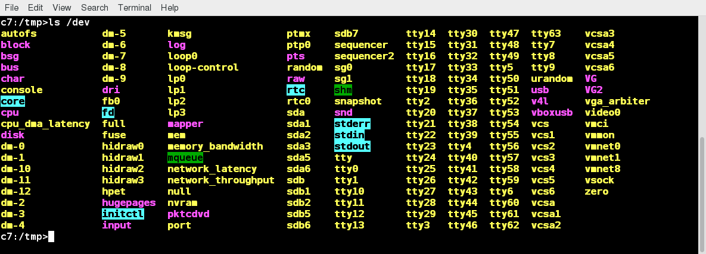

## The /var Directory

The **/var** directory contains files that are expected to change in size and content as the system is running (var stands for variable), such as the entries in the following directories:

- System log files: **/var/log**
- Packages and database files: **/var/lib**
- Print queues: **/var/spool**
- Temporary files: **/var/tmp**.

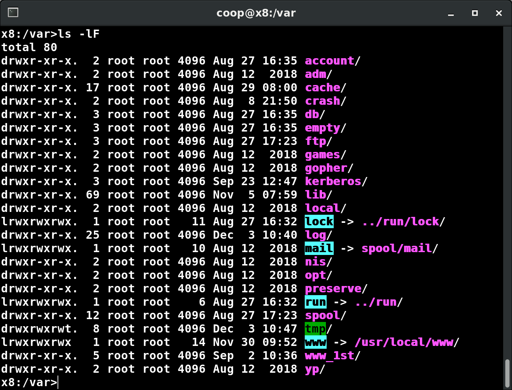

The **/var** directory may be put on its own filesystem so that growth of the files can be accommodated and any exploding file sizes do not fatally affect the system. Network services directories such as **/var/ftp** (the FTP service) and **/var/www** (the HTTP web service) are also found under **/var**.

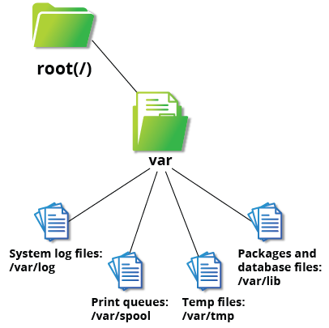

## The /etc Directory

The **/etc** directory is the home for system configuration files. It contains no binary programs, although there are some executable scripts. For example, **/etc/resolv.conf** tells the system where to go on the network to obtain host name to IP address mappings (DNS). Files like **passwd**, **shadow** and **group** for managing user accounts are found in the **/etc** directory. While some distributions have historically had their own extensive infrastructure under /etc (for example, Red Hat and SUSE have used **/etc/sysconfig**), with the advent of systemd there is much more uniformity among distributions today.

**Note** that **/etc** *is for system-wide configuration files and only the superuser can modify files there. User-specific configuration files are always found under their home directory*.

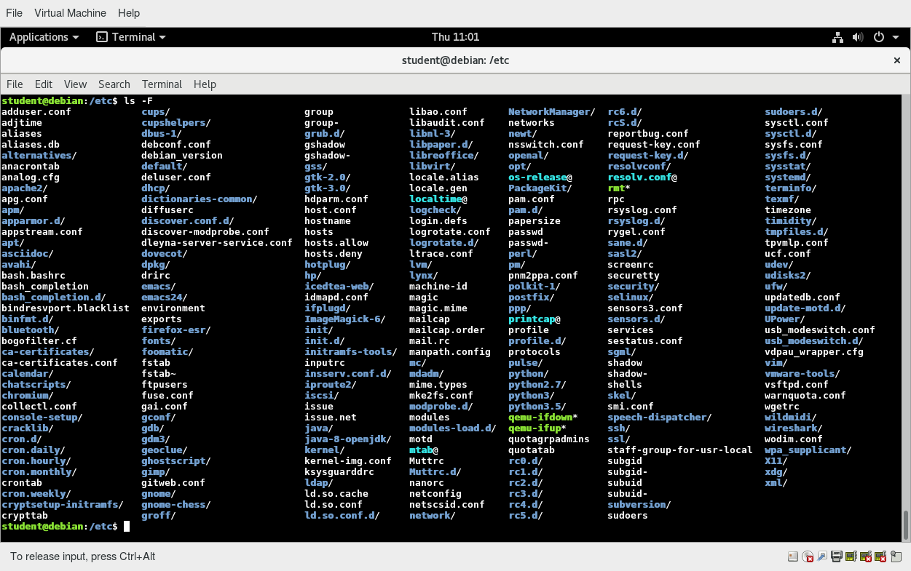

## The /boot Directory

The **/boo**t directory contains the few essential files needed to boot the system. For every alternative kernel installed on the system there are four files:

1. **vmlinuz**
    - The compressed Linux kernel, required for booting.
2. **initramfs**
    - The initial ram filesystem, required for booting, sometimes called initrd, not initramfs.
3. **config**
    - The kernel configuration file, only used for debugging and bookkeeping.
4. **System.map**
    - Kernel symbol table, only used for debugging.

Each of these files has a kernel version appended to its name.

The **Grand Unified Bootloader (GRUB)** files such as **/boot/grub/grub.conf** or **/boot/grub2/grub2.cfg** are also found under the **/boot** directory.

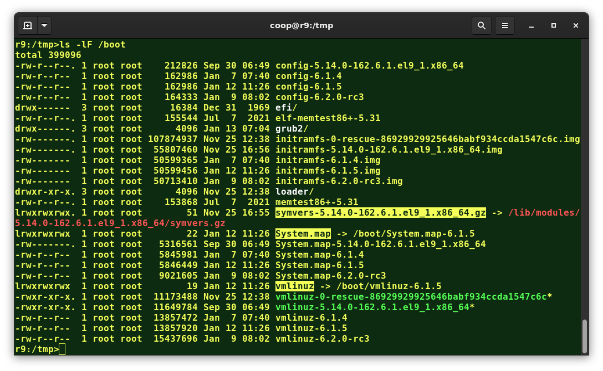

The screenshot shows an example listing of the **/boot**  directory, taken from a RHEL system that has multiple installed kernels, including both distribution-supplied and custom-compiled ones. Names will vary and things will tend to look somewhat different on a different distribution.

## The /lib and /lib64 Directories

**/lib** contains libraries (common code shared by applications and needed for them to run) for the essential programs in **/bin** and **/sbin**. These library filenames either start with **ld** or **lib**. For example, **/lib/libncurses.so.5.9**.

Most of these are what is known as **dynamically loaded libraries** (also known as **shared libraries** or **Shared Objects (SO)**). On some Linux distributions there exists a **/lib64** directory containing **64-bit** libraries, while **/lib** contains **32-bit** versions.

On recent Linux distributions, one finds:


i.e., just like for **/bin** and **/sbin**, the directories just point to those under /usr.

Kernel modules (kernel code, often device drivers, that can be loaded and unloaded without re-starting the system) are located in **/lib/modules/<kernel-version-number>**.


## Removable media: the /media, /run and /mnt Directories

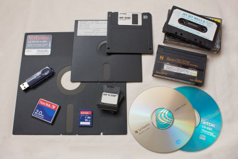

One often uses removable media, such as USB drives, CDs and DVDs. To make the material accessible through the regular filesystem, it has to be mounted at a convenient location. Most Linux systems are configured so any removable media are automatically mounted when the system notices something has been plugged in.

While historically this was done under the **/media** directory, modern Linux distributions place these mount points under the **/run** directory. For example, a USB pen drive with a label **myusbdrive** for a user named student would be mounted at **/run/media/student/myusbdriv**.

The **/mnt** directory has been used since the early days of UNIX for temporarily mounting filesystems. These can be those on removable media, but more often might be network filesystems, which are not normally mounted. Or these can be temporary partitions, or so-called **loopback** filesystems, which are files which pretend to be partitions.

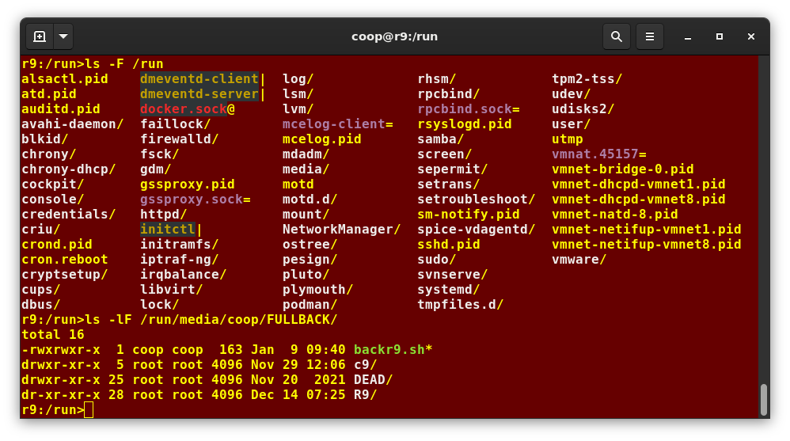

## Additional Directories Under /:

There are some additional directories to be found under the root directory:

**Table: Additional Directories Under Root Directory**

| Directory Name | Usage                                                                                                                            |
|----------------|----------------------------------------------------------------------------------------------------------------------------------|
| `/opt`         | Optional application software packages.                                                                                          |
| `/sys`         | Virtual pseudo-filesystem giving information about the system and the hardware. Can be used to alter system parameters and for debugging purposes. |
| `/srv`         | Site-specific data served up by the system. Seldom used.                                                                         |
| `/tmp`         | Temporary files; on some distributions erased across a reboot and/or may actually be a ramdisk in memory.                        |
| `/usr`         | Multi-user applications, utilities and data.                                                                                     |

## The /usr Directory Tree

The **/usr** directory tree contains theoretically non-essential programs and scripts (in the sense that they should not be needed to initially boot the system) and has at least the following sub-directories:

**Table: Sub-directories**

| Directory Name | Usage                                                                                                    |
|----------------|----------------------------------------------------------------------------------------------------------|
| `/usr/include` | Header files used to compile applications.                                                               |
| `/usr/lib`     | Libraries for programs in `/usr/bin` and `/usr/sbin`.                                                    |
| `/usr/lib64`   | 64-bit libraries for 64-bit programs in `/usr/bin` and `/usr/sbin`.                                      |
| `/usr/sbin`    | Non-essential system binaries, such as system daemons, and scripts.                                      |
| `/usr/share`   | Shared data used by applications, generally architecture-independent.                                    |
| `/usr/src`     | Source code, usually for the Linux kernel.                                                               |
| `/usr/local`   | Data and programs specific to the local machine; subdirectories include `bin`, `sbin`, `lib`, `share`, `include`, etc. |
| `/usr/bin`     | This is the primary directory of executable programs and scripts.                                        |

# Comparing Files and File Types

## Comparing Files with diff

Now that you know about the filesystem and its structure, let’s learn how to manage files and directories.

diff is used to compare files and directories. This often-used utility program has many useful options (see: man diff) including:

**Table: diff Options and Usage**

| `diff` Option | Usage                                                                                             |
|---------------|---------------------------------------------------------------------------------------------------|
| `-c`          | Provides a listing of differences that include three lines of context before and after the lines differing in content. |
| `-r`          | Used to recursively compare subdirectories, as well as the current directory.                     |
| `-i`          | Ignore the case of letters.                                                                       |
| `-w`          | Ignore differences in spaces and tabs (white space).                                              |
| `-q`          | Be quiet: only report if files are different without listing the differences.                     |

To compare two files, at the command prompt, type diff [options] <filename1> <filename2>. diff is meant to be used for text files; for binary files, one can use cmp.

If you prefer, there are multiple graphical interfaces to diff, including diffuse, vimdiff, and meld.

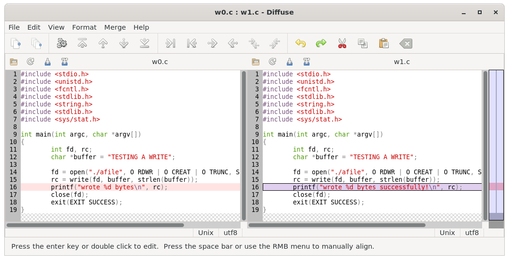

# Comparing Files and File Types

## Using the file Utility

In Linux, a file's extension does not, by default, categorize its nature the way it might in other operating systems. For example, one cannot assume that a file named **file.txt** is a text file and not an executable program. In Linux, a filename is generally more meaningful to the user of the system than the system itself. In fact, most applications directly examine a file's contents to see what kind of object it is rather than relying on an extension. This is very different from the way Windows handles filenames, where a filename ending with **.exe**, for example, represents an executable binary file.

The real nature of a file can be ascertained by using the file utility. For the file names given as arguments, it examines the contents and certain characteristics to determine whether the files are plain text, shared libraries, executable programs, scripts, or something else.


# Backing Up and Compressing Data

## Backing Up Data
There are many ways you can back up data or even your entire system. Basic ways to do so include the use of simple copying with **cp** and use of the more robust **rsync**.

Both can be used to synchronize entire directory trees. However, **rsync** is more efficient, because it checks if the file being copied already exists. If the file exists and there is no change in size or modification time, **rsync** will avoid an unnecessary copy and save time. Furthermore, because **rsync** copies only the parts of files that have actually changed, it can be very fast.

cp can only copy files to and from destinations on the local machine (unless you are copying to or from a filesystem mounted using NFS), but **rsync** can also be used to copy files from one machine to another. Locations are designated in the **target:path** form, where **target** can be in the form of **someone@host**. The **omeone@** part is optional and used if the remote user is different from the local user.

**rsync** is very efficient when recursively copying one directory tree to another, because only the differences are transmitted over the network. One often synchronizes the destination directory tree with the origin, using the -r option to recursively walk down the directory tree copying all files and directories below the one listed as the source.

## Using rsync


**rsync** is a very powerful utility. For example, a very useful way to back up a project directory might be to use the following command:

```bash
$ rsync -r project-X archive-machine:archives/project-X
```

Note that **rsync** can be very destructive! Accidental misuse can do a lot of harm to data and programs, by inadvertently copying changes to where they are not wanted. Take care to specify the correct options and paths. It is highly recommended that you first test your **rsync** command using the **-dry-run** option to ensure that it provides the results that you want.

To use **rsync** at the command prompt, type **rsync sourcefile destinationfile**, where either file can be on the local machine or on a networked machine; The contents of **sourcefile* will be copied to **destinationfile**.

A good combination of options is shown in:

```bash
$ rsync --progress -avrxH  --delete sourcedir destdir
```

## Compressing Data

File data is often compressed to save disk space and reduce the time it takes to transmit files over networks.

Linux uses a number of methods to perform this compression, including:

**Table: Methods to Perform Compression**

| Command | Usage                                                                      |
|---------|----------------------------------------------------------------------------|
| `gzip`  | The most frequently used Linux compression utility.                        |
| `bzip2` | Produces files significantly smaller than those produced by `gzip`.          |
| `xz`    | The most space-efficient compression utility used in Linux.                |
| `zip`   | Is often required to examine and decompress archives from other operating systems. |

These techniques vary in the efficiency of the compression (how much space is saved) and in how long they take to compress; generally, the more efficient techniques take longer. Decompression time does not vary as much across different methods.

In addition, the tar utility is often used to group files in an archive and then compress the whole archive at once.

## Compress Data Using gzip

gzip has historically been the most widely used Linux compression utility. It compresses well and is very fast. The following table provides some usage examples:

**Table: gzip Usage Examples**

| Command            | Usage                                                                                                                            |
|--------------------|----------------------------------------------------------------------------------------------------------------------------------|
| `gzip *`           | Compresses all files in the current directory; each file is compressed and renamed with a `.gz` extension.                         |
| `gzip -r projectX` | Compresses all files in the `projectX` directory, along with all files in all of the directories under `projectX`.                 |
| `gunzip foo`       | De-compresses `foo` found in the file `foo.gz`. Under the hood, the `gunzip` command is actually the same as `gzip -d`.             |

## Compressing Data Using bzip2

bzip2 has a syntax that is similar to gzip but it uses a different compression algorithm and produces significantly smaller files, at the price of taking a longer time to do its work. Thus, it is more likely to be used to compress larger files.

Examples of common usage are also similar to **gzip**:

**Table: bzip2 Usage Examples**

| Command         | Usage                                                                                                                            |
|-----------------|----------------------------------------------------------------------------------------------------------------------------------|
| `bzip2 *`       | Compresses all of the files in the current directory and replaces each file with a file renamed with a `.bz2` extension.           |
| `bunzip2 *.bz2` | Decompresses all of the files with an extension of `.bz2` in the current directory. Under the hood, `bunzip2` is the same as calling `bzip2 -d`. |

**NOTE**: *bzip2 has lately become deprecated due to lack of maintenance and the superior compression ratios of xz which is actively maintained. While it should no longer be used for compressing files, you are likely to still need it to decompress files you encounter with the bz2 extension*.

## Compressing Data Using xz

xz is the most space-efficient compression utility frequently used in Linux and is the choice for distributing and storing archives of the Linux kernel. Once again, it trades a slower compression speed for an even higher compression ratio. It is gradually becoming the dominant compression method, especially for large files which may need to be downloaded from the Internet.

**Table: xz Usage Examples**

| Command                                | Usage                                                                                                |
|----------------------------------------|------------------------------------------------------------------------------------------------------|
| `xz *`                                 | Compresses all of the files in the current directory and replaces each file with one with a `.xz` extension. |
| `xz foo`                               | Compresses `foo` into `foo.xz` using the default compression level (-6), and removes `foo` if compression succeeds. |
| `xz -dk bar.xz`                        | Decompresses `bar.xz` into `bar` and does not remove `bar.xz` even if decompression is successful.     |
| `xz -dcf a.txt b.txt.xz > abcd.txt`    | Decompresses a mix of compressed and uncompressed files to standard output, using a single command.  |
| `xz -d *.xz`                           | Decompresses the files compressed using `xz`.                                                        |

Compressed files are stored with a .xz extension.

## Handling Files Using zip

While, the zip program is rarely used to compress files in Linux, it may be needed to examine and decompress archives from other operating systems. It is only used in Linux when you get a zipped file from a Windows user or environment or from Internet downloads. It is a legacy program. It is neither fast nor efficient.

**Table: zip Usage Examples**

| Command               | Usage                                                                                        |
|-----------------------|----------------------------------------------------------------------------------------------|
| `zip backup *`        | Compresses all files in the current directory and places them in `backup.zip`.               |
| `zip -r backup.zip ~` | Archives your login directory (~) and all files and directories under it in `backup.zip`.    |
| `unzip backup.zip`    | Extracts all files in `backup.zip` and places them in the current directory.                 |

## Archiving and Compressing Data Using tar

Historically, **tar** stood for **"tape archive"** and was used to archive files to a magnetic tape. It allows you to create or extract files from an archive file, often called a **tarball**. At the same time, you can optionally compress while creating the archive, and decompress while extracting its contents.

**Table: tar Usage Examples**

| Command                       | Usage                                                                                                                      |
|-------------------------------|----------------------------------------------------------------------------------------------------------------------------|
| `tar xvf mydir.tar`           | Extract all the files in `mydir.tar` into the `mydir` directory.                                                             |
| `tar zcvf mydir.tar.gz mydir` | Create the archive and compress with `gzip`.                                                                               |
| `tar jcvf mydir.tar.bz2 mydir`  | Create the archive and compress with `bzip2`.                                                                              |
| `tar Jcvf mydir.tar.xz mydir`   | Create the archive and compress with `xz`.                                                                                 |
| `tar xvf mydir.tar.gz`        | Extract all the files in `mydir.tar.gz` into the `mydir` directory. NOTE: You do not have to tell `tar` it is in `gzip` format. |

Use of a dash (“-”) before options is often done, although it is usually unnecessary, as in **tar -xvf mydir.tar**.

You can separate out the archiving and compression stages, as in:

```bash
$ tar cvf mydir.tar mydir ; gzip mydir.tar
$ gunzip mydir.tar.gz ; tar xvf mydir.tar
```

but this is slower and wastes space by creating an unneeded intermediary **.tar** file.

## Relative Compression Times and Sizes

To demonstrate the relative efficiency of gzip, bzip2, and xz, the following screenshot shows the results of compressing a purely text file directory tree (the include directory from the kernel source) using the three methods.

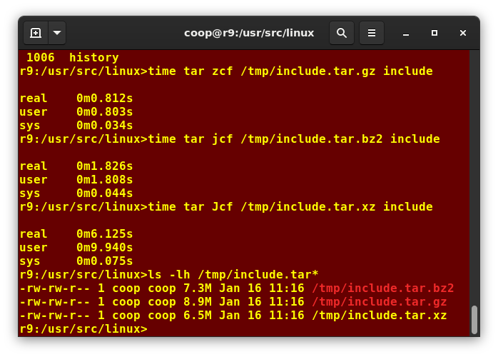

This shows that as compression factors go up, CPU time does as well (i.e., producing smaller archives takes longer).

## Disk-to-Disk Copying (dd)

The dd program is very useful for making copies of raw disk space. For example, to back up your Master Boot Record (MBR) (the first 512-byte sector on the disk that contains a table describing the partitions on that disk), you might type:

**dd if=/dev/sda of=sda.mbr bs=512 count=1**

**WARNING!**

Typing:

**dd if=/dev/sda of=/dev/sdb**

to make a copy of one disk onto another, will delete everything that previously existed on the second disk.

An exact copy of the first disk device is created on the second disk device.

**Do not experiment with this command as written above, as it can erase a hard disk!**

Exactly what the name dd stands for is an often-argued item. The words data definition is the most popular theory and has roots in early IBM history. Often, people joke that it means disk destroyer and other variants such as delete data!


## Chapter Summary

You have completed Chapter 11. Let’s summarize the key concepts covered:

- The filesystem tree starts at what is often called the root directory (or trunk, or /).
- The  Filesystem Hierarchy Standard (FHS) provides Linux developers and system administrators a standard directory structure for the filesystem.
- Partitions help to segregate files according to usage, ownership, and type.
- Filesystems can be mounted anywhere on the main filesystem tree at a mount point. Automatic filesystem mounting can be set up by editing /etc/fstab.
- NFS (Network File System) is a useful method for sharing files and data through the network systems.
- Filesystems like /proc are called pseudo filesystems because they exist only in memory.
- /root (slash-root) is the home directory for the root user.
- /var may be put in its own filesystem so that growth can be contained and not fatally affect the system.
- /boot contains the basic files needed to boot the system.
- patch is a very useful tool in Linux. Many modifications to source code and configuration files are distributed with patch files, as they contain the deltas or changes to go from an old version of a file to the new version of a file.
- File extensions in Linux do not necessarily mean that a file is of a certain type.
- cp is used to copy files on the local machine, while rsync can also be used to copy files from one machine to another, as well as synchronize contents.
- gzip, bzip2, xz and zip are used to compress files.
- tar allows you to create or extract files from an archive file, often called a tarball. You can optionally compress while creating the archive, and decompress while extracting its contents.
- dd can be used to make large exact copies, even of entire disk partitions, efficiently.