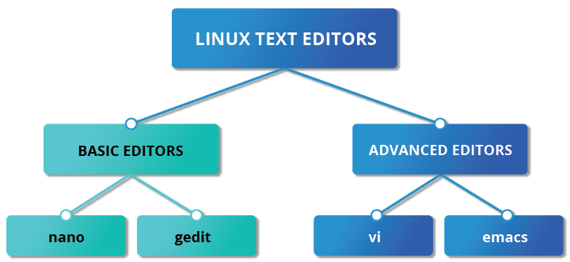
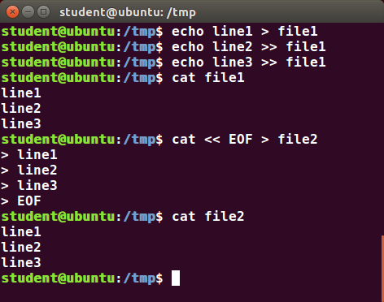
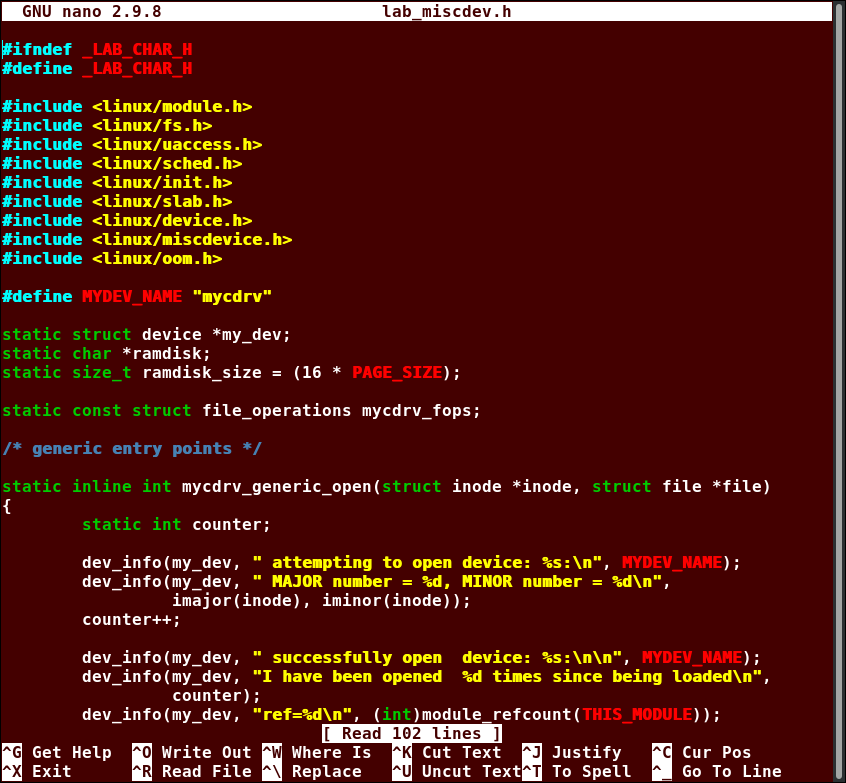
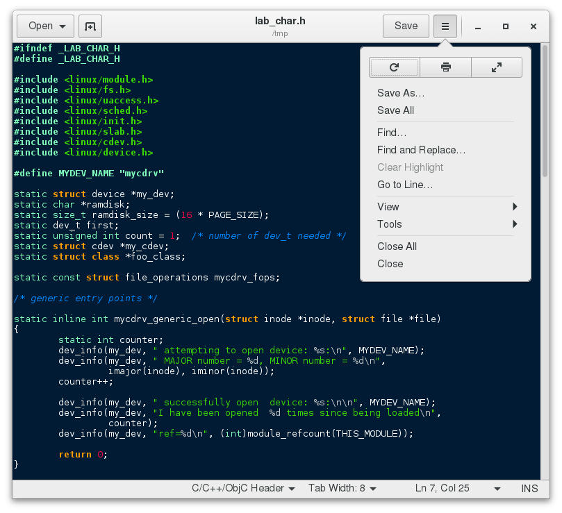
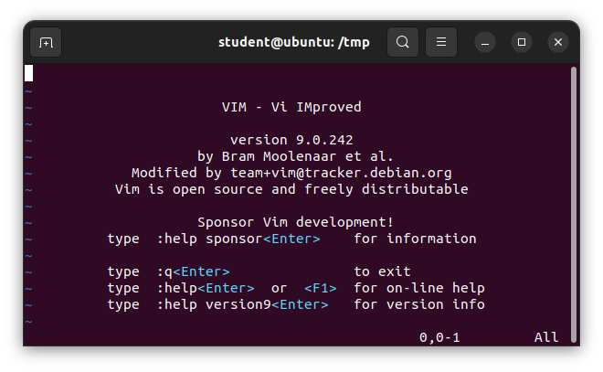
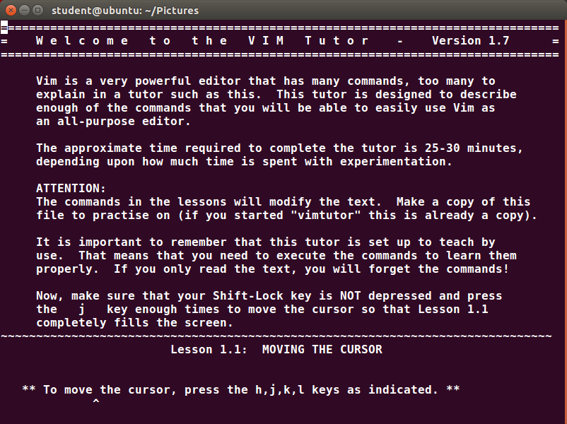
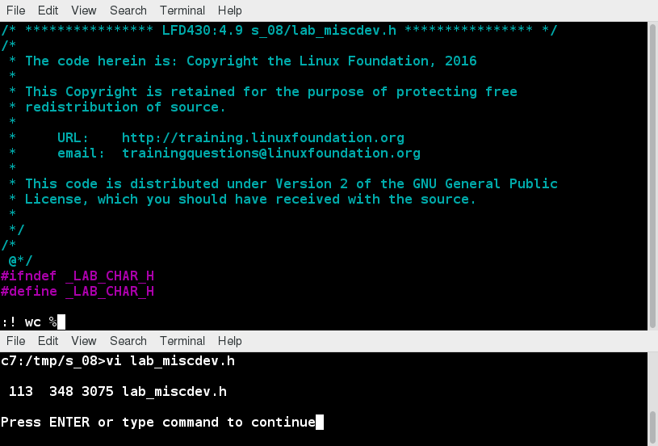
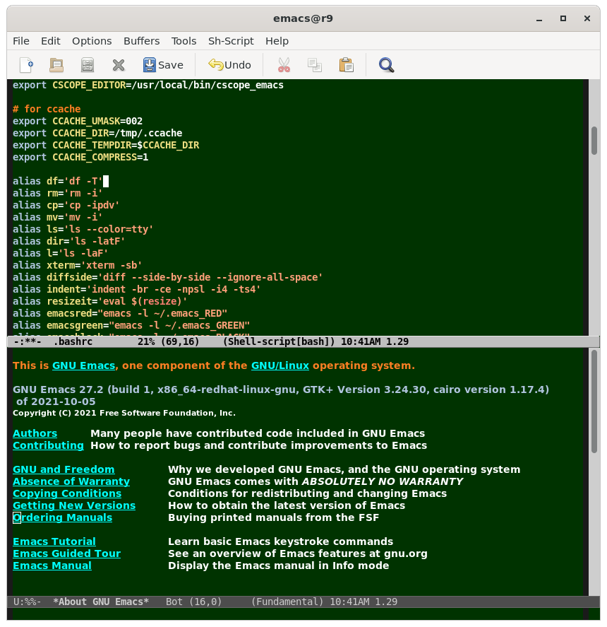

# Text Editors

## Learning Objectives

By the end of this chapter, you should be familiar with:

- How to create and edit files using the available Linux text editors.
- nano, a simple text-based editor.
- gedit, a simple graphical editor.
- vi and emacs, two advanced editors with both text-based and graphical interfaces.

# Basic Editors: nano and gedit

## verview of Text Editors in Linux

At some point, you will need to manually edit text files. You might be composing an email offline, writing a script to be used for **bash** or other command interpreters, altering a system or application configuration file, or developing source code for a programming language such as C, Python or Java.

Linux users and administrators may sidestep using a text editor, instead employing graphical utilities for creating and modifying system configuration files. However, this can be both more laborious than directly using a text editor and more limited in capability. In fact, word processing applications (including those that are part of common office application suites) are not really basic text editors; they add a lot of extra (usually invisible) formatting information that will probably render system administration configuration files unusable for their intended purpose. Thus, knowing how to confidently use one or more text editors is really an essential skill to have for Linux.

By now, you have certainly realized Linux is packed with choices; when it comes to text editors, there are many choices, ranging from quite simple to very complex, including:

- **nano**
- **gedit**
- **vi**
- **emacs**

In this section, we learn first about the **nano** and **gedit** editors, which are relatively simple and easy to learn, and then later the more complicated choices, **vi** and **emacs**.

Another product that has gained in usage and popularity is [Microsoft’s Visual Studio Code](https://code.visualstudio.com/), usually abbreviated as **code** when used in Linux.  This is actually a fully featured integrated development environment and far from lightweight, but many new Linux users are already used to it from working in other operating systems.  Installation details vary from one distribution to another and usually involve incorporating additional package repositories; we will not go into how to do this here.



## Creating Files Without Using an Editor

Sometimes, you may want to create a short file and not want to bother invoking a full text editor. Furthermore, doing so can be quite useful when used from within scripts, even when creating longer files. You will no doubt find yourself using this method when you start on the later chapters that cover shell scripting!

If you want to create a file without using an editor, there are two standard ways to create one from the command line and fill it with content.

The first is to use echo repeatedly:

```bash
echo line one > myfile
echo line two >> myfile
echo line three >> myfile
```

Note that while a single greater-than sign (**>**) will send the output of a command to a file (and obliterate any already existing version of that file!), two of them (**>>**) will append the new output to an existing file.

The second way is to use cat combined with redirection:

```bash
$ cat << EOF > myfile
> line one
> line two
> line three
> EOF
$
```

In this example, the string used to show the beginning and end of the process need not be EOF; it could be STOP or any other string not used in the content itself. Both techniques produce a file with the following lines in it:

**line one**
**line two**
**line three**

and are extremely useful when employed by scripts.



## nano and gedit

There are some text editors that are pretty obvious; they require no particular experience to learn and are actually quite capable, even robust. A particularly easy-to-use one is the text terminal-based editor nano. Just invoke nano by giving a file name as an argument. All the help you need is displayed at the bottom of the screen, and you should be able to proceed without any problem.

As a graphical editor, gedit is part of the GNOME desktop system (kwrite is associated with KDE). The gedit and kwrite editors are very easy to use and are extremely capable. They are also very configurable. They look a lot like Notepad in Windows. Other variants, such as kate, are also supported by KDE.

## nano

**nano** is easy to use, and requires very little effort to learn. To open a file, type **nano <filename>** and press **Enter**. If the file does not exist, it will be created.

**nano** provides a two line shortcut bar at the bottom of the screen that lists the available commands. Some of these commands are:

- **CTRL-G**
  - Display the help screen.
- **CTRL-O**
  - Write to a file.
- **CTRL-X**
  - Exit a file.
- **CTRL-R**
  - Insert contents from another file to the current buffer.
- **CTRL-C**
  - Show cursor position.



## gedit

**gedit** (pronounced **'g-edit'**) is a simple-to-use graphical editor that can only be run within a Graphical Desktop environment. It is visually quite similar to the Notepad text editor in Windows, but is actually far more capable and very configurable and has a wealth of plugins available to extend its capabilities further.

To open a new file find the program in your desktop's menu system, or from the command line type **gedit <filename>**. If the file does not exist, it will be created.

Using **gedit** is pretty straightforward and does not require much training. Its interface is composed of quite familiar elements.



## Visual Studio Code

Visual Studio Code (code) is another simple-to-use graphical editor. It has a lot of functionality besides being used as a text editor. Here is a screenshot of it working on the same file we have already shown with the other editors.


# More Advanced Editors: vi and emacs

## vi and emacs

Developers and administrators experienced in working on UNIX-like systems almost always use one of the two venerable editing options: **vi** and **emacs**. Both are present or easily available on all distributions and are completely compatible with the versions available on other operating systems.

Both **vi** and **emacs** have a basic, purely text-based form that can run in a non-graphical environment. They also have one or more graphical interface forms with extended capabilities; these may be friendlier for a less experienced user. While vi and emacs can have significantly steep learning curves for new users, they are extremely efficient when one has learned how to use them.

You need to be aware that fights among seasoned users over which editor is better can be quite intense and are often described as a holy war. It is clear, however, that there are many more users of vi than there are of emacs. Both editing programs are here to stay no matter what.

## Introduction to vi

Usually, the actual program installed on your system is **vim**, which stands for **Vi IMproved** and is aliased to the name **vi**. The name is pronounced as **“vee-eye”**.

Even if you do not want to use **vi**, it is good to gain some familiarity with it: it is a standard tool installed on virtually all Linux distributions. Indeed, there may be times when there is no other editor available on the system.

GNOME extends **vi** with a very graphical interface known as **gvim** and KDE offers **kvim**. Either of these may be easier to use at first.

When using **vi**, all commands are entered through the keyboard. You do not need to keep moving your hands to use a pointer device such as a mouse or touchpad, unless you want to do so when using one of the graphical versions of the editor.



## vimtutor

Typing **vimtutor** launches a short but very comprehensive tutorial for those who want to learn their first vi commands. Even though it provides only an introduction and just seven lessons, it has enough material to make you a very proficient vi user, because it covers a large number of commands. After learning these basic ones, you can look up new tricks to incorporate into your list of vi commands because there are always more optimal ways to do things in vi with less typing.



## Modes in vi

vi provides three modes, as described in the table below. It is vital to not lose track of which mode you are in. Many keystrokes and commands behave quite differently in different modes.

### Table: Modes and Features

| Mode | Feature |
|------|---------|
| **Command** | By default, vi starts in Command mode.<br><br>Each key is an editor command.<br><br>Keyboard strokes are interpreted as commands that can modify file contents. |
| **Insert** | Type `i` to switch to Insert mode from Command mode.<br><br>Insert mode is used to enter (insert) text into a file.<br><br>Insert mode is indicated by an "-- INSERT --" indicator at the bottom of the screen.<br><br>Press `Esc` to exit Insert mode and return to Command mode. |
| **Line** | Type `:` to switch to the Line mode from Command mode.<br><br>Each key is an external command, including operations such as writing the file contents to disk or exiting.<br><br>Uses line editing commands inherited from older line editors. Most of these commands are actually no longer used. Some line editing commands are very powerful.<br><br>Press `Esc` to exit Line mode and return to Command mode. |

## Working with Files in vi

The table describes the most important commands used to start, exit, read, and write files in vi. The ENTER key needs to be pressed after all of these commands.

### Table: Start, Exit, Read and Write Files in vi

| Command | Usage |
|---------|-------|
| `vi myfile` | Start the editor and edit myfile |
| `vi -r myfile` | Start and edit myfile in recovery mode from a system crash |
| `:r file2` | Read in file2 and insert at current position |
| `:w` | Write to the file |
| `:w myfile` | Write out to myfile |
| `:w! file2` | Overwrite file2 |
| `:x` or `:wq` | Exit and write out modified file |
| `:q` | Quit |
| `:q!` | Quit even though modifications have not been saved |

## Changing Cursor Positions in vi

The table describes the most important keystrokes used when changing cursor position in vi. Line mode commands (those following colon `:`) require the ENTER key to be pressed after the command is typed.

### Table: Keys and Usage Examples

| Key | Usage |
|-----|-------|
| Arrow keys | To move up, down, left and right |
| `j` or `<ret>` | To move one line down |
| `k` | To move one line up |
| `h` or Backspace | To move one character left |
| `l` or Space | To move one character right |
| `0` | To move to beginning of line |
| `$` | To move to end of line |
| `w` | To move to beginning of next word |
| `:0` or `1G` | To move to beginning of file |
| `:n` or `nG` | To move to line n |
| `:$` or `G` | To move to last line in file |
| `Ctrl-F` or Page Down | To move forward one page |
| `Ctrl-B` or Page Up | To move backward one page |
| `Ctrl-L` | To refresh and center screen |

## Searching for Text in vi

The table describes the most important commands used when searching for text in vi.

### Table: Commands Used to Search for Text in vi

| Command | Usage |
|---------|-------|
| `/pattern` | Search forward for pattern |
| `?pattern` | Search backward for pattern |

The table describes the most important keystrokes used when navigating search results in vi.

### Table: Keystrokes Used to Search for Text in vi

| Key | Usage |
|-----|-------|
| `n` | Move to next occurrence of search pattern |
| `N` | Move to previous occurrence of search pattern |

## Working with Text in vi

The table describes the most important keystrokes used when changing, adding, and deleting text in vi.

### Table: Changing, Adding, Deleting Text in vi

| Key | Usage |
|-----|-------|
| `a` | Append text after cursor; stop upon Escape key |
| `A` | Append text at end of current line; stop upon Escape key |
| `i` | Insert text before cursor; stop upon Escape key |
| `I` | Insert text at beginning of current line; stop upon Escape key |
| `o` | Start a new line below current line, insert text there; stop upon Escape key |
| `O` | Start a new line above current line, insert text there; stop upon Escape key |
| `r` | Replace character at current position |
| `R` | Replace text starting with current position; stop upon Escape key |
| `x` | Delete character at current position |
| `Nx` | Delete N characters, starting at current position |
| `dw` | Delete the word at the current position |
| `D` | Delete the rest of the current line |
| `dd` | Delete the current line |
| `Ndd` or `dNd` | Delete N lines |
| `u` | Undo the previous operation |
| `yy` | Yank (copy) the current line and put it in buffer |
| `Nyy` or `yNy` | Yank (copy) N lines and put it in buffer |
| `p` | Paste at the current position the yanked line or lines from the buffer |

## Using External Commands in vi

Typing **sh** command opens an external command shell. When you exit the shell, you will resume your editing session.

Typing ! executes a command from within vi. The command follows the exclamation point. This technique is best suited for non-interactive commands, such as : **! wc %**. Typing this will run the **wc (word count)** command on the file; the character % represents the file currently being edited.



## Introduction to emacs

The emacs editor is a popular competitor for vi. Unlike vi, it does not work with modes. emacs is highly customizable and includes a large number of features. It was initially designed for use on a console, but was soon adapted to work with a GUI as well. emacs has many other capabilities other than simple text editing. For example, it can be used for email, debugging, etc.

Rather than having different modes for command and insert, like vi, emacs uses the **CTRL** and Meta (**Alt**  or **Esc**) keys for special commands.



The table lists some of the most important key combinations that are used when starting, exiting, reading, and writing files in emacs.

## Working with emacs

The table lists some of the most important key combinations that are used when starting, exiting, reading, and writing files in emacs.

## Table: Starting, Exiting, Reading, and Writing Files in emacs

| Key | Usage |
|-----|-------|
| **emacs myfile** | Start emacs and edit **myfile** |
| **CTRL-x i** | Insert prompted for file at current position |
| **CTRL-x s** | Save all files |
| **CTRL-x CTRL-w** | Write to the file giving a new name when prompted |
| **CTRL-x CTRL-s** | Saves the current file |
| **CTRL-x CTRL-c** | Exit after being prompted to save any modified files |

The emacs tutorial is a good place to start learning basic commands. It is available any time when in emacs by simply typing **CTRL-h** (for help) and then the letter **t** for tutorial.

## Changing Cursor Positions in emacs

The table lists some of the keys and key combinations that are used for changing cursor positions in emacs.

## Table: Keys and Usage Examples

| Key | Usage |
|-----|-------|
| **arrow keys** | Use the arrow keys for up, down, left and right |
| **CTRL-n** | One line down |
| **CTRL-p** | One line up |
| **CTRL-f** | One character forward/right |
| **CTRL-b** | One character back/left |
| **CTRL-a** | Move to beginning of line |
| **CTRL-e** | Move to end of line |
| **Meta-f** | Move to beginning of next word |
| **Meta-b** | Move back to beginning of preceding word |
| **Meta-<** | Move to beginning of file |
| **Meta-g-g-n** | Move to line n (can also use **'Esc-x Goto-line n'**) |
| **Meta->** | Move to end of file |
| **CTRL-v** or **Page Down** | Move forward one page |
| **Meta-v** or **Page Up** | Move backward one page |
| **CTRL-l** | Refresh and center screen |

## Searching for Text in emacs

The table lists the key combinations that are used for searching for text in emacs.

## Table: Key Combinations Used to Search for Text in emacs

| Key | Usage |
|-----|-------|
| **CTRL-s** | Search forward for prompted pattern, or for next pattern |
| **CTRL-r** | Search backwards for prompted pattern, or for next pattern |

## Working with Text in emacs

The table lists some of the key combinations used for changing, adding, and deleting text in emacs.

## Table: Changing, Adding, and Deleting Text in emacs

| Key | Usage |
|-----|-------|
| **CTRL-o** | Insert a blank line |
| **CTRL-d** | Delete character at current position |
| **CTRL-k** | Delete the rest of the current line |
| **CTRL-_** | Undo the previous operation |
| **CTRL-** (space or **CTRL-@**) | Mark the beginning of the selected region (the end will be at the cursor position) |
| **CTRL-w** | Delete the current marked text and write it to the buffer |
| **CTRL-y** | Insert at current cursor location whatever was most recently deleted |

## Chapter Summary

You have completed Chapter 12. Let’s summarize the key concepts covered:

- Text editors (rather than word processing programs) are used quite often in Linux, for tasks such as creating or modifying system configuration files, writing scripts, developing source code, etc.
- nano is an easy-to-use text-based editor that utilizes on-screen prompts.
- gedit is a graphical editor, very similar to Notepad in Windows.
- The vi editor is available on all Linux systems and is very widely used. Graphical extension versions of vi are widely available as well.
- emacs is available on all Linux systems as a popular alternative to vi. emacs can support both a graphical user interface and a text mode interface.
- To access the vi tutorial, type vimtutor at a command line window.
- To access the emacs tutorial type Ctl-h and then t from within emacs.
- vi has three modes: Command, Insert, and Line. emacs has only one, but requires use of special keys, such as Control and Escape.
- Both editors use various combinations of keystrokes to accomplish tasks. The learning curve to master these can be long, but once mastered using either editor is extremely efficient.
