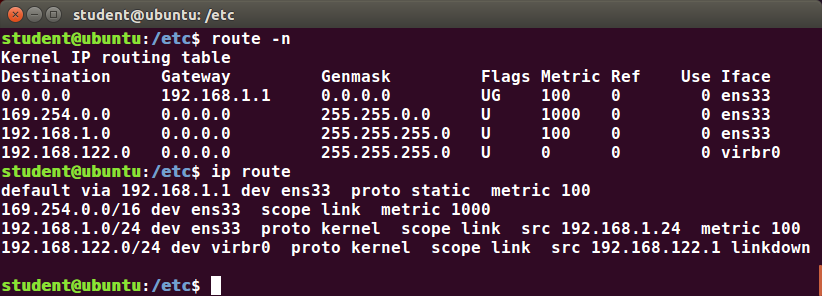

# Network Operations

## Learning Objectives

By the end of this chapter, you should be able to:

- Explain basic networking concepts, including types of networks and addressing issues.
- Configure network interfaces and use basic networking utilities, such as `ifconfig`, `ip`, `ping`, `route` and `traceroute`.
- Use graphical and non-graphical browsers, such as Lynx, w3m, Firefox, Chrome and Epiphany.
- Transfer files to and from clients and servers using both graphical and text mode applications, such as scp, ftp, sftp, curl and wget.

# Network Addresses and DNS

## Introduction to Networking

A `network` is a group of computers and computing devices connected together through communication channels, such as cables or wireless media. The computers connected over a network may be located in the same geographical area or spread across the world. The connected devices are often termed `nodes`.

A network is used to:

- Allow the connected devices to communicate with each other.
- Enable multiple users to share devices over the network, such as music and video servers, printers, and scanners.
- Share and manage information such as databases and file systems across computers easily.

Most organizations have both an internal network and an Internet connection for users to communicate with machines and people outside the organization. The `Internet` is the largest network in the world and can be called *"the network of networks"*.

## IP Addresses

Devices attached to a network must have at least one unique network address identifier known as the `IP (Internet Protocol) address`. This address is essential for routing packets of information through the network.

Exchanging information across the network requires using streams of small packets, each of which contains a piece of the information going from one machine to another. These packets contain data buffers, together with headers which contain information about where the packet is going to and coming from and where it fits in the sequence of packets that constitute the stream. Networking protocols and software are rather complicated due to the diversity of machines and operating systems they must deal with, as well as the fact that even very old standards must be supported.


## Pv4 and IPv6

There are two different types of IP addresses available: `IPv4 (version 4)` and `IPv6 (version 6)`. `IPv4` is older and by far the more widely used, while `IPv6 is newer and is designed to get past limitations inherent in the older standard and furnish many more possible addresses.

`IPv4` uses `32-bits` for addresses; there are only `4.3 billion` unique addresses available. Furthermore, many addresses are allotted and reserved, but not actually used. `IPv4` is considered inadequate for meeting future needs because the number of devices available on the global network has increased enormously in recent years.

`IPv6` uses `128-bits` for addresses; this allows for `3.4 X 1038` unique addresses. If you have a larger network of computers and want to add more, you might want to move to `IPv6` because it provides more unique addresses. However, it can be complex to migrate to `IPv6`; the two protocols do not always inter-operate well. Thus, moving equipment and addresses to `IPv6` requires significant effort and has not been quite as fast as was originally intended. We will discuss `IPv4` more than `IPv6` as you are more likely to deal with it.


Retrieved from 

One reason IPv4 has not disappeared is there are widely-used ways to effectively make many more addresses available by methods such as `NAT (Network Address Translation)`. `NAT` enables sharing one `IP` address among many locally connected computers, each of which has a unique address only seen on the local network. While this is used in organizational settings, it is also used in simple home networks. For example, if you have a router hooked up to your Internet Provider (such as a cable system) it gives you one externally visible address, but issues each device in your home an individual local address, which is invisible to the outside world.


## Decoding IPv4 Addresses

A `32-bit` `IPv4` address is divided into four `8-bit` sections called [octets](https://en.wikipedia.org/wiki/Octet_(computing)).

`Example:
IP address →            172  .          16  .      31  .     46
Bit format →     10101100.00010000.00011111.00101110`

`NOTE`: *Octet is just another word for byte*.

Network addresses are divided into five classes: `A, B, C, D` and `E`. `Classes A, B` and `C` are classified into two parts: `Network addresses (Net ID)` and `Host address (Host ID)`. The `Net ID` is used to identify the network, while the `Host ID` is used to identify a host in the network. `Class D` is used for special multicast applications (information is broadcast to multiple computers simultaneously) and `Class E` is reserved for future use. In this section you will learn about classes `A`, `B` and `C`.


## Class A Network Addresses

`Class A` addresses use the first octet of an `IP` address as their `Net ID` and use the other three octets as the `Host ID`. The first bit of the first octet is always set to zero. So you can use only `7-bits` for unique network numbers. As a result, there are a maximum of `126 Class A networks` available (the addresses `0000000` and `1111111` are reserved). Not surprisingly, this was only feasible when there were very few unique networks with large numbers of hosts. As the use of the `Internet` expanded, `Classes B` and `C` were added in order to accommodate the growing demand for independent networks.

Each `Class A` network can have up to `16.7 million` unique hosts on its network. The range of host addresses is from ``1.0.0.0 to `127.255.255.255`.

`NOTE`: *The value of an octet, or 8-bits, can range from 0 to 255*. 

An example of a Class A address is:


## Class B Network Addresses

`Class B` addresses use the first two octets of the `IP` address as their `Net ID` and the last two octets as the `Host ID`. The first two bits of the first octet are always set to `binary 10`, so there are a maximum of `16,384 (14-bits)` `Class B` networks. The first octet of a `Class B` address has values from `128` to `191`. The introduction of `Class B` networks expanded the number of networks but it soon became clear that a further level would be needed.

Each `Class B` network can support a maximum of `65,536` unique hosts on its network. The range of host addresses is from `128.0.0.0` to `191.255.255.255`.

An example of a Class B address is:


## Class C Network Addresses

`Class C` addresses use the first three octets of the `IP` address as their `Net ID` and the last octet as their `Host ID`. The first three bits of the first octet are set to `binary 110`, so almost `2.1 million (21-bits)` `Class C` networks are available. The first octet of a `Class C` address has values from `192` to `223`. These are most common for smaller networks which don't have many unique hosts.

Each `Class C` network can support up to `256 (8-bits)` unique hosts. The range of host addresses is from `192.0.0.0` to `223.255.255.255`.

An example of a Class C address is:


## IP Address Allocation

Typically, a range of `IP` addresses are requested from your `Internet Service Provider (ISP)` by your organization's network administrator. Often, your choice of which class of `IP` address you are given depends on the size of your network and expected growth needs. If `NAT` is in operation, such as in a home network, you only get one externally visible address!


You can assign `IP` addresses to computers over a network either `manually` or `dynamically`. `Manual` assignment adds `static` (never changing) addresses to the network. `Dynamically` assigned addresses can change every time you reboot or even more often; the `Dynamic Host Configuration Protocol (DHCP)` is used to assign IP addresses.

## Name Resolution

`Name Resolution` is used to convert `numerical IP` address values into a human-readable format known as the `hostname`. For example, `3.13.31.214` is the `numerical IP` address that refers to the `hostname` `linuxfoundation.org`. `Hostnames` are much easier to remember!

Given an `IP` address, you can obtain its corresponding `hostname`. Accessing the machine over the network becomes easier when you can type the `hostname` instead of the `IP` address.

You can view your system’s hostname simply by typing hostname with no argument.

`NOTE`: *If you give an argument, the system will try to change its hostname to match it, however, only root users can do that*.

The special `hostname` localhost is associated with the `IP` address `127.0.0.1` and describes the machine you are currently on (which normally has additional network-related `IP` addresses).

# Networking Configuration and Tools

## Network Configuration Files

`Network configuration` files are essential to ensure that `interfaces` function correctly. They are located in the `/etc` directory tree. However, the exact files used have historically been dependent on the particular Linux distribution and version being used.

For `Debian family` configurations, the basic network configuration files could be found under `/etc/network/`, while for `Red Hat` and `SUSE family` systems one needed to inspect `/etc/sysconfig/network`.

Modern systems emphasize the use of `Network Manager`, which we briefly discussed when we considered graphical system administration, rather than try to keep up with the vagaries of the files in `/etc`. While the graphical versions of `Network Manager` do look somewhat different in different distributions, the `nmtui` utility (shown in the screenshot) varies almost not at all, as does the even more sparse `nmcli` (command line interface) utility. If you are proficient in the use of the GUIs, by all means, use them. If you are working on a variety of systems, the lower level utilities may make life easier.


Recent Ubuntu distributions include `netplan`, which is turned on by default, and supplants Network Manager. Since no other distribution has shown interest, and since it can easily be disabled if it bothers you, we will ignore it.

## Network Interfaces

1Network interfaces1 are a connection channel between a device and a network. Physically, network interfaces can proceed through a 1network interface card (NIC)1 or can be more abstractly implemented as software. You can have multiple network interfaces operating at once. Specific interfaces can be brought up (activated) or brought down (deactivated) at any time.

Information about a particular `network interface` or all network interfaces can be reported by the `ip` and `ifconfig` utilities, which you may have to run as the `superuser`, or at least, give the full path, i.e. `/sbin/ifconfig`, on some distributions. `ip` is newer than `ifconfig`and has far more capabilities, but its output is uglier to the human eye. Some new Linux distributions do not install the older `net-tools` package to which `ifconfig` belongs, and so you would have to install it if you want to use it.


## The ip Utility

To view the IP address:

```bash
$ /sbin/ip addr show
```

To view the routing information:

```bash
$ /sbin/ip route show
```

`ip` is a very powerful program that can do many things. Older (and more specific) utilities such as `ifconfig` and `route` are often used to accomplish similar tasks. A look at the relevant man pages can tell you much more about these utilities.


## ping

`ping` is used to check whether or not a machine attached to the network can receive and send data; i.e. it confirms that the remote host is online and is responding.

To check the status of the remote host, at the command prompt, type `ping <hostname>`.

`ping` is frequently used for network testing and management; however, its usage can increase network load unacceptably. Hence, you can abort the execution of ping by typing `CTRL-C`, or by using the `-c` option, which limits the number of packets that `ping` will send before it quits. When execution stops, a summary is displayed. Some hosts refuse to answer `ping` requests.


## route

A network requires the connection of many nodes. Data moves from source to destination by passing through a series of routers and potentially across multiple networks. Servers maintain routing tables containing the addresses of each node in the network. The IP routing protocols enable routers to build up a forwarding table that correlates final destinations with the next hop addresses.



One can use the `route` utility (or the newer `ip route` command) to view or change the IP routing table to add, delete, or modify specific (static) routes to specific hosts or networks. The table explains some commands that can be used to manage IP routing:

`Table: Tasks and Commands`

| Task | Command |
| :--- | :--- |
| **Show current routing table** | `$ route –n` or `ip route` |
| **Add static route** | `$ route add -net address` or `ip route add` |
| **Delete static route** | `$ route del -net address` or `ip route del` |

## traceroute

`traceroute` is used to inspect the route which the data packet takes to reach the destination host, which makes it quite useful for troubleshooting network delays and errors. By using `traceroute`, you can isolate connectivity issues between hops, which helps resolve them faster.

To print the route taken by the packet to reach the network host, at the command prompt, type `traceroute <address>`.


## More Networking Tools  🌐

Now, let’s learn about some additional networking tools. Networking tools are very useful for monitoring and debugging network problems, such as network connectivity and network traffic.

| Networking Tool | Description |
| :--- | :--- |
| **`ethtool`** | Queries network interfaces and can also set various parameters such as speed. |
| **`netstat`** | Displays all active connections and routing tables; useful for monitoring performance and troubleshooting. |
| **`nmap`** | Scans open ports on a network; important for security analysis. |
| **`tcpdump`** | Dumps network traffic for analysis. |
| **`iptraf`** | Monitors network traffic in text mode. |
| **`mtr`** | Combines the functionality of `ping` and `traceroute` and provides a continuously updated display. |
| **`dig`** | Tests DNS workings; a good replacement for `host` and `nslookup`. |

## Graphical and Non-Graphical Browsers

Browsers are used to retrieve, transmit, and explore information resources, usually on the World Wide Web. Linux users commonly use both graphical and non-graphical browser applications.

The common graphical browsers used in Linux are:

- [Firefox](https://www.mozilla.org/en-US/firefox/)
- [Google Chrome](https://www.google.com/chrome/)
- [Chromium](https://www.chromium.org/Home)
- [Konqueror](https://kde.org/applications/internet/org.kde.konqueror)
- [Opera](https://www.opera.com/)

Sometimes, you either do not have a graphical environment to work in (or have reasons not to use it) but still need to access web resources. In such a case, you can use non-graphical browsers, such as the following:

- [lynx](http://lynx.browser.org/) (configurable text-based web browser; the earliest such browser and still in use)
- [elinks](http://www.elinks.cz/) (based on lynx; it can display tables and frames)
- [w3m](https://w3m.sourceforge.net/) (another text-based web browser with many features)

## wget

Sometimes, you need to download files and information, but a browser is not the best choice, either because you want to download multiple files and/or directories, or you want to perform the action from a command line or a script. `wget` is a command line utility that can capably handle the following types of downloads:

- Large file downloads
- Recursive downloads, where a web page refers to other web pages and all are downloaded at once
- Password-required downloads
- Multiple file downloads.

To download a web page, you can simply type `wget <url>`, and then you can read the downloaded page as a local file using a graphical or non-graphical browser.

