# The Bash Shell and Basic Scripting

## Learning Objectives

By the end of this chapter, you should be able to:

- Explain the features and capabilities of bash shell scripting.
- Know the basic syntax of scripting statements.
- Be familiar with various methods and constructs used.
- Test for properties and existence of files and other objects.
- Use conditional statements, such as if-then-else blocks.
- Perform arithmetic operations using scripting language.

# Features and Capabilities

## Shell Scripting

Suppose you want to look up a filename, check if the associated file exists, and then respond accordingly, displaying a message confirming or not confirming the file's existence. If you only need to do it once, you can just type a sequence of commands at a terminal. However, if you need to do this multiple times, automation is the way to go. In order to automate sets of commands, you will need to learn how to write shell scripts. Most commonly in Linux, these scripts are developed to be run under the `bash` command shell interpreter. The graphic illustrates several of the benefits of deploying scripts.

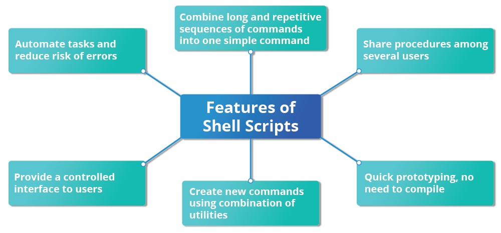

`NOTE`: *Many of the topics discussed in this and the next chapter have already been introduced earlier, while discussing things that can be done at the command line. We have elected to repeat some of that discussion in order to make the sections on scripting stand on their own, so the repetition is intentional*.

## Command Shell Choices

The command interpreter is tasked with executing statements that follow it in the script. Commonly used interpreters include: `/usr/bin/perl, /bin/bash, /bin/csh, /usr/bin/python and /bin/sh`.

Typing a long sequence of commands at a terminal window can be complicated, time consuming, and error prone. By deploying shell scripts, using the command line becomes an efficient and quick way to launch complex sequences of steps. The fact that shell scripts are saved in a file also makes it easy to use them to create new script variations and share standard procedures with several users.

Linux provides a wide choice of shells; exactly what is available on the system is listed in `/etc/shells`. Typical choices are:

- `/bin/sh`
- `/bin/bash`
- `/bin/tcsh`
- `/bin/csh`
- `/bin/ksh`
- `/bin/zsh`

Most Linux users use the default bash shell, but those with long UNIX backgrounds with other shells may want to override the default.

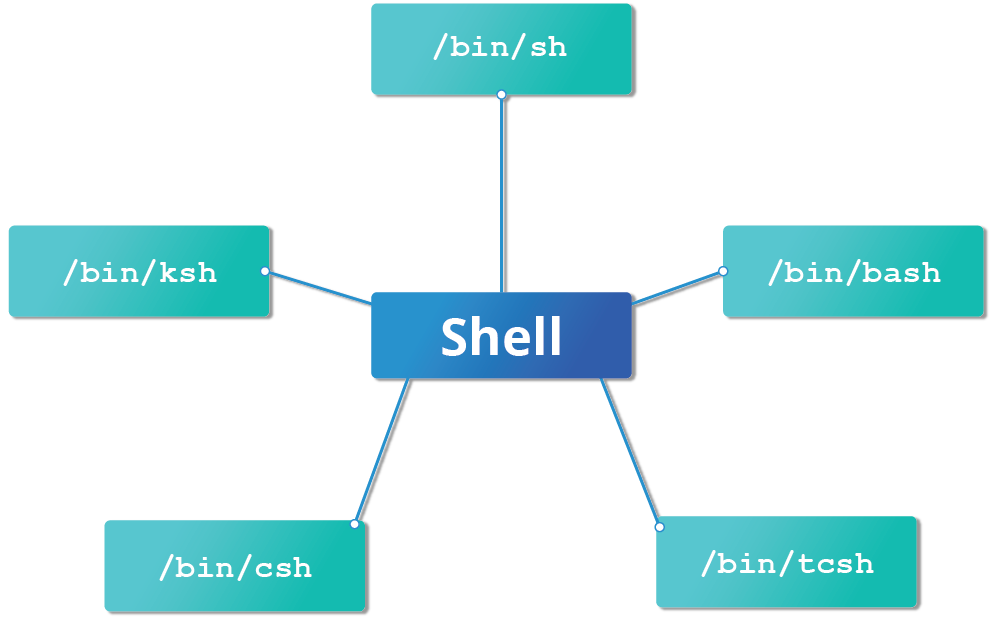

## Shell Scripts

A shell is simply a command line interpreter which provides the user interface for terminal windows. A command shell can also be used to run scripts, even in non-interactive sessions without a terminal window, as if the commands were being directly typed in. For example, typing `find . -name "*.c" -ls` at the command line accomplishes the same thing as executing a script file containing the lines:

- `#!/bin/bash`
- `find . -name "*.c" -ls`

The first line of the script, which starts with `#!`, contains the full path of the command interpreter (in this case `/bin/bash`) that is to be used on the file. You have quite a few choices for the scripting language you can use, such as `/usr/bin/perl`, `/bin/csh`, `/usr/bin/python`, etc. The special two-character sequence, `#`!, is often called a `shebang`, and avoids the usual rule that the pound sign, `#`, delineates the following text as a comment.

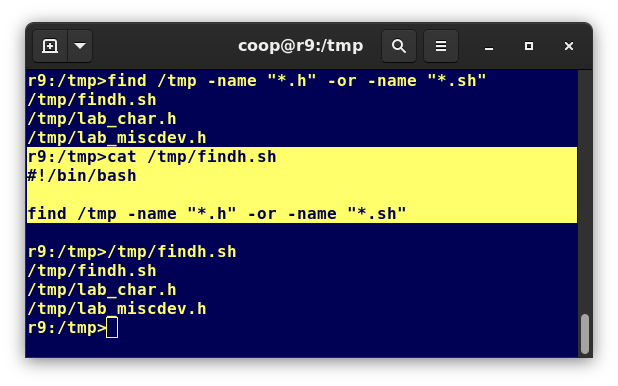

## A Simple bash Script

Let's write a simple bash script that displays a one line message on the screen. Either type:

```bash
$ cat > hello.sh
#!/bin/bash
echo "Hello Linux Foundation Student"
```

and press `ENTER` and `CTRL-D` to save the file, or just create `hello.sh` in your favorite text editor. Then, type `chmod +x hello.sh` to make the file executable by all users.

You can then run the script by typing `./hello.sh` or by doing:

```bash
$ bash hello.sh
Hello Linux Foundation Student
```

`NOTE`: *If you use the second form, you do not have to make the file executable*.

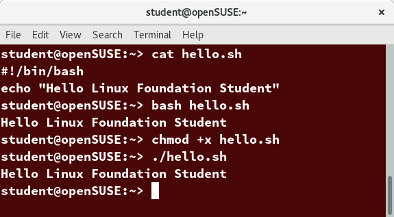

## Interactive Example Using bash Scripts

Now, let's see how to create a more interactive example using a bash script. The user will be prompted to enter a value, which is then displayed on the screen. The value is stored in a temporary variable, `name`. We can reference the value of a shell variable by using a `$` in front of the variable `name`, such as `$name`. To create this script, you need to create a file named `getname.sh` in your favorite editor with the following content:

```bash
#!/bin/bash
# Interactive reading of a variable
echo "ENTER YOUR NAME"
read name
# Display variable input
echo The name given was :$name
```

Once again, make it executable by doing `chmod +x getname.sh`.

In the above example, when the user types `./getname.sh` and the script is executed, the user is prompted with the string `ENTER YOUR NAME`. The user then needs to enter a value and press the `Enter` key. The value will then be printed out.

`NOTE`: *The hash-tag/pound-sign/number-sign (`#`) is used to start comments in the script and can be placed anywhere in the line (the rest of the line is considered a comment). However, note the special magic combination of `#!` (`shebang`) used on the first line, is a unique exception to this rule*.

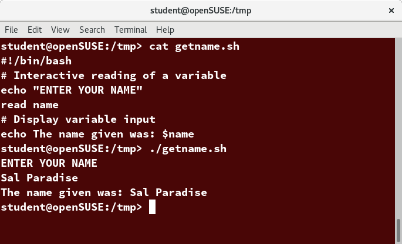

## Return Values

All shell scripts generate a return value upon finishing execution, which can be explicitly set with the `exit` statement. Return values permit a process to monitor the exit state of another process, often in a parent-child relationship. Knowing how the process terminates enables taking any appropriate steps which are necessary or contingent on success or failure.


## Viewing Return Values

As a script executes, one can check for a specific value or condition and return success or failure as the result. By convention, success is returned as zero (0), and failure is returned as any non-zero value. An easy way to demonstrate success and failure completion is to execute the `ls` program on a file that exists as well as one that does not. The return value is stored in the environment variable represented by $?:

```bash
$ ls /etc/logrotate.conf
/etc/logrotate.conf

$ echo $?
0
```

In this example, the system is able to locate the file `/etc/logrotate.conf` and `ls` returns a value of `0` to indicate success. When run on a non-existing file, it returns `2`. Applications often translate these return values into meaningful messages easily understood by the user. Usually, the specific values that can be returned and their meanings are explained in the man page for the program as in:

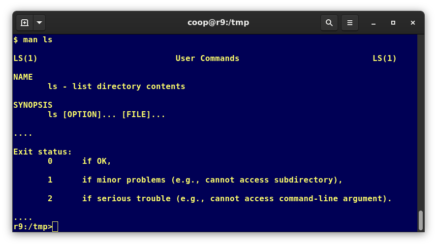

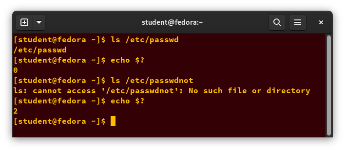

## Basic Syntax and Special Characters

Scripts require you to follow a standard language syntax. Rules delineate how to define variables and how to construct and format allowed statements, etc. The table lists some special character usages within bash scripts:

## Table: Character Usages and Their Descriptions

| Character | Description |
|-----------|-------------|
| **#** | Used to add a comment, except when used as **\#**, or as **#!** when starting a script |
| **\\** | Used at the end of a line to indicate continuation on to the next line, or to indicate that the next character is to be interpreted literally, as in **\$** |
| **;** | Used to interpret what follows as a new command to be executed after completion of the current command |
| **$** | Indicates what follows is an environment variable |
| **>** | Redirect output |
| **>>** | Append output |
| **<** | Redirect input |
| **\|** | Used to pipe the result into the next command |

There are other special characters and character combinations and constructs that scripts understand, such as **(..)**, **{..}**, **[..]**, **&&**, **\|\|**, **'**, **"**, **$((...))**, some of which we will discuss later.

## Splitting Long Commands Over Multiple Lines

Sometimes, commands are too long to either easily type on one line, or to grasp and understand (even though there is no real practical limit to the length of a command line).

In this case, the concatenation operator (**\\**), the backslash character, is used to continue long commands over several lines.

Here is an example of a command installing a long list of packages on a system using Debian package management:

```bash
$~/> cd $HOME 
$~/> sudo apt install autoconf automake bison build-essential \
    chrpath curl diffstat emacs flex gcc-multilib g++-multilib \
    libsdl1.2-dev libtool lzop make mc patch \
    screen socat sudo tar texinfo tofrodos u-boot-tools unzip \
    vim wget xterm zip
```

The command is divided into multiple lines to make it look readable and easier to understand. The **\\** operator at the end of each line causes the shell to combine (concatenate) multiple lines and execute them as one single command.

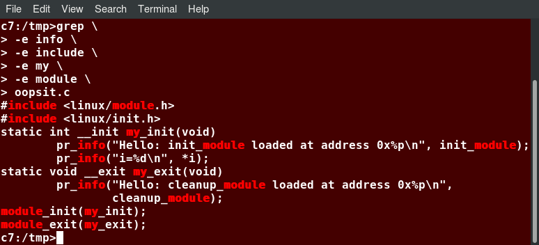

## Putting Multiple Commands on a Single Line

Users sometimes need to combine several commands and statements and even conditionally execute them based on the behavior of operators used in between them. This method is called chaining of commands.

There are several different ways to do this, depending on what you want to do. The ; (semicolon) character is used to separate these commands and execute them sequentially, as if they had been typed on separate lines. Each ensuing command is executed whether or not the preceding one succeeded.

Thus, the three commands in the following example will all execute, even if the ones preceding them fail:

```bash
make ; make install ; make clean
```

However, you may want to abort subsequent commands when an earlier one fails. You can do this using the && (and) operator as in:

```bash
make && make install && make clean
```

If the first command fails, the second one will never be executed. A final refinement is to use the || (or) operator, as in:

```bash
cat file1 || cat file2 || cat file3
```

In this case, you proceed until something succeeds and then you stop executing any further steps.

Chaining commands is not the same as piping them; in the later case succeeding commands begin operating on data streams produced by earlier ones before they complete, while in chaining each step exits before the next one starts.

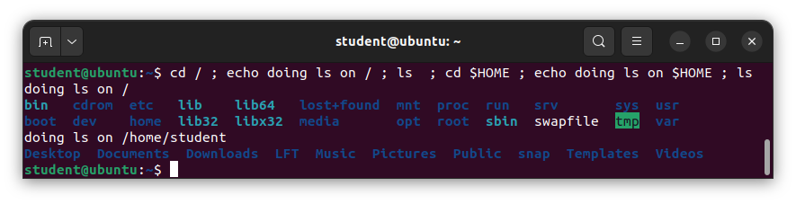

## Output Redirection

Most operating systems accept input from the keyboard and display the output on the terminal. However, with shell commands and scripts you can send the output to a file. The process of diverting the output to a file is called output redirection. We have already used this facility in our earlier sections on how to use the command line.

The `>` character is used to write output to a file. For example, the following command sends the output of free to `/tmp/free.out`:

```bash
free > /tmp/free.out
```

To check the contents of /tmp/free.out, at the command prompt type cat /tmp/free.out.

Two `>` characters (`>>`) will append output to a file if it exists, and act just like `>` if the file does not already exist.

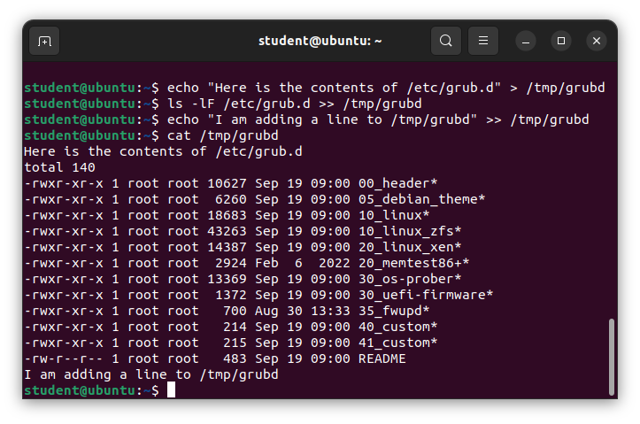

## Input Redirection

Just as the output can be redirected to a file, the input of a command can be read from a file. The process of reading input from a file is called input redirection and uses the `<` character.

The following three commands (using `wc` to count the number of lines, words and characters in a file) are entirely equivalent and involve input redirection, and a command operating on the contents of a file:

```bash
$ wc < /etc/passwd
49  105 2678 /etc/passwd

$ wc /etc/passwd
49  105 2678 /etcpasswd

$ cat /etc/passwd | wc
49  105 2678
```

# Syntax

## Built-In Shell Commands

Shell scripts execute sequences of commands and other types of statements. These commands can be:

- `Compiled applications`
- Built-in bash commands`
- `Shell scripts or scripts from other interpreted languages, such as perl and Python`.

Compiled applications are binary executable files, usually residing on the `filesystem` in well-known directories such as `/usr/bin`. Shell scripts always have access to applications in the default path, such as `rm, ls, df, vi`, and `gzip`, which are programs compiled from lower-level programming languages such as `C`.

In addition, bash has many *built-in* commands, which can only be used to display the output within a terminal shell or shell script. Sometimes, these commands have the same name as executable programs on the system, which can lead to subtle problems. These built-in commands include `cd, pwd, echo, read, logout, printf, let, time`, and `ulimit`. Thus, slightly different behavior can be expected from the built-in version of a command such as `echo` as compared to `/bin/echo`.

A complete list of bash built-in commands can be found in the bash man page, or by simply typing `help`, as we review on the next page.

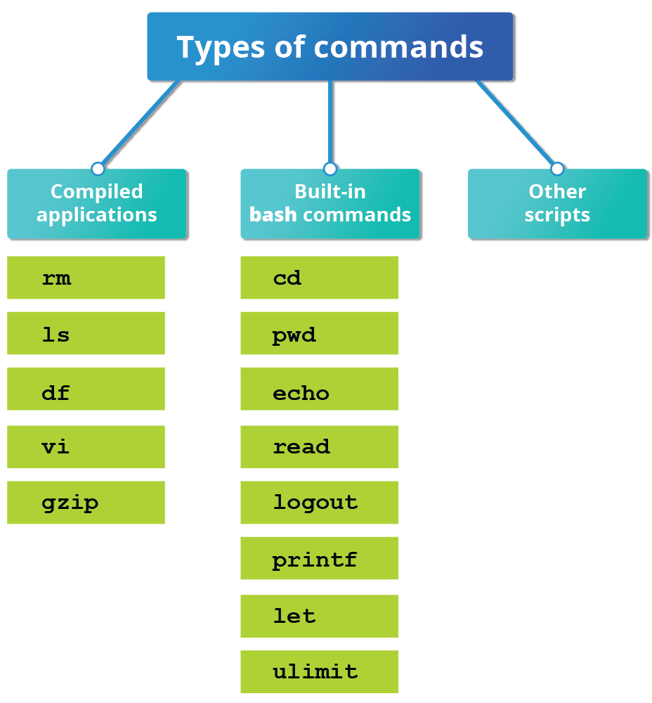

## Commands Built in to bash

We already enumerated which commands have versions internal to bash in our earlier discussion of how to get help on Linux systems. Once again, here is a screenshot listing exactly which commands are available.

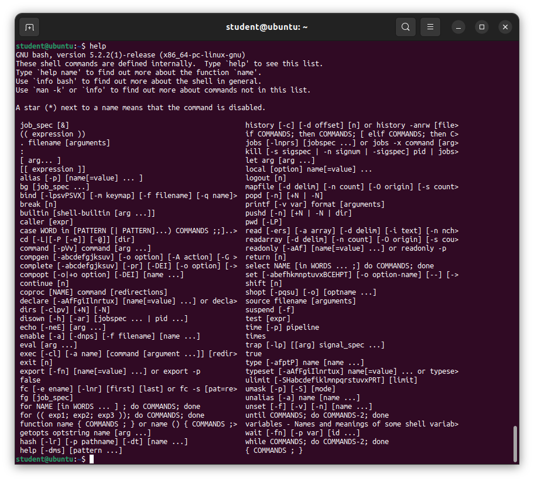

## Script Parameters

Users often need to pass parameter values to a script, such as a filename, date, etc. Scripts will take different paths or arrive at different results according to the parameters (command arguments) that are passed to them. These values can be text or numbers as in:

```bash
./script.sh /tmp
./script.sh 100 200
```

Within a script, the parameter or an argument is represented with a **$** and a number or special character. The table lists some of these parameters.

## Table: Parameters and Their Meanings

| Parameter | Meaning |
|-----------|---------|
| **$0** | Script name |
| **$1** | First parameter |
| **$2**, **$3**, etc. | Second, third parameter, etc. |
| **$*** | All parameters |
| **$#** | Number of arguments |

## Using Script Parameters

If you type in the script shown in the figure, make the script executable with `chmod +x param.sh`. Then, run the script giving it several arguments, as shown. The script is processed as follows:

```bash
$0 prints the script name: param.sh

$1 prints the first parameter: one

$2 prints the second parameter: two

$3 prints the third parameter: three

$* prints all parameters: one two three four five
```

The final statement becomes: All done with `param.sh`

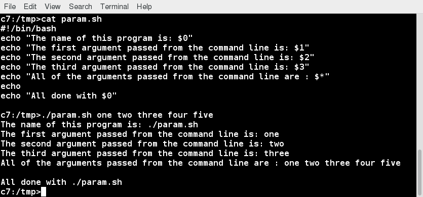

## Command Substitution

At times, you may need to substitute the result of a command as a portion of another command. It can be done in two ways:

- By enclosing the inner command in `$( )`
- By enclosing the inner command with backticks (**`**)

The second form using backticks is deprecated, and its use should be avoided in new scripts and commands. No matter which method is used, the specified command will be executed in a newly launched shell environment, and the standard output of the shell will be inserted where the command substitution is done.

Virtually any command can be executed this way. While both of these methods enable command substitution, the $( ) method allows command nesting, while the use of backticks does not because the right and left delimiters are identical. New scripts should always use this more modern method. For example:

```bash
ls /lib/modules/$(uname -r)/
```

In the above example, the output of the command `uname –r` (which will be something like `6.2.4`) is inserted into the argument for the `ls` command.


## Environment Variables

Most scripts use variables containing a value, which can be used anywhere in the script. These variables can either be user or system-defined. Many applications use such environment variables (already covered in some detail in the *User Environment* chapter) for supplying inputs, validation, and controlling behavior.

As we discussed earlier, some examples of standard environment variables are `HOME, PATH`, and `HOST`. When referenced, environment variables must be prefixed with the `$` symbol, as in `$HOME`. You can view and set the value of environment variables. For example, the following command displays the value stored in the PATH variable:

```bash
echo $PATH
```

However, no prefix is required when setting or modifying the variable value. For example, the following command sets the value of the MYCOLOR variable to blue:

```bash
MYCOLOR=blue
```

You can get a list of environment variables with the env, set, or printenv commands.

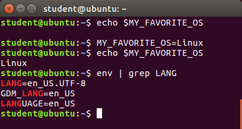

## Exporting Variables

While we discussed the export of environment variables in the section on the *"User Environment"*, it is worth reviewing this topic in the context of writing bash scripts.

By default, the variables created within a script are available only to the subsequent steps of that script. Any `child processes (sub-shells)` do not have automatic access to the values of these variables. To make them available to child processes, they must be promoted to environment variables using the export statement, as in:

```bash

export VAR=value

or

VAR=value ; export VAR
```

While child processes are allowed to modify the value of exported variables, the parent will not see any changes; exported variables are not shared, they are only copied and inherited.

Typing export with no arguments will give a list of all currently exported environment variables.

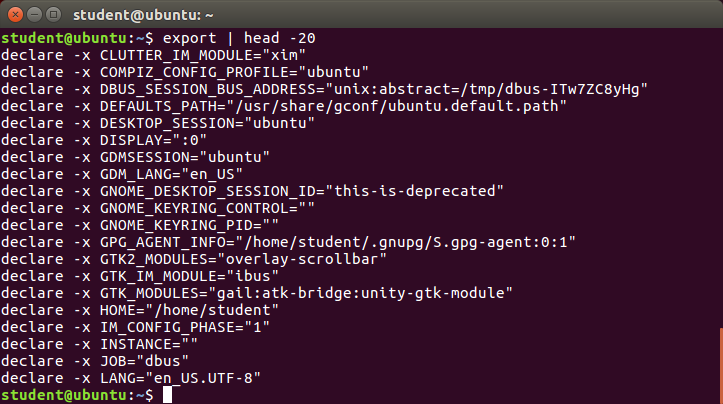

## Functions

A `function` is a code block that implements a set of operations. Functions are useful for executing procedures multiple times, perhaps with varying input variables. `Functions` are also often called `subroutines`. Using `functions` in scripts requires two steps:

1. `Declaring a function`
2. `Calling a function`

The `function` declaration requires a `name` which is used to invoke it. The proper syntax is:

```bash
function_name () {
   command...
}
```

For example, the following `function` is named `display`:

```bash
display () {
   echo "This is a sample function that just displays a string"
}
```

The `function` can be as long as desired and have many `statements`. Once defined, the function can be called later as many times as necessary. In the full example shown in the figure, we are also showing an `often-used` refinement: how to pass an argument to the `function`. The first argument can be referred to as `$1`, the second as `$2`, etc.

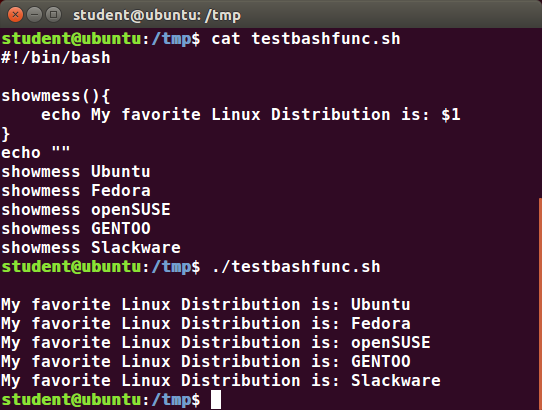

# Constructs

## The if Statement


`Conditional` decision making, using an `if statement`, is a basic construct that any useful programming or scripting language must have.

When an `if statement` is used, the ensuing actions depend on the evaluation of specified conditions, such as:

- `Numerical or string comparisons`
- `Return value of a command (0 for success)`
- `File existence or permissions`

In compact form, the syntax of an if statement is:

```bash
if TEST-COMMANDS; then CONSEQUENT-COMMANDS; fi
```

A more general definition is:

```bash
if condition
then
       statements
else
       statements
fi
```

## Using the if Statement


In the following example, an `if` statement checks to see `if` a certain file exists, and `if` the file is found, it displays a message indicating success or failure:

```bash
if [ -f "$1" ]
then
    echo file "$1" exists 
else
    echo file "$1" does not exist
fi
```

We really should also check first that there is an argument passed to the script `($1)` and abort if not.

Notice the use of the square brackets `([])` to delineate the test condition. There are many other kinds of tests you can perform, such as checking whether two numbers are equal to, greater than, or less than each other and make a decision accordingly; we will discuss these other tests.

In modern scripts, you may see doubled brackets as in `[[ -f /etc/passwd ]]`. This is not an error. It is never wrong to do so and it avoids some subtle problems, such as referring to an empty environment variable without surrounding it in double quotes; we will not talk about this here.

## The elif Statement

You can use the `elif statement` to perform more complicated tests, and take action appropriate actions. The basic syntax is:

```bash
if [ sometest ] ; then
    echo Passed test1 
elif [ someothertest ] ; then
    echo Passed test2 
fi
```

In the example shown we use strings tests which we will explain shortly, and show how to pull in an environment variable with the read statement.


## Testing for Files

bash provides a set of file conditionals, that can be used with the `if statement`, including those in the table.

You can use the `if statement` to test for file attributes, such as:

- `File or directory existence`
- `Read or write permission`
- `Executable permission`

For example, in the following example:

```bash
if [ -x /etc/passwd ] ; then
    ACTION
fi
```

the `if statement` checks `if` the file `/etc/passwd` is executable, which it is not. Note the very common practice of putting:

```bash
; then
```

on the same line as the if statement.

You can view the full list of file conditions typing:

```bash
man 1 test.
```

## Testing for Files

bash provides a set of file conditionals, that can be used with the **if** statement, including those in the table.

You can use the **if** statement to test for file attributes, such as:

- File or directory existence
- Read or write permission
- Executable permission

For example, in the following example:

```bash
if [ -x /etc/passwd ] ; then
    ACTION
fi
```

the **if** statement checks if the file **/etc/passwd** is executable, which it is not. Note the very common practice of putting:

```bash
; then
```

on the same line as the **if** statement.

You can view the full list of file conditions typing:

```bash
man 1 test
```

## Table: Conditions and Their Meanings

| Condition | Meaning |
|-----------|---------|
| **-e file** | Checks if the file exists |
| **-d file** | Checks if the file is a directory |
| **-f file** | Checks if the file is a regular file (i.e., not a symbolic link, device node, directory, etc.) |
| **-s file** | Checks if the file is of non-zero size |
| **-g file** | Checks if the file has **sgid** set |
| **-u file** | Checks if the file has **suid** set |
| **-r file** | Checks if the file is readable |
| **-w file** | Checks if the file is writable |
| **-x file** | Checks if the file is executable |

## Boolean Expressions

Boolean expressions evaluate to either TRUE or FALSE, and results are obtained using the various Boolean operators listed in the table.

## Table: Operator, Operation, and Meaning

| Operator | Operation | Meaning |
|----------|-----------|---------|
| **&&** | AND | The action will be performed only if both the conditions evaluate to true |
| **\|\|** | OR | The action will be performed if any one of the conditions evaluate to true |
| **!** | NOT | The action will be performed only if the condition evaluates to false |

Note that if you have multiple conditions strung together with the **&&** operator, processing stops as soon as a condition evaluates to false. For example, if you have **A && B && C** and A is true but B is false, C will never be executed.

Likewise, if you are using the **\|\|** operator, processing stops as soon as anything is true. For example, if you have **A \|\| B \|\| C** and A is false and B is true, you will also never execute C.

## Tests in Boolean Expressions

`Boolean expressions` return either `TRUE` or `FALSE`. We can use such expressions when working with multiple data types, including strings or numbers, as well as with files. For example, to check if a file exists, use the following conditional test:

```bash
[ -e <filename> ]
```

Similarly, to check if the value of `number1` is greater than the value of `number2`, use the following conditional test:

```bash
[ $number1 -gt $number2 ]
```

The operator `-gt` returns `TRUE` `if number1 is greater than number2`.

## Example of Testing of Strings

You can use the if statement to compare strings using the operator == (two equal signs). The syntax is as follows:

```bash
if [ string1 == string2 ] ; then
   ACTION
fi
```

`Note` *that using one = sign will also work, but some consider it deprecated usage. Let’s now consider an example of testing strings*.

In the example illustrated here, the if statement is used to compare the input provided by the user and accordingly display the result.


## Numerical Tests

You can use specially defined operators with the **if** statement to compare numbers. The various operators that are available are listed in the table:

## Table: Operator and Meaning

| Operator | Meaning |
|----------|---------|
| **-eq** | Equal to |
| **-ne** | Not equal to |
| **-gt** | Greater than |
| **-lt** | Less than |
| **-ge** | Greater than or equal to |
| **-le** | Less than or equal to |

The syntax for comparing numbers is as follows:

```bash
exp1 -op exp2
```

## Example of Testing for Numbers

Let us now consider an example of comparing numbers using the various operators:


## Arithmetic Expressions

`Arithmetic expressions` can be evaluated in the following three ways (spaces are important!):

- Using the `expr` utility
expr is a standard but somewhat deprecated program. The syntax is as follows:

```bash
expr 8 + 8
echo $(expr 8 + 8)
```

- Using the $((...)) syntax
This is the built-in shell format. The syntax is as follows:

```bash
echo $((x+1))
```

- Using the built-in shell command let. The syntax is as follows:

```bash
let x=( 1 + 2 ); echo $x
```

In modern shell scripts, the use of `expr` is better replaced with var=$((...)).

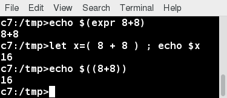

# #Chapter Summary

You have completed Chapter 16. Let's summarize the key concepts covered:

- Scripts are a sequence of statements and commands stored in a file that can be executed by a shell. The most commonly used shell in Linux is bash.
- Command substitution allows you to substitute the result of a command as a portion of another command.
- Functions or routines are a group of commands that are used for execution.
- Environmental variables are quantities either preassigned by the shell or defined and modified by the user.
- To make environment variables visible to child processes, they need to be exported.
- Scripts can behave differently based on the parameters (values) passed to them.
- The process of writing the output to a file is called output redirection.
- The process of reading input from a file is called input redirection.
- The **if** statement is used to select an action based on a condition.
- Arithmetic expressions consist of numbers and arithmetic operators.
