# More on Bash Shell Scripting

## Learning Objectives

By the end of this chapter, you should be able to:

- Manipulate `strings` to perform actions such as `comparison` and `sorting`.
- Use `Boolean` expressions when working with multiple data types, including `strings` or `numbers`, as well as `files`.
- Use `case` statements to handle command line options.
- Use ``looping` constructs to execute one or more lines of code repetitively.
- Debug scripts using set `-x` and set `+x`.
- Create temporary files and directories.
- Create and use `random` numbers.

# String Manipulation

Let's go deeper and find out how to work with strings in scripts.

A string variable contains a sequence of text characters. It can include letters, numbers, symbols and punctuation marks. Some examples include: **abcde**, **123**, **abcde 123**, **abcde-123**, **&acbde=%123**.

String operators include those that do comparison, sorting, and finding the length. The following table demonstrates the use of some basic string operators:

## Table: Operator and Its Meaning

| Operator | Meaning |
|----------|---------|
| **[[ string1 > string2 ]]** | Compares the sorting order of **string1** and **string2** |
| **[[ string1 == string2 ]]** | Compares the characters in **string1** with the characters in **string2** |
| **myLen1=${#string1}** | Saves the length of **string1** in the variable **myLen1** |

Remember, in most cases, we can use single square brackets ( **[ ]** ) instead of double (**[[ ]]**) in comparisons and logical tests, but the more modern doubled form helps avoid some errors, such as those that can arise when doing a comparison with empty strings and environment variables.

## Example of String Manipulation

In the first example, we compare two strings and display an appropriate message using the `if` statement. In the results shown, note the third test where there is an error `if` we use single brackets and do not put the variable name in quotes.

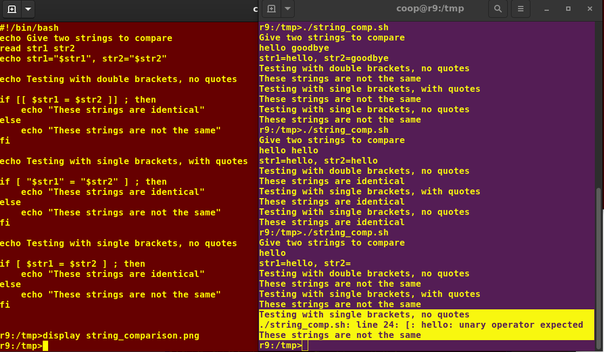

In the second example, we pass in a file name and see if that file exists or not.

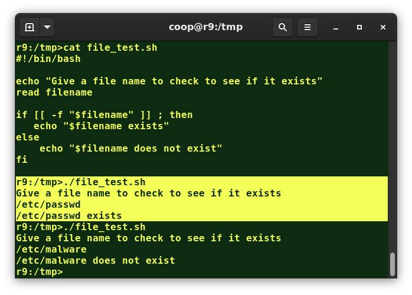

## Parts of a String

At times, you may not need to compare or use an entire string. To extract the first n characters of a string, we can specify: `${string:0:n}`. Here, `0` is the offset in the string (i.e., which character to begin from) where the extraction needs to start, and `n` is the number of characters to be extracted.

To extract all characters in a string after a dot `(.)`, use the following expression: 

```bash
${string#*.}.
```

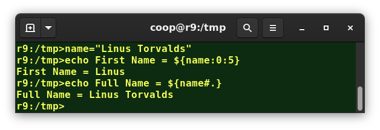

## Lab 17.1: String Tests and Operations

*Click on the two boxes to access Lab 17.1.*
To download the lab solution, check the Resources tab in the Menu on the left-hand side.

## Lab Exercise

Write a script which reads two strings as arguments and then:

1. Tests to see if the first string is of zero length, and if the other is of non-zero length, telling the user of both results.
2. Determines the length of each string, and reports on which one is longer or if they are of equal length.
3. Compares the strings to see if they are the same, and reports on the result.

## Solution

Create a file named **teststrings.sh**, with the content below:

```bash
#!/bin/bash
# check two string arguments were given
[[ $# -lt 2 ]] && \
    echo "Usage: Give two strings as arguments" && exit 1
str1=$1
str2=$2

#------------------------------------
## test command
echo "Is string 1 zero length? Value of 1 means FALSE"
[ -z "$str1" ]
echo $?
# note if $str1 is empty, the test [ -z $str1 ] would fail
#                              but [[ -z $str1 ]] succeeds
#         i.e., with [[ ]] it works even without the quotes
echo "Is string 2 nonzero length? Value of 0 means TRUE;"
[ -n $str2 ]
echo $?

## comparing the lengths of two string
len1=${#str1}
len2=${#str2}
echo length of string1 = $len1, length of string2 = $len2

if [ $len1 -gt $len2 ]
then
    echo "String 1 is longer than string 2"
else
    if [ $len2 -gt $len1 ]
    then
        echo "String 2 is longer than string 1"
    else
        echo "String 1 is the same length as string 2"
    fi
fi

## compare the two strings to see if they are the same
if [[ $str1 == $str2 ]]
then
    echo "String 1 is the same as string 2"
else
    if [[ $str1 != $str2 ]]
    then
        echo "String 1 is not the same as string 2"
    fi
fi
```

## Example Output

```bash
student:/tmp> chmod +x teststrings.sh
student:/tmp> ./teststrings.sh str1 str2
Is string 1 zero length? Value of 1 means FALSE
1
Is string 2 nonzero length? Value of 0 means TRUE;
0
length of string1 = 4, length of string2 = 4
String 1 is the same length as string 2
String 1 is not the same as string 2

student:/tmp>./teststrings.sh str1 str2long
Is string 1 zero length? Value of 1 means FALSE
1
Is string 2 nonzero length? Value of 0 means TRUE;
0
length of string1 = 4, length of string2 = 8
String 2 is longer than string 1
String 1 is not the same as string 2

student:/tmp>
```

# The case Statement

The `case` statement is used in scenarios where the actual value of a variable can lead to different execution paths. `case` statements are often used to handle command-line options.

Below are some of the advantages of using the `case` statement:

- It is easier to read and write and is a good alternative to nested, multi-level `if-then-else-fi` code blocks.
- It enables you to compare a variable against several values at once.
- It reduces the complexity of a program.

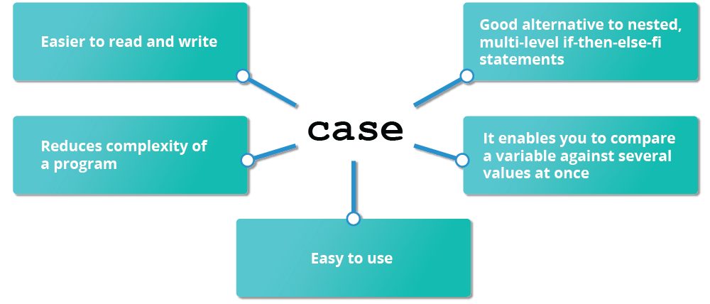

## Structure of the case Statement

Here is the basic structure of the `case` statement:

```bash
case expression in
   pattern1) execute commands;;
   pattern2) execute commands;;
   pattern3) execute commands;;
   pattern4) execute commands;;
   * )       execute some default commands or nothing ;;
esac
```

`Note` *that as soon as the expression matches a pattern successfully, the execution path exits; i.e., the further tests are neither executed nor evaluated. If none of the tests return success, the final choice will execute, which can be to do nothing*.

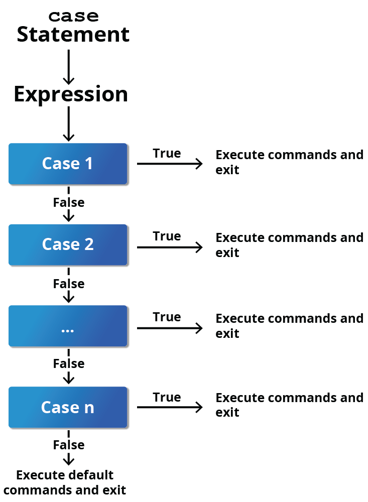

## Example of Use of the case Construct

Here is an example of the use of a case construct. Note you can have multiple possibilities for each case value that take the same action.

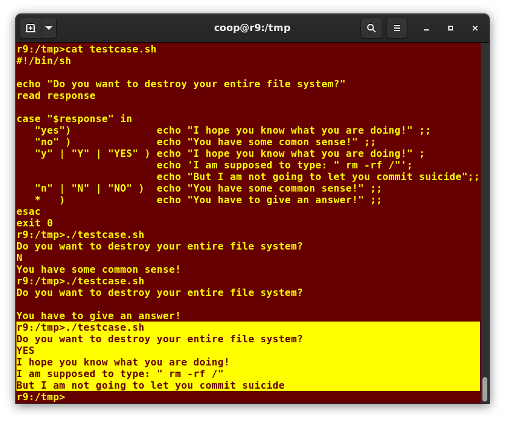

# Looping Constructs

By using `looping constructs`, you can execute one or more lines of code repetitively, usually on a selection of values of data such as individual files. Usually, you do this until a conditional test returns either true or false, as is required.

Three frequently used types of `loops` are often used in bash and in many programming languages:

- `for` loops
- `while` loops
- `until` loops

for
while
until

All these `loops` are easily used for repeatedly executing one or more statements until the exit condition is true.  Each has an easily understood structural form.

## The for loop

The `for` loop operates on each element of a list of items. The syntax for the `for` loop is:

```bash
for variable-name in list
do
execute one iteration for each item in the list until the list is finished
done
```

In this case, `variable-name` and `list` are substituted by you as appropriate (see examples). As with other looping constructs, the statements that are repeated should be enclosed by `do` and `done`.

The screenshot here shows an example of the `for` loop to print the sum of numbers 1 to 10.

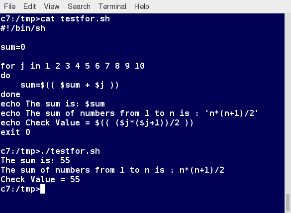

## The while Loop

The `while` loop repeats a set of statements as long as the control command returns true. The syntax is:

```bash
while condition is true
do
    Commands for execution
----
done
```

The set of commands that need to be repeated should be enclosed between `do` and `done`. You can use any command or operator as the condition. Often, it is enclosed within square brackets (`[]`).

The screenshot here shows an example of the while loop that calculates the factorial of a number. Do you know why the computation of 21! gives a bad result?

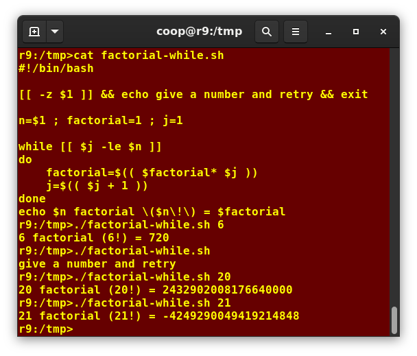

## The until Loop

The `until` loop repeats a set of statements as long as the control command is false. Thus, it is essentially the opposite of the `while` loop. The syntax is:

```bash
until condition is false
do
Commands for execution
----
done
```

Similar to the `while` loop, the set of commands that need to be repeated should be enclosed between `do` and `done`. You can use any command or operator as the condition.

The screenshot here shows an example of the `until` loop that once again computes factorials; it is only slightly different than the test case for the `while` loop.

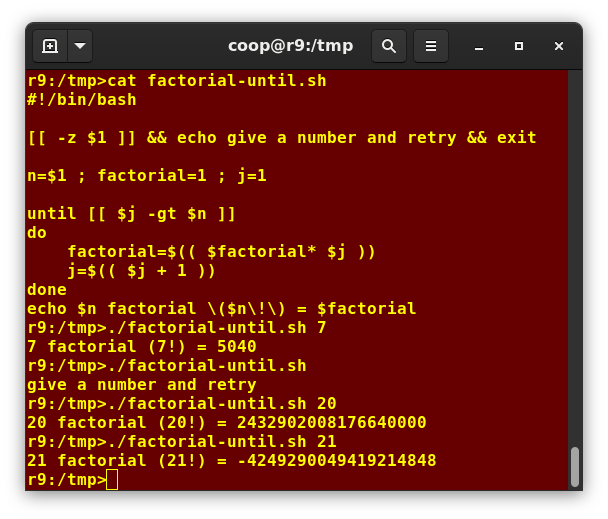

# Script Debugging

## Debugging bash Scripts

While working with scripts and commands, you are likely to incur errors. These may be due to an error in the script, such as `incorrect syntax`, or other ingredients, such as a missing file or insufficient permission to do an operation. These errors may be reported with a specific `error code` but often yield incorrect or confusing output. So, how do you go about identifying and fixing an error?

Debugging helps troubleshoot and resolve such errors and is one of the most important tasks a system administrator performs.

## Script Debug Mode

Before fixing an error (or bug), it is vital to locate the source.

You can run a bash script in debug mode either by doing `bash –x ./script_file`, or bracketing parts of the script with `set -x` and `set +x`. The debug mode helps identify the error because:

- It traces and prefixes each command with the + character.
- It displays each command before executing it.
- It can debug only selected parts of a script (if desired) with:

```bash
set -x    # turns on debugging
...
set +x    # turns off debugging
```

The screenshot shown here demonstrates a previously demonstrated script that checks for a file’s existence but now running in debug mode.

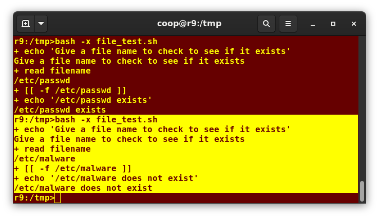

# Redirecting Errors to File and Screen

In UNIX/Linux, all programs that run are given three open file streams when they are started as listed in the table:

## File Streams

| File Stream | Description | File Descriptor |
|-------------|-------------|-----------------|
| **stdin** | Standard Input, by default the keyboard/terminal for programs run from the command line | 0 |
| **stdout** | Standard output, by default the screen for programs run from the command line | 1 |
| **stderr** | Standard error, where output error messages are shown or saved; by default, the same as **stdout** | 2 |

By using redirection, we can save the standard output and error streams to one file or two separate files for later analysis after a program or command is executed.

The screenshot shows a shell script with a simple bug, which is then run, and the error output is diverted to **error.log**. We then use **cat** to display the contents of the error log. Do you see how to fix the script?


## Creating Temporary Files and Directories

Consider a situation where you want to retrieve 100 lines from a file with 10,000 lines. You will need a place to store the extracted information, perhaps in a temporary file, while you do further processing on it.

Temporary files (and directories) are meant to store data for a short time. Usually, one arranges it so that these files disappear when the program using them terminates. While you can also use **touch** to create a temporary file, in some circumstances, this may make it easy for hackers to gain access to your data. This is particularly true if the name and the file location of the temporary file are predictable.

The best practice is to create random and unpredictable filenames for temporary storage. One way to do this is with the **mktemp** utility, as in the following examples.

The **XXXXXXXX** is replaced by **mktemp** with random characters to ensure the name of the temporary file cannot be easily predicted and is only known within your program. You have to have at least 3 **X**s in the supplied template, and the number of random characters will be equal to the number of **X**s given.

## Commands and Usage Examples

| Command | Usage |
|---------|-------|
| `TEMP=$(mktemp /tmp/tempfile.XXXXXXXX)` | To create a temporary file |
| `TEMPDIR=$(mktemp -d /tmp/tempdir.XXXXXXXX)` | To create a temporary directory |

# Example of Creating a Temporary File and Directory

Sloppiness in creation of temporary files can lead to real damage, either by accident or if there is a malicious actor. For example, if someone were to create a symbolic link from a known temporary file used by root to the **/etc/passwd** file, like this:

```bash
$ ln -s /etc/passwd /tmp/tempfile
```

There could be a big problem if a script run by root has a line in it like this:

```bash
echo $VAR > /tmp/tempfile
```

The password file will be overwritten by the temporary file contents.

To prevent such a situation, make sure you randomize your temporary file names by replacing the above line with the following lines:

```bash
TEMP=$(mktemp /tmp/tempfile.XXXXXXXX)
echo $VAR > $TEMP
```

The displayed screen capture shows similarly named temporary files on an Ubuntu system, which has randomly generated characters appended to their name.

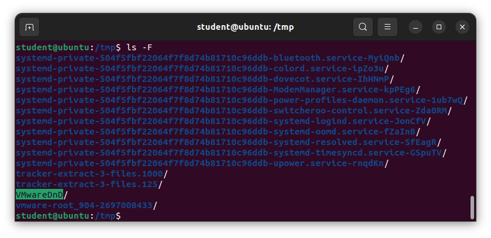

## Discarding Output with /dev/null

Certain commands (such as **find**) are quite capable of spewing voluminous and overwhelming amounts of output. To avoid this, we can redirect the large output to a special file (a device node) called **/dev/null**. This pseudofile is also called the bit bucket or black hole.

All data written to **/dev/null** is discarded. Furthermore, write operations never return failure conditions. Using the proper redirection operators, it can make the uninteresting output disappear from commands that would normally generate output to **stdout** and/or **stderr**:

```bash
$ ls -lR /tmp > /dev/null
```

In the above command, the entire standard output stream is ignored, but any errors will still appear on the console. However, if one does:

```bash
$ ls -lR /tmp >& /dev/null
```

Both **stdout** and **stderr** will be dumped into **/dev/null**.

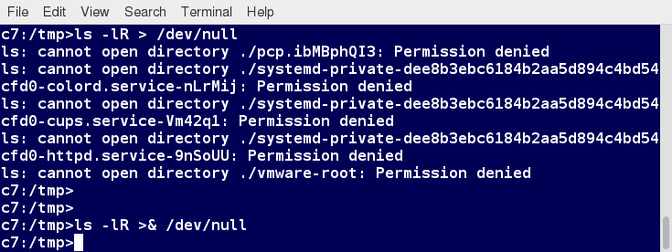

## Random Numbers and Data

It is often useful to generate random numbers and other random data when performing tasks such as:

- Performing security-related tasks
- Reinitializing storage devices
- Erasing and/or obscuring existing data
- Generating meaningless data to be used for tests

Such random numbers can be generated by using the **$RANDOM** environment variable, which is derived from the Linux kernel's built-in random number generator, or by the OpenSSL library function, which uses the FIPS140 (Federal Information Processing Standard) algorithm to generate random numbers for encryption.

To learn about FIPS140, read Wikipedia's [*"FIPS 140-2"*](https://en.wikipedia.org/wiki/FIPS_140-2) article.

The example shows you how to easily use the environmental variable method to generate random numbers.

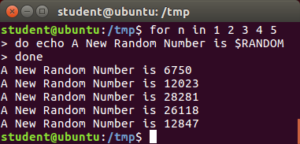

## How the Kernel Generates Random Numbers

Some servers have hardware random number generators that take as input different types of noise signals, such as thermal noise and photoelectric effect. A transducer converts this noise into an electric signal, which is again converted into a digital number by an A-D converter. This number is considered random. However, most common computers do not contain such specialized hardware and, instead, rely on events created during booting to create the raw data needed.

Regardless of which of these two sources is used, the system maintains a so-called **entropy pool** of these digital numbers/random bits. Random numbers are created from this entropy pool.

The Linux kernel offers the **/dev/random** and **/dev/urandom** device nodes, which draw on the entropy pool to provide random numbers which are drawn from the estimated number of bits of noise in the entropy pool.

**/dev/random** is used where very high-quality randomness is required, such as a one-time pad or key generation, but it is relatively slow to provide values. **/dev/urandom** is faster and suitable (good enough) for most cryptographic purposes.

Furthermore, when the entropy pool is empty, **/dev/random** is blocked and does not generate any number until additional environmental noise (network traffic, mouse movement, etc.) is gathered, whereas **/dev/urandom** reuses the internal pool to produce more pseudo-random bits.

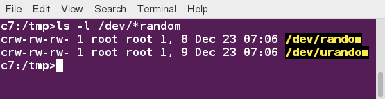

# Lab 17.3: Using the case Statement

*Click on the two boxes to access Lab 17.3.*

To download the lab solution, check the Resources tab in the Menu on the left-hand side.

## Lab Exercise

**Task**

Write a script which:
1. Takes a word as an argument.
2. Appends a random number to it.
3. Displays the answer.

## Solution

Create a file named **testrandom.sh**, with the content below:

```bash
#!/bin/bash
#
# check to see if the user supplied in the parameter.
[[ $# -eq 0 ]] && echo "Usage: $0 word" && exit 1

echo "$1-$RANDOM"
exit 0
```

Make it executable and run it:

```bash
student:/tmp> chmod +x testrandom.sh
student:/tmp> ./testrandom.sh strA
strA-29294

student:/tmp> ./testrandom.sh strB
strB-23911

student:/tmp> ./testrandom.sh strC
strC-27782
student:/tmp>
```

## Chapter 17 Summary

You have completed Chapter 17. Let's summarize the key concepts covered:

## String Manipulation

- You can manipulate strings to perform actions such as comparison, sorting, and finding length.

## Boolean Expressions

- You can use Boolean expressions when working with multiple data types, including strings or numbers, as well as files.
- The output of a Boolean expression is either true or false.
- Operators used in Boolean expressions include the **&&** (AND), **||** (OR), and **!** (NOT) operators.

## Case Statements

- We looked at the advantages of using the **case** statement in scenarios where the value of a variable can lead to different execution paths.

## Script Debugging

- Script debugging methods help troubleshoot and resolve errors.
- The standard and error outputs from a script or shell commands can easily be redirected into the same file or separate files to aid in debugging and saving results.

## Temporary Files and Directories

- Linux allows you to create temporary files and directories, which store data for a short duration, both saving space and increasing security.

## Random Number Generation

- Linux provides several different ways of generating random numbers, which are widely used.