# Local Security Principles

## Learning Objectives

By the end of this chapter, you should be able to:

- Have a good grasp of best practices and tools for making Linux systems as secure as possible.
- Understand the powers and dangers of using the root (superuser) account.
- Use the sudo command to perform privileged operations while restricting enhanced powers as much as feasible.
- Explain the importance of process isolation and hardware access.
- Work with passwords, including how to set and change them.
- Describe how to secure the boot process and hardware resources.

# Understanding Linux Security

## User Accounts

The `Linux kernel` allows properly authenticated `users` to access files and applications. While each user is identified by a `unique integer` (the user `id` or `UID`), a separate database associates a `username` with each `UID`. Upon account creation, new `user` information is added to the `user` database and the user's home directory must be created and populated with some essential files. Command line programs such as `useradd` and `userdel` as well as `GUI` tools are used for creating and removing accounts.

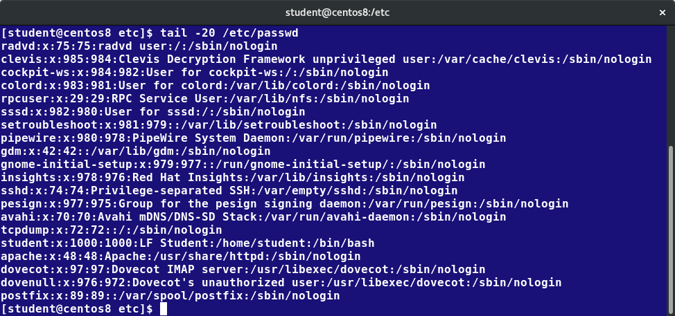

For each user, the following seven fields are maintained in the `/etc/passwd` file:

`Table: Fields Maintained in the /etc/passwd File`:

| Field Name | Details | Remarks |
|------------|---------|---------|
| **Username** | User login name | Should be between 1 and 32 characters long |
| **Password** | User password (or the character x if the password is stored in the `/etc/shadow` file) in encrypted format | Is never shown in Linux when it is being typed; this stops prying eyes |
| **User ID (UID)** | Every user must have a user id (UID)<br> | UID 0 is reserved for root user<br>• UIDs ranging from 1-99 are reserved for other predefined accounts<br> UIDs ranging from 100-999 are reserved for system accounts and groups<br> Normal users have UIDs of 1000 or greater | |
| **Group ID (GID)** | The primary Group ID (GID); Group Identification Number stored in the `/etc/group` file | Is covered in detail in the chapter on *Processes* |
| **User Info** | This field is optional and allows insertion of extra information about the user such as their name | For example: `Rufus T. Firefly` |
| **Home Directory** | The absolute path location of user's home directory | For example: `/home/rtfirefly` |
| **Shell** | The absolute location of a user's default shell | For example: `/bin/bash` |

## Types of Accounts

By default, Linux distinguishes between several account types in order to isolate processes and workloads. Linux has four types of accounts:

- `root`
- `System`
- `Normal`
- `Network`

For a safe working environment, it is advised to grant the minimum privileges possible and necessary to accounts, and remove inactive accounts. The `last` utility, which shows the `last` time each user logged into the system, can be used to help identify potentially inactive accounts which are candidates for system removal.

Keep in mind that practices you use on multi-user business systems are more strict than practices you can use on personal desktop systems that only affect the casual user. This is especially true with security. We hope to show you practices applicable to enterprise servers that you can use on all systems, but understand that you may choose to relax these rules on your own personal system.


## Understanding the root Account

`root` is the most privileged account on a `Linux/UNIX` system. This account has the ability to carry out all facets of system administration, including adding accounts, changing user passwords, examining log files, installing software, etc. Utmost care must be taken when using this account. It has no security restrictions imposed upon it.

When you are signed in as, or acting as root, the shell prompt displays `#` (if you are using `bash` and you have not customized the prompt, as we have discussed previously). This convention is intended to serve as a warning to you of the absolute power of this account.


# When Are root Privileges Required?

## Operations Requiring root Privileges

`root privileges` are required to perform operations such as:

- Creating, removing and managing user accounts
- Managing software packages
- Removing or modifying system files
- Restarting system services.

Regular account users of Linux distributions might be allowed to install software packages, update some settings, use some peripheral devices, and apply various kinds of changes to the system. However, root privilege is required for performing administration tasks such as restarting most services, manually installing packages and managing parts of the filesystem that are outside the normal user’s directories.

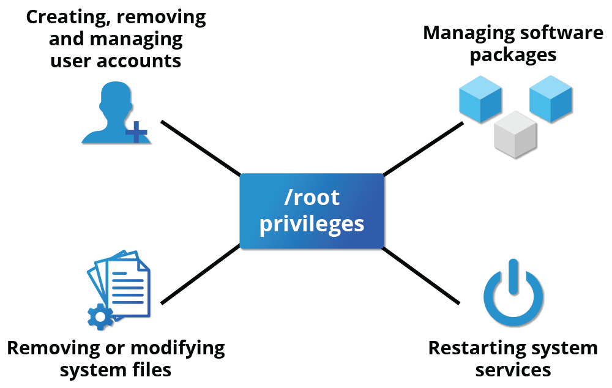

## Operations Not Requiring root Privileges

A regular account user can perform some operations requiring special permissions; however, the system configuration must allow such abilities to be exercised.

**SUID** (**S**et owner **U**ser **ID** upon execution - similar to the Windows "run as" feature) is a special kind of file permission given to a file. Use of SUID provides temporary permissions to a user to run a program with the permissions of the file *owner* (which may be root) instead of the permissions held by the *user*.

The table provides examples of operations which do not require root privileges:

## Operations Which Do Not Require root Privileges

| Operations that do not require root privileges | Examples of this operation |
|------------------------------------------------|---------------------------|
| Running a network client | Sharing a file over the network |
| Using devices such as printers | Printing over the network |
| Operations on files that the user has proper permissions to access | Accessing files that you have access to or sharing data over the network |
| Running SUID-root applications | Executing programs such as `passwd` |

# sudo, Process Isolation, Limiting Hardware Access and Keeping Systems Current

## Comparing sudo and su

In Linux you can use either `su` or `sudo` to temporarily grant root access to a normal user. However, these methods are actually quite different. Listed below are the differences between the two commands.

## su and sudo Comparison

| Feature | su | sudo |
|---------|----|----- |
| **Password Required** | When elevating privilege, you need to enter the root password. Giving thttps://www.msn.com/en-za/news/other/news-in-a-minute-kaizer-chiefs-signs-two-ex-pirates-video/ar-AA1HXrdihe root password to a normal user should never, ever be done. | When elevating privilege, you need to enter the user's password and not the root password. |
| **Session Duration** | Once a user elevates to the root account using `su`, the user can do anything that the root user can do for as long as the user wants, without being asked again for a password. | Offers more features and is considered more secure and more configurable. Exactly what the user is allowed to do can be precisely controlled and limited. By default the user will either always have to keep giving their password to do further operations with `sudo`, or can avoid doing so for a configurable time interval. |
| **Logging Features** | The command has limited logging features. | The command has detailed logging features. |

## sudo Features

`sudo` has the ability to keep track of unsuccessful attempts at gaining root access. Users' authorization for using `sudo` is based on configuration information stored in the `/etc/sudoers` file and in the `/etc/sudoers.d` directory.

A message such as the following would appear in a system log file (usually `/var/log/secure`) when trying to execute `sudo` for `badperson` without successfully authenticating the user:

```bash
$ badperson : user NOT in sudoers ; TTY=pts/4 ; PWD=/var/log ; USER=root ; COMMAND=/usr/bin/tail secure
```

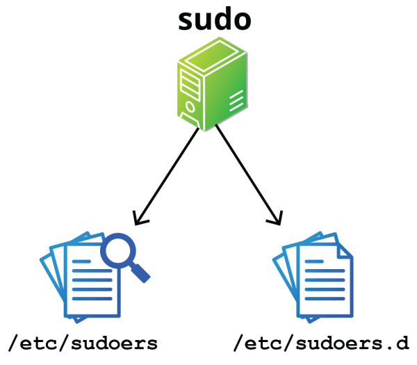

## The sudoers File

Whenever `sudo` is invoked, a trigger will look at `/etc/sudoers` and the files in `/etc/sudoers.d` to determine if the user has the right to use sudo and what the scope of their privilege is. Unknown user requests and requests to do operations not allowed to the user even with `sudo` are reported. The basic structure of entries in these files is:

```bash
$ who where = (as_whom) what
```

`/etc/sudoers` contains a lot of documentation in it about how to customize. Most Linux distributions now prefer you add a file in the directory `/etc/sudoers.d` with a name the same as the user. This file contains the individual user's `sudo` configuration, and one should leave the main configuration file untouched except for changes that affect all users.

You should edit any of these configuration files by using `visudo`, which ensures that only one person is editing the file at a time, has the proper permissions, and refuses to write out the file and exit if there are syntax errors in the changes made. The editing can be accomplished by doing a command such as the following ones:

```bash
$ # visudo /etc/sudoers
$ # visudo -f /etc/sudoers.d/student
```

The actual specific editor invoked will depend on the setting of your `EDITOR` environment variable.

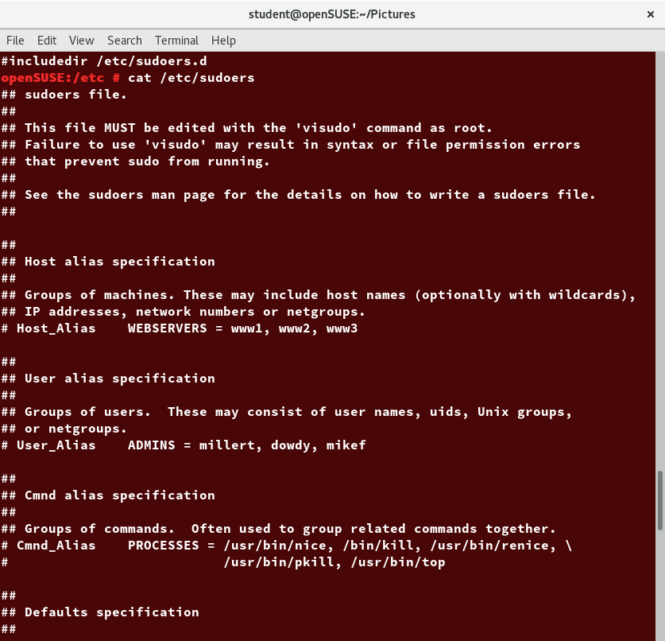

## Command Logging

By default, `sudo` commands and any failures are logged in `/var/log/auth.log` under the `Debian distribution family`, and in `/var/log/messages` and/or `/var/log/secure` on other systems. This is an important safeguard to allow for tracking and accountability of sudo use. A typical entry of the message contains:

- Calling username
- Terminal info
- Working directory
- User account invoked
- Command with arguments

Running a command such as `sudo whoami` results in a log file entry such as:

```bash
$ Dec 8 14:20:47 server1 sudo: op : TTY=pts/6 PWD=/var/log USER=root COMMAND=/usr/bin/whoami
```

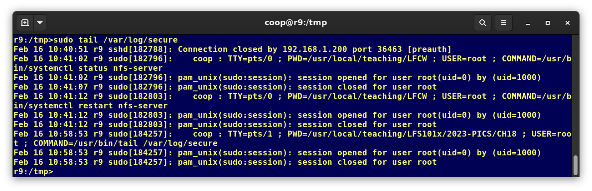


## Process Isolation

`Linux` is considered to be more secure than many other operating systems because processes are naturally isolated from each other. One process normally cannot access the resources of another process, even when that process is running with the same user privileges. Linux thus makes it difficult (though certainly not impossible) for viruses and security exploits to access and attack random resources on a system.

More recent additional security mechanisms that limit risks even further include:

- `Control Groups (cgroups)`
  - Allows system administrators to group processes and associate finite resources to each cgroup.
- `Containers`
  - Makes it possible to run multiple isolated Linux systems (containers) on a single system by relying on cgroups.
- `Virtualization`
  - Hardware is emulated in such a way that not only can processes be isolated, but entire systems are run simultaneously as isolated and insulated guests (virtual machines) on one physical host.

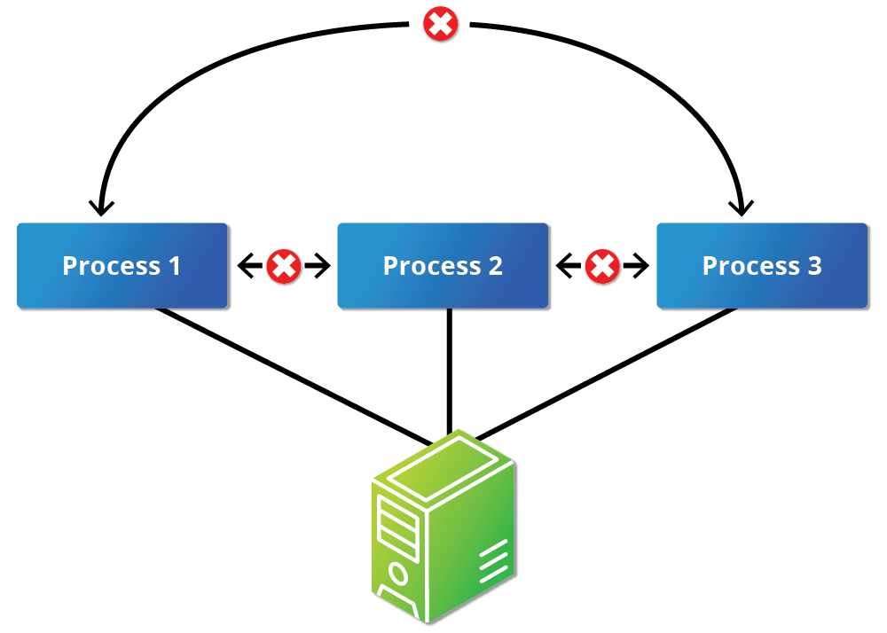

## Hardware Device Access

Linux limits user access to non-networking hardware devices in a manner that is extremely similar to regular file access. Applications interact by engaging the filesystem layer (which is independent of the actual device or hardware the file resides on). This layer will then open a device special file (often called a device node) under the `/dev` directory that corresponds to the device being accessed. Each device special file has standard owner, group and world permission fields. Security is naturally enforced just as it is when standard files are accessed.

Hard disks, for example, are represented as `/dev/sd*`. While a root user can read and write to the disk in a raw fashion, for example, by doing something like:

```bash
$ # echo hello world > /dev/sda1
```

The standard permissions, as shown in the figure, make it impossible for regular users to do so. Writing to a device in this fashion can easily obliterate the filesystem stored on it in a way that cannot be repaired without great effort, if at all. The normal reading and writing of files on the hard disk by applications is done at a higher level through the filesystem and never through direct access to the device node.

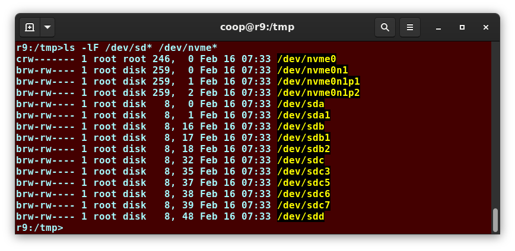

## Keeping Current

When security problems in either the Linux kernel or applications and libraries are discovered, Linux distributions have a good record of reacting quickly and pushing out fixes to all systems by updating their software repositories and sending notifications to update immediately. The same thing is true with bug fixes and performance improvements that are not security related.

However, it is well known that many systems do not get updated frequently enough and problems which have already been cured are allowed to remain on computers for a long time; this is particularly true with proprietary operating systems where users are either uninformed or distrustful of the vendor's patching policy as sometimes updates can cause new problems and break existing operations. Many of the most successful attack vectors come from exploiting security holes for which fixes are already known but not universally deployed.

So the best practice is to take advantage of your Linux distribution's mechanism for automatic updates and never postpone them. It is extremely rare that such an update will cause new problems.

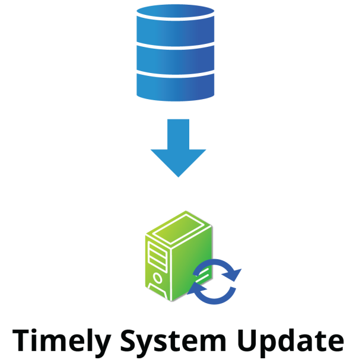

## Lab 19.1: sudo

## Lab Exercise

### Task

1. Create a new user, using `useradd`, and give the user an initial password with `passwd`.
2. Configure this user to be able to use `sudo`.
3. Login as or switch to this new user and make sure you can execute a command that requires root privilege.

For example, a trivial command requiring root privilege could be:

```bash
$ ls /root
```

### Solution

1. **Create new user and set password:**

   ```bash
   $ sudo useradd newuser
   $ sudo passwd newuser
   ```

   (give the password for this user when prompted)

2. **Configure sudo access:**
   With root privilege, (use `sudo visudo`) add this line to `/etc/sudoers`:

   ```bash
   $ newuser      ALL=(ALL)      ALL
   ```

   Alternatively, create a file named `/etc/sudoers.d/newuser` with just that one line as content.

3. **Test sudo access:**
   You can login by doing:

   ```bash
   $ sudo su newuser
   ```

   or

   ```bash
   $ ssh newuser@localhost
   ```

   which will require giving **newuser**'s password, and is probably a better solution. Instead of `localhost` you can give your hostname, IP address or `127.0.0.1`.

   Then as **newuser** just type:

   ```bash
   $ sudo ls /root
   ```

# Working with Passwords

## How Passwords Are Stored

The system verifies authenticity and identity using user credentials.

Originally, encrypted passwords were stored in the `/etc/passwd` file, which was readable by everyone. This made it rather easy for passwords to be cracked.

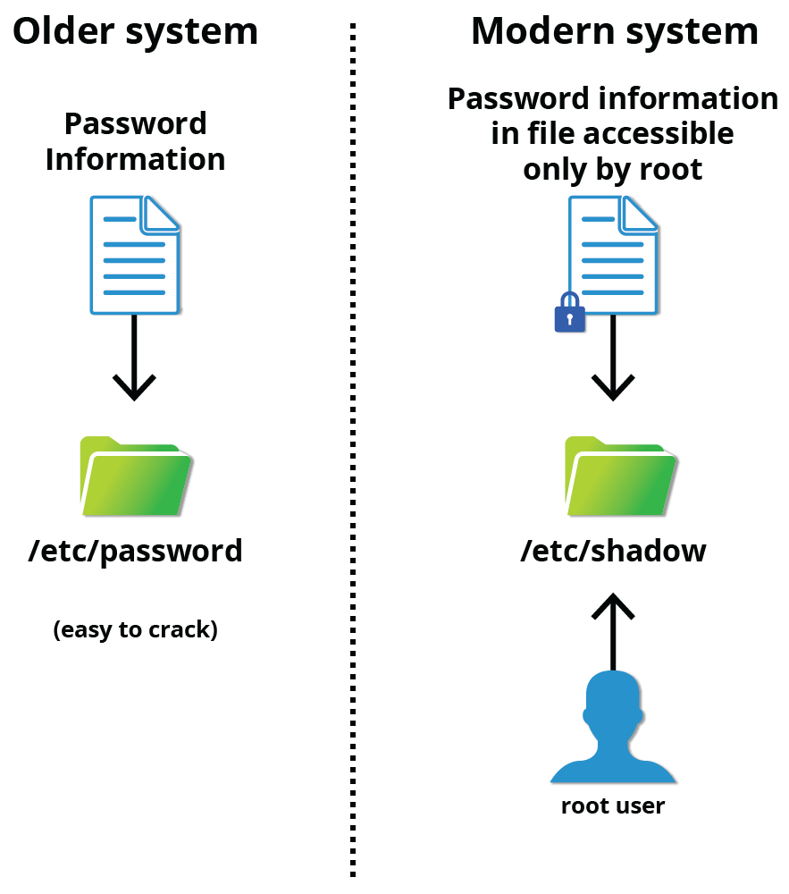

On modern systems, passwords are actually stored in an encrypted format in a secondary file named `/etc/shadow`. Only those with root access can read or modify this file.

## Password Encryption

Protecting passwords has become a crucial element of security. Most Linux distributions rely on a modern password encryption algorithm called `SHA-512 (Secure Hashing Algorithm 512 bits)`, developed by the `U.S. National Security Agency (NSA)` to encrypt passwords.

The `SHA-512 algorithm` is widely used for security applications and protocols. These security applications and protocols include `TLS`, `SSL`, `PHP`, `SSH`,` S/MIME` and `IPSec`. `SHA-512` is one of the most tested hashing algorithms.

For example, if you wish to experiment with` SHA-512` encoding, the word "test" can be encoded using the program `sha512sum` to produce the `SHA-512 form` (see graphic):

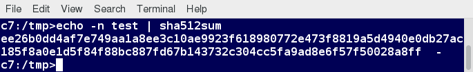

## Good Password Practices

IT professionals follow several good practices for securing the data and the password of every user.

## Password Aging

**Password aging** is a method to ensure that users get prompts that remind them to create a new password after a specific period. This can ensure that passwords, if cracked, will only be usable for a limited amount of time. This feature is implemented using `chage`, which configures the password expiry information for a user.

## Strong Password Enforcement

Another method is to force users to set strong passwords using **P**luggable **A**uthentication **M**odules (**PAM**). PAM can be configured to automatically verify that a password created or modified using the `passwd` utility is sufficiently strong. PAM configuration is implemented using a library called `pam_cracklib.so`, which can also be replaced by `pam_passwdqc.so` to take advantage of more options.

## Password Security Testing

One can also install password cracking programs, such as [John The Ripper](http://www.openwall.com/john/), to secure the password file and detect weak password entries. It is recommended that written authorization be obtained before installing such tools on any system that you do not own.

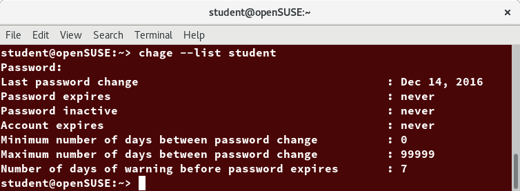

# Lab 19.2: Password Aging

## Lab Exercise

### Task
With the newly created user from the previous exercise, look at the password aging for the user.

Modify the expiration date for the user, setting it to be something that has passed, and check to see what has changed.

When you are finished and wish to delete the newly created account, use `userdel`, as in:
```bash
$ sudo userdel newuser
```

### Solution
```bash
chage --list newuser
sudo chage -E 2014-31-12 newuser
chage --list newuser
sudo userdel newuser
```

> **NOTE**: The example solution works in the US. `chage -E` uses the default date format for the local keyboard setting.

# Securing the Boot Process and Hardware Resources

## Requiring Boot Loader Passwords

You can secure the boot process with a secure password to prevent someone from bypassing the user authentication step. This can work in conjunction with password protection for the BIOS. Note that while using a bootloader password alone will stop a user from editing the bootloader configuration during the boot process, it will **not** prevent a user from booting from an alternative boot media such as optical disks or pen drives. Thus, it should be used with a BIOS password for full protection.

For the older GRUB 1 boot method, it was relatively easy to set a password for `grub`. However, for the GRUB 2 version, things became more complicated. However, you have more flexibility, and can take advantage of more advanced features, such as user-specific passwords (which can be their normal login ones).

Furthermore, you never edit `grub.cfg` directly; instead, you can modify the configuration files in `/etc/grub.d` and `/etc/defaults/grub`, and then run `update-grub`, or `grub2-mkconfig` and save the new configuration file.

To learn more, read the following post: [*"GRUB 2 Password Protection"*](https://help.ubuntu.com/community/Grub2/Passwords).


## Hardware Vulnerability

When hardware is physically accessible, security can be compromised by:

- **Key logging** - Recording the real-time activity of a computer user, including the keys they press. The captured data can either be stored locally or transmitted to remote machines.
- **Network sniffing** - Capturing and viewing the network packet level data on your network.
- **Booting with a live or rescue disk**
- **Remounting and modifying disk content**

Your IT security policy should start with requirements on how to properly secure physical access to servers and workstations. Physical access to a system makes it possible for attackers to easily leverage several attack vectors in a way that makes all operating system level recommendations irrelevant.

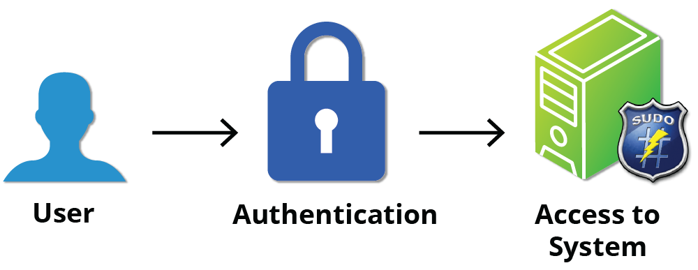

## Security Guidelines

The guidelines of security are:

- Lock down workstations and servers.
- Protect your network links such that it cannot be accessed by people you do not trust.
- Protect your keyboards where passwords are entered to ensure the keyboards cannot be tampered with.
- Ensure a password protects the BIOS in such a way that the system cannot be booted with a live or rescue DVD or USB key.

For single-user computers and those in a home environment, some of the above features (like preventing booting from removable media) can be excessive, and you can avoid implementing them. However, if sensitive information is on your system that requires careful protection, either it shouldn't be there, or it should be better protected by following the above guidelines.

# Software Vulnerability

Like all software, hackers occasionally find weaknesses in the Linux ecosystem. The strength of Linux (and open source community in general) is the speed with which such vulnerabilities are exposed and remediated. Specific coverage of vulnerabilities is beyond the scope of this course, but the Discussion Board can be used to carry out further discussion.


